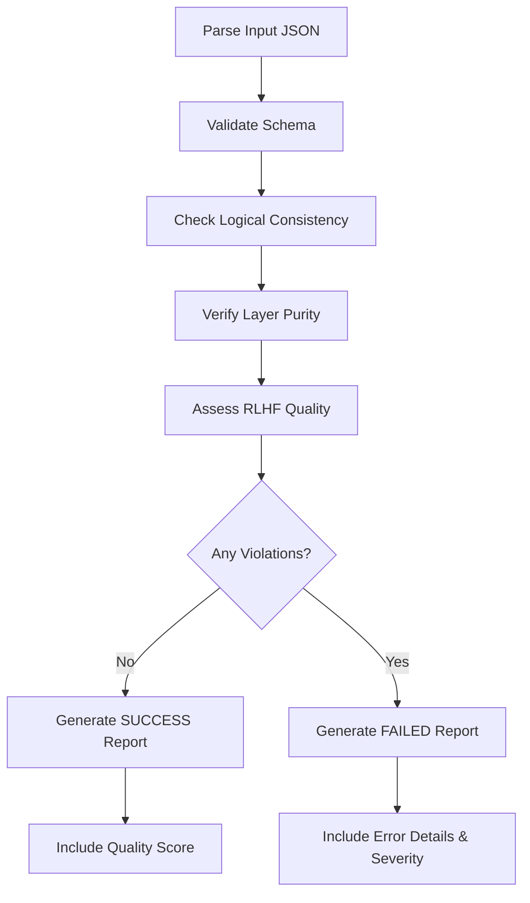

# Task: Validate Domain JSON Plan

## 🤖 RLHF Scoring Impact

This validation directly affects your RLHF score:

| Score | Level | Impact | Common Causes |
|-------|-------|--------|---------------|
| **-2** | CATASTROPHIC | Build failure | Wrong REPLACE/WITH format, architecture violations |
| **-1** | RUNTIME ERROR | Execution failure | Missing placeholders, invalid templates |
| **0** | LOW CONFIDENCE | System uncertainty | Missing references, unclear concepts |
| **+1** | GOOD | Working solution | Valid but missing ubiquitous language |
| **+2** | PERFECT | Excellence | Complete DDD concepts and ubiquitous language |

## 1. Your Deliverable

Your **only** output for this task is a validation report in JSON format.

### ✅ Success Output:
```json
{
  "status": "SUCCESS",
  "message": "JSON plan is valid and complete.",
  "qualityScore": "PERFECT|GOOD|ACCEPTABLE"
}
```

### ❌ Failure Output:
```json
{
  "status": "FAILED",
  "errors": ["error message with RLHF impact"],
  "severity": "CATASTROPHIC|RUNTIME|WARNING"
}
```

## 2. Objective

Act as an **automated quality assurance engineer**. Validate the JSON plan against a strict set of logical and structural rules to ensure it will generate a valid selected layer following Clean Architecture principles.

## 3. Input Parameters

- **JSON Plan:** The JSON object generated by the `/01-plan-domain-features` command

## 4. Validation Checklist (Rules of Engagement)

You **MUST** validate the input JSON against every rule in this checklist. The validation fails if even one rule is violated.

### A. Schema and Structure Validation 📋

| Rule | Description | Impact if Violated |
|------|-------------|-------------------|
| **Root Keys** | Must contain `featureName` (string) and `steps` (array) | RUNTIME (-1) |
| **Ubiquitous Language** | If present, must be object with string key-value pairs | GOOD (+1) if missing |
| **Step Keys** | Every step must have `id`, `type`, `description`, `path` | RUNTIME (-1) |
| **Step Types** | Must be one of: `create_file`, `refactor_file`, `delete_file`, `folder` | RUNTIME (-1) |
| **References** | Every step must have `references` array (can be empty for errors) | LOW CONFIDENCE (0) |

### B. Logical Consistency and Completeness 🔍

#### Path Consistency
- [ ] The `path` in each step must be consistent with the `featureName`
- [ ] Example: `featureName: "UserAccount"` → path should contain `features/user-account/`

#### Template Completeness for `create_file`:

| File Type | Required Placeholders | Required Fields | RLHF Impact |
|-----------|----------------------|-----------------|-------------|
| **Use Case** | `__USE_CASE_INPUT_FIELDS__`<br>`__USE_CASE_OUTPUT_FIELDS__` | `input[]`, `output[]` | -1 if missing |
| **Test Helper** | `__MOCK_INPUT_DATA__`<br>`__MOCK_OUTPUT_DATA__` | `mockInput{}`, `mockOutput{}` | -1 if missing |
| **Error Class** | None (complete template) | None | N/A |

> 🏆 **For +2 Score:** Templates should include JSDoc comments with `@layerConcept` and `@pattern` tags

#### Template Correctness for `refactor_file`:
- [ ] Must contain exactly one `<<<REPLACE>>>...<<</REPLACE>>>` block
- [ ] Must contain exactly one `<<<WITH>>>...<<</WITH>>>` block
- [ ] **⚠️ CRITICAL:** Invalid format causes CATASTROPHIC (-2) error

#### Dependency Sanity:
- [ ] No `refactor_file` or `delete_file` before corresponding `create_file`
- [ ] Steps should generally start with `folder` or `create_file`

### C. Content and Naming Conventions 📝

| Convention | Rule | Example | Impact |
|------------|------|---------|--------|
| **Type Names** | PascalCase | `CreateUser` ✅<br>`create-user` ❌ | -1 |
| **IDs & Paths** | kebab-case | `create-user-use-case` ✅<br>`CreateUserUseCase` ❌ | -1 |
| **Use Cases** | Must be verbs | `CreateUser` ✅<br>`UserCreator` ❌ | -1 |
| **Mock Data** | Must exist for use cases | Non-empty `mockInput` & `mockOutput` | 0 |

### D. Selected Layer Purity Validation 🛡️ (RLHF Critical)

#### ❌ **FORBIDDEN - Causes CATASTROPHIC (-2)**:
```typescript
// These imports will fail validation:
import axios from 'axios';              // ❌ External library
import { PrismaClient } from '@prisma/client'; // ❌ Database
import express from 'express';          // ❌ Framework
import React from 'react';              // ❌ UI library
```

#### ✅ **REQUIRED Patterns**:

| Pattern | Requirement | Example | Score Impact |
|---------|-------------|---------|--------------|
| **Use Cases** | Must be interfaces with `execute` method | `interface CreateUser { execute(...) }` | -2 if class |
| **Errors** | Must extend native `Error` | `class UserError extends Error` | -1 if custom |
| **Types** | Only TypeScript native types | `string`, `number`, `Date` | -2 if external |
| **Logic** | NO implementation in domain | Types only, no logic | -2 if present |

### E. RLHF Quality Indicators 🏆

Quality scoring criteria for achieving higher RLHF scores:

| Indicator | Requirement | Impact | Score |
|-----------|------------|--------|-------|
| **Ubiquitous Language** | Present with meaningful business terms | Missing prevents +2 | +2 |
| **Domain Documentation** | `@layerConcept` tags in templates | Quality indicator | +1 to +2 |
| **Reference Quality** | Meaningful references to patterns | Empty = low confidence | 0 to +1 |
| **Test Coverage** | Test helper for every use case | Missing = incomplete | +1 |
| **DDD Alignment** | Proper Value Objects, Entities, Aggregates | Excellence indicator | +2 |

## 5. Step-by-Step Execution Plan



### Execution Steps:

1. **Parse Input:** Receive and parse the JSON plan
2. **Iterate Checklist:** Validate against all rules systematically
3. **Calculate RLHF Impact:** Assess severity based on violations
4. **Collect Errors:** Build detailed error list with impact scores
5. **Generate Report:** Produce appropriate JSON output

## 6. Example Validations

### Example 1: ✅ Valid JSON (PERFECT Score)

<details>
<summary>Input JSON</summary>

```json
{
  "featureName": "UserAccount",
  "ubiquitousLanguage": {
    "Account": "User's identity in the system",
    "Registration": "Process of creating new account"
  },
  "steps": [
    {
      "id": "create-use-case-create-user-account",
      "type": "create_file",
      "description": "Create user account use case",
      "path": "src/features/user-account/[LAYER]/use-cases/create-user-account.ts",
      "references": [
        {
          "type": "external_pattern",
          "source": "context7",
          "description": "DDD patterns for user registration"
        }
      ],
      "template": "/**\n * @layerConcept User Account Creation\n */\nexport interface CreateUserAccount {\n  execute(input: CreateUserAccountInput): Promise<CreateUserAccountOutput>;\n}\n\nexport type CreateUserAccountInput = {\n  __USE_CASE_INPUT_FIELDS__\n};\n\nexport type CreateUserAccountOutput = {\n  __USE_CASE_OUTPUT_FIELDS__\n};",
      "input": [
        { "name": "email", "type": "string" },
        { "name": "password", "type": "string" }
      ],
      "output": [
        { "name": "id", "type": "string" },
        { "name": "email", "type": "string" }
      ]
    }
  ]
}
```
</details>

**Output:**
```json
{
  "status": "SUCCESS",
  "message": "JSON plan is valid and complete.",
  "qualityScore": "PERFECT"
}
```

### Example 2: ❌ Invalid JSON (RUNTIME Error)

<details>
<summary>Input JSON with Errors</summary>

```json
{
  "featureName": "UserAccount",
  "steps": [
    {
      "id": "create-use-case-create-user-account",
      "type": "create_file",
      "description": "Create user account",
      "path": "src/features/some-other-feature/use-cases/create.ts",
      "references": [],
      "template": "import axios from 'axios';\n\nclass CreateUserAccount {\n  // Implementation here\n}"
    }
  ]
}
```
</details>

**Output:**
```json
{
  "status": "FAILED",
  "errors": [
    "Path inconsistency: 'src/features/some-other-feature' doesn't match featureName 'UserAccount' (RLHF: -1)",
    "Empty references array: Missing pattern documentation (RLHF: 0)",
    "External dependency detected: 'axios' import forbidden in domain (RLHF: -2)",
    "Use case as class: Must be interface, not class (RLHF: -2)",
    "Missing placeholders: No __USE_CASE_INPUT_FIELDS__ found (RLHF: -1)",
    "Missing field definitions: 'input' and 'output' arrays required (RLHF: -1)"
  ],
  "severity": "CATASTROPHIC"
}
```

## 7. Severity Classification

| Severity | RLHF Score | When Applied | Recovery Action |
|----------|------------|--------------|-----------------|
| **CATASTROPHIC** | -2 | Architecture violations, external dependencies | Complete redesign required |
| **RUNTIME** | -1 | Missing required fields, invalid syntax | Fix specific issues |
| **WARNING** | 0 | Missing quality indicators | Enhance for better score |

## 📍 Next Steps

Based on your validation results:

### ✅ If validation PASSED (SUCCESS):
Proceed to generate the YAML plan:
```bash
/03-generate-layer-code create feature from json: <your-validated-json>
```

### ❌ If validation FAILED:
Fix the identified issues and re-run validation:
```bash
/02-validate-layer-plan from json: <your-corrected-json>
```

> 💡 **Pro Tip**: Address CATASTROPHIC errors first, then RUNTIME errors, and finally optimize for PERFECT score by adding quality indicators.