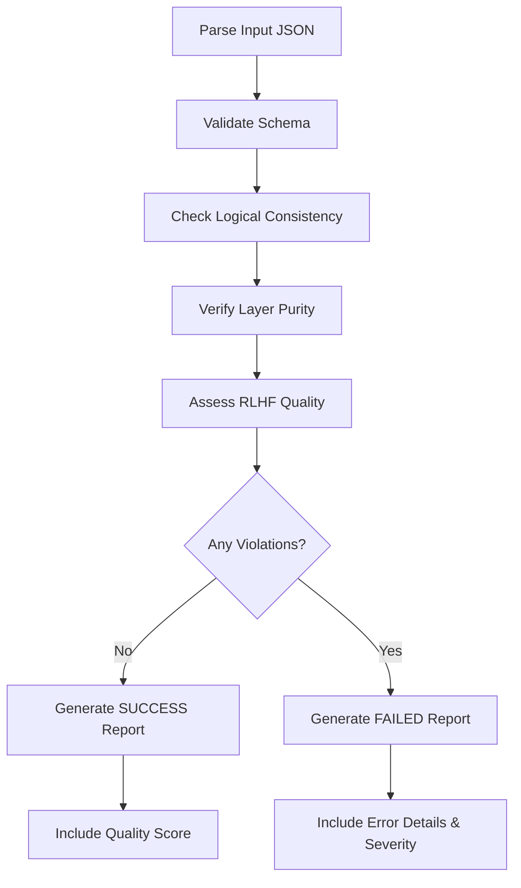

# Task: Validate Domain JSON Plan

## 🤖 RLHF Scoring Impact

This validation directly affects your RLHF score:

| Score | Level | Impact | Common Causes |
|-------|-------|--------|---------------|
| **-2** | CATASTROPHIC | Build failure | Wrong REPLACE/WITH format, architecture violations |
| **-1** | RUNTIME ERROR | Execution failure | Missing placeholders, invalid templates |
| **0** | LOW CONFIDENCE | System uncertainty | Missing references, unclear concepts |
| **+1** | GOOD | Working solution | Valid but missing ubiquitous language |
| **+2** | PERFECT | Excellence | Complete DDD concepts and ubiquitous language |

## 0. Input Processing

**CRITICAL**: Before proceeding with validation, you must handle the input parameter correctly:

### Step 1: Determine Input Method

Check the command format to identify which input method is being used:

1. **If `--file` parameter is provided**:
   ```bash
   # Example: /02-validate-layer-plan --layer=domain --file=spec/001-user-auth/domain/plan.json
   ```
   - **Action Required**: Use the Read tool to read the specified JSON file
   - **Example**: `Read("spec/001-user-auth/domain/plan.json")`
   - Parse the JSON content from the file
   - Proceed with validation using the parsed JSON

2. **If inline JSON is provided** (legacy):
   ```bash
   # Example: /02-validate-layer-plan --layer=domain from json: {...}
   ```
   - Parse the JSON directly from the command arguments
   - Proceed with validation

### Step 2: Validate File Exists (if using --file)

If `--file` parameter is used:
- Use Read tool to load the file
- If file doesn't exist, immediately return error:
  ```json
  {
    "status": "FAILED",
    "errors": ["File not found: <file-path>"],
    "severity": "RUNTIME"
  }
  ```

### Step 3: Parse JSON

- Parse the JSON content (either from file or inline)
- If JSON parsing fails, immediately return error:
  ```json
  {
    "status": "FAILED",
    "errors": ["Invalid JSON format"],
    "severity": "RUNTIME"
  }
  ```

**Only after successfully loading and parsing the JSON should you proceed to section 1 (Your Deliverable) and beyond.**

## 1. Your Deliverable

Your **only** output for this task is a validation report in JSON format.

### ✅ Success Output:
```json
{
  "status": "SUCCESS",
  "message": "JSON plan is valid and complete.",
  "qualityScore": "PERFECT|GOOD|ACCEPTABLE"
}
```

### ❌ Failure Output:
```json
{
  "status": "FAILED",
  "errors": ["error message with RLHF impact"],
  "severity": "CATASTROPHIC|RUNTIME|WARNING"
}
```

## 2. Objective

Act as an **automated quality assurance engineer**. Validate the JSON plan against a strict set of logical and structural rules to ensure it will generate a valid selected layer following Clean Architecture principles.

## 3. Input Parameters

You can provide the JSON plan in two ways:

### Option 1: Direct JSON (inline)
```bash
/02-validate-layer-plan --layer=domain from json: <paste-json-here>
```

### Option 2: File Reference (recommended)
```bash
/02-validate-layer-plan --layer=domain --file=spec/__FEATURE_NUMBER__-__FEATURE_NAME__/domain/plan.json
```

**Example with actual values:**
```bash
/02-validate-layer-plan --layer=domain --file=spec/001-user-authentication/domain/plan.json
```

**Recommended**: Use `--file` parameter to reference the generated plan.json file directly, avoiding manual copy-paste of large JSON files.

## 4. Validation Checklist (Rules of Engagement)

You **MUST** validate the input JSON against every rule in this checklist. The validation fails if even one rule is violated.

### A. Schema and Structure Validation 📋

#### **🔄 CRITICAL: Support for Both Legacy and Modular Structures (Issue #117)**

The validator now supports **TWO valid JSON structures**:

**1️⃣ LEGACY Structure (pre-Issue #117):**
```json
{
  "featureName": "FeatureName",
  "featureNumber": "001",
  "layer": "domain",
  "target": "backend",
  "steps": [...]  // ← Flat array of all steps
}
```

**2️⃣ MODULAR Structure (Issue #117 - NEW):**
```json
{
  "featureName": "FeatureName",
  "featureNumber": "001",
  "layer": "domain",
  "target": "backend",
  "layerContext": { "ubiquitousLanguage": {...}, "businessRules": [...] },
  "sharedComponents": {    // ← Shared models, VOs, repos, errors
    "models": [...],
    "valueObjects": [...],
    "repositories": [...],
    "sharedErrors": [...]
  },
  "useCases": [...]        // ← Individual use case definitions
}
```

**Validation Logic**: Check if JSON has `steps` array OR (`sharedComponents` + `useCases`). If NEITHER exists, fail validation.

---

#### Structure Validation Rules

| Rule | Description | Impact if Violated |
|------|-------------|-------------------|
| **Root Keys (Required)** | Must contain `featureName` (string), `featureNumber` (string), `layer` (string), `target` (string) | RUNTIME (-1) |
| **Structure Type** | Must have EITHER `steps` array (legacy) OR `sharedComponents` object + `useCases` array (modular) | RUNTIME (-1) |
| **Layer Context** | If modular structure: MUST have `layerContext` with `ubiquitousLanguage` and `businessRules` | GOOD (+1) if present |
| **Ubiquitous Language** | If present, must be object with string key-value pairs | GOOD (+1) if comprehensive |
| **Step Keys (Legacy)** | If using `steps[]`: Every step must have `id`, `type`, `description`, `path` | RUNTIME (-1) |
| **Use Case Keys (Modular)** | If using `useCases[]`: Every use case must have `name`, `description`, `input`, `output`, `path` | RUNTIME (-1) |
| **Step Types** | Must be one of: `create_file`, `refactor_file`, `delete_file`, `folder` | RUNTIME (-1) |
| **References** | Every step/component must have `references` (can be empty) | LOW CONFIDENCE (0) |

---

#### 🔍 Detection Algorithm

```typescript
// Pseudo-code for structure detection
function detectStructureType(json: any): 'legacy' | 'modular' | 'invalid' {
  const hasSteps = Array.isArray(json.steps);
  const hasSharedComponents = typeof json.sharedComponents === 'object';
  const hasUseCases = Array.isArray(json.useCases);

  if (hasSteps && !hasSharedComponents && !hasUseCases) {
    return 'legacy';  // Pre-Issue #117 structure
  }

  if (!hasSteps && hasSharedComponents && hasUseCases) {
    return 'modular'; // Issue #117 modular structure
  }

  return 'invalid';   // Fail validation - neither structure detected
}
```

**Important**: When validating MODULAR structure, validate `sharedComponents` definitions AND `useCases` definitions separately, as they will generate separate YAML files downstream.

### B. Logical Consistency and Completeness 🔍

#### Path Consistency
- [ ] The `path` in each step must be consistent with the `featureName`
- [ ] Example: `featureName: "UserAccount"` → path should contain `features/user-account/`

#### Template Completeness for `create_file`:

| File Type | Required Placeholders | Required Fields | RLHF Impact |
|-----------|----------------------|-----------------|-------------|
| **Use Case** | `__USE_CASE_INPUT_FIELDS__`<br>`__USE_CASE_OUTPUT_FIELDS__` | `input[]`, `output[]` | -1 if missing |
| **Test Helper** | `__MOCK_INPUT_DATA__`<br>`__MOCK_OUTPUT_DATA__` | `mockInput{}`, `mockOutput{}` | -1 if missing |
| **Error Class** | None (complete template) | None | N/A |

> 🏆 **For +2 Score:** Templates should include JSDoc comments with `@layerConcept` and `@pattern` tags

#### Template Correctness for `refactor_file`:
- [ ] Must contain exactly one `<<<REPLACE>>>...<<</REPLACE>>>` block
- [ ] Must contain exactly one `<<<WITH>>>...<<</WITH>>>` block
- [ ] **⚠️ CRITICAL:** Invalid format causes CATASTROPHIC (-2) error

#### Dependency Sanity:
- [ ] No `refactor_file` or `delete_file` before corresponding `create_file`
- [ ] Steps should generally start with `folder` or `create_file`

### C. Content and Naming Conventions 📝

| Convention | Rule | Example | Impact |
|------------|------|---------|--------|
| **Type Names** | PascalCase | `CreateUser` ✅<br>`create-user` ❌ | -1 |
| **IDs & Paths** | kebab-case | `create-user-use-case` ✅<br>`CreateUserUseCase` ❌ | -1 |
| **Use Cases** | Must be verbs | `CreateUser` ✅<br>`UserCreator` ❌ | -1 |
| **Mock Data** | Must exist for use cases | Non-empty `mockInput` & `mockOutput` | 0 |

### D. Selected Layer Purity Validation 🛡️ (RLHF Critical)

#### ❌ **FORBIDDEN - Causes CATASTROPHIC (-2)**:
```typescript
// These imports will fail validation:
import axios from 'axios';              // ❌ External library
import { PrismaClient } from '@prisma/client'; // ❌ Database
import express from 'express';          // ❌ Framework
import React from 'react';              // ❌ UI library
```

#### ✅ **REQUIRED Patterns**:

| Pattern | Requirement | Example | Score Impact |
|---------|-------------|---------|--------------|
| **Use Cases** | Must be interfaces with `execute` method | `interface CreateUser { execute(...) }` | -2 if class |
| **Errors** | Must extend native `Error` | `class UserError extends Error` | -1 if custom |
| **Types** | Only TypeScript native types | `string`, `number`, `Date` | -2 if external |
| **Logic** | NO implementation in domain | Types only, no logic | -2 if present |

### E. RLHF Quality Indicators 🏆

Quality scoring criteria for achieving higher RLHF scores:

| Indicator | Requirement | Impact | Score |
|-----------|------------|--------|-------|
| **Ubiquitous Language** | Present with meaningful business terms | Missing prevents +2 | +2 |
| **Domain Documentation** | `@layerConcept` tags in templates | Quality indicator | +1 to +2 |
| **Reference Quality** | Meaningful references to patterns | Empty = low confidence | 0 to +1 |
| **Test Coverage** | Test helper for every use case | Missing = incomplete | +1 |
| **DDD Alignment** | Proper Value Objects, Entities, Aggregates | Excellence indicator | +2 |

## 5. Step-by-Step Execution Plan



### Execution Steps:

1. **Parse Input:** Receive and parse the JSON plan
2. **Iterate Checklist:** Validate against all rules systematically
3. **Calculate RLHF Impact:** Assess severity based on violations
4. **Collect Errors:** Build detailed error list with impact scores
5. **Run Architectural Validation:** Execute automated tools (see section 6)
6. **Generate Report:** Produce appropriate JSON output

## 6. Architectural Validation (Objective Quality Gate)

After JSON schema validation, run objective architectural validation tools to detect violations:

### Step 6.1: ESLint Boundaries Validation

Run ESLint with boundaries plugin to check architectural constraints:

```bash
npm run lint
```

**What it checks:**
- Domain layer purity (no imports from outer layers)
- Proper layer dependencies (data/infra/presentation → domain only)
- Main layer can use all layers
- Real-time IDE feedback for developers

**If violations detected:**
- Add to errors array with CATASTROPHIC severity (-2)
- Include specific file paths and violation descriptions
- Suggest fixes based on Clean Architecture principles

### Step 6.2: Dependency Cruiser Validation

Run dependency-cruiser for holistic architecture analysis:

```bash
npm run arch:validate
```

**What it checks:**
- Circular dependencies (warns)
- Cross-layer violations (errors)
- Orphaned modules (info)
- Complete dependency graph validation

**If violations detected:**
- CATASTROPHIC (-2): Any layer dependency violations
- WARNING (0): Circular dependencies
- Include violation count and details in error report

### Step 6.3: Success Criteria

Architectural validation passes if:
- ✅ `npm run lint` produces no boundary violations
- ✅ `npm run arch:validate` reports 0 errors
- ⚠️ Warnings are acceptable but should be noted

### Step 6.4: Failure Handling

If architectural validation fails:

**Example 1: Layer Violation (CATASTROPHIC)**
```json
{
  "status": "FAILED",
  "errors": [
    "ESLint boundaries violation: domain/models/user.ts imports from data layer (RLHF: -2)"
  ],
  "severity": "CATASTROPHIC"
}
```

**Example 2: Circular Dependency (WARNING)**
```json
{
  "status": "WARNING",
  "errors": [
    "Dependency cruiser warning: circular dependency detected in use-cases (RLHF: 0)"
  ],
  "severity": "WARNING",
  "recommendation": "Refactor to break the cycle - consider introducing an interface or splitting responsibilities"
}
```

**Example 3: Multiple Violations (CATASTROPHIC)**
```json
{
  "status": "FAILED",
  "errors": [
    "ESLint boundaries violation: domain/models/user.ts imports from data layer (RLHF: -2)",
    "External dependency detected: 'express' import in domain layer (RLHF: -2)",
    "Circular dependency warning: CreateUser ↔ UserValidator (RLHF: 0)"
  ],
  "severity": "CATASTROPHIC",
  "criticalCount": 2,
  "warningCount": 1
}
```

**Severity Classification Table:**

| Violation Type | Severity | RLHF Score | When Applied | Example |
|----------------|----------|------------|--------------|---------|
| **Domain imports from outer layer** | CATASTROPHIC | -2 | Domain layer imports from data/infra/presentation | `domain/user.ts` imports from `data/repositories` |
| **Layer violates dependency rules** | CATASTROPHIC | -2 | Any layer imports from forbidden layer | `presentation` imports directly from `data` |
| **External dependencies in domain** | CATASTROPHIC | -2 | Domain uses external libraries | `import axios from 'axios'` in domain |
| **Wrong REPLACE/WITH format** | CATASTROPHIC | -2 | Invalid refactor template syntax | Missing `<<<WITH>>>` block |
| **Missing required placeholders** | RUNTIME | -1 | Template lacks required fields | No `__USE_CASE_INPUT_FIELDS__` in use case |
| **Invalid template syntax** | RUNTIME | -1 | Malformed code structure | TypeScript compilation errors |
| **Path inconsistencies** | RUNTIME | -1 | File path doesn't match feature | `featureName: "User"` but path has `products/` |
| **Circular dependency** | WARNING | 0 | Module A → B → A | Use case imports create a cycle |
| **Orphaned module** | INFO | 0 | File not imported anywhere | Unused helper file |
| **Missing references** | WARNING | 0 | Empty references array | No pattern documentation |
| **Unclear concepts** | WARNING | 0 | Vague descriptions | Generic naming without context |

**Key Insights:**
- **CATASTROPHIC (-2)**: Violations that break Clean Architecture principles - require complete redesign
- **RUNTIME (-1)**: Errors that will cause execution failures - need immediate fixes
- **WARNING (0)**: Issues that should be addressed but don't violate core principles
- **INFO (0)**: Informational notices for code quality improvement

**Note on Circular Dependencies:**
Circular dependencies are classified as **WARNING (0)**, not errors, because:
- They don't violate Clean Architecture layer rules
- They indicate design smell but are not blocking
- Should be fixed during refactoring but don't prevent execution
- Tools report them as warnings, not errors

**Important:** These are **objective, tool-based validations**, not LLM opinions. They provide deterministic, repeatable quality gates.

## 7. Example Validations

### Example 1: ✅ Valid JSON (PERFECT Score)

<details>
<summary>Input JSON</summary>

```json
{
  "featureName": "UserAccount",
  "ubiquitousLanguage": {
    "Account": "User's identity in the system",
    "Registration": "Process of creating new account"
  },
  "steps": [
    {
      "id": "create-use-case-create-user-account",
      "type": "create_file",
      "description": "Create user account use case",
      "path": "src/features/user-account/__LAYER__/use-cases/create-user-account.ts",
      "references": [
        {
          "type": "external_pattern",
          "source": "context7",
          "description": "DDD patterns for user registration"
        }
      ],
      "template": "/**\n * @layerConcept User Account Creation\n */\nexport interface CreateUserAccount {\n  execute(input: CreateUserAccountInput): Promise<CreateUserAccountOutput>;\n}\n\nexport type CreateUserAccountInput = {\n  __USE_CASE_INPUT_FIELDS__\n};\n\nexport type CreateUserAccountOutput = {\n  __USE_CASE_OUTPUT_FIELDS__\n};",
      "input": [
        { "name": "email", "type": "string" },
        { "name": "password", "type": "string" }
      ],
      "output": [
        { "name": "id", "type": "string" },
        { "name": "email", "type": "string" }
      ]
    }
  ]
}
```
</details>

**Output:**
```json
{
  "status": "SUCCESS",
  "message": "JSON plan is valid and complete.",
  "qualityScore": "PERFECT"
}
```

### Example 2: ❌ Invalid JSON (RUNTIME Error)

<details>
<summary>Input JSON with Errors</summary>

```json
{
  "featureName": "UserAccount",
  "steps": [
    {
      "id": "create-use-case-create-user-account",
      "type": "create_file",
      "description": "Create user account",
      "path": "src/features/some-other-feature/create-user/domain/use-cases/create.ts",
      "references": [],
      "template": "import axios from 'axios';\n\nclass CreateUserAccount {\n  // Implementation here\n}"
    }
  ]
}
```
</details>

**Output:**
```json
{
  "status": "FAILED",
  "errors": [
    "Path inconsistency: 'src/features/some-other-feature/create-user/domain/use-cases' doesn't match featureName 'UserAccount' (RLHF: -1)",
    "Empty references array: Missing pattern documentation (RLHF: 0)",
    "External dependency detected: 'axios' import forbidden in domain (RLHF: -2)",
    "Use case as class: Must be interface, not class (RLHF: -2)",
    "Missing placeholders: No __USE_CASE_INPUT_FIELDS__ found (RLHF: -1)",
    "Missing field definitions: 'input' and 'output' arrays required (RLHF: -1)"
  ],
  "severity": "CATASTROPHIC"
}
```

## 8. Comprehensive Severity Classification

### Severity Levels and Recovery Actions

| Severity | RLHF Score | When Applied | Recovery Action | Blocking? |
|----------|------------|--------------|-----------------|-----------|
| **CATASTROPHIC** | -2 | Architecture violations, external dependencies, wrong layer imports | Complete redesign required | ✅ YES - CI fails |
| **RUNTIME** | -1 | Missing required fields, invalid syntax, path inconsistencies | Fix specific issues immediately | ✅ YES - Build fails |
| **WARNING** | 0 | Circular dependencies, missing quality indicators, unclear concepts | Enhance during refactoring | ⚠️ NO - Should fix but not blocking |
| **INFO** | 0 | Orphaned modules, minor quality improvements | Optional cleanup | ❌ NO - Informational only |

### Detailed Violation Examples

#### CATASTROPHIC (-2) Examples:
```typescript
// ❌ Domain importing from outer layer
// File: src/features/user/domain/models/user.ts
import { UserRepository } from '../../data/repositories/user-repository'; // CATASTROPHIC!

// ❌ External dependency in domain
import axios from 'axios'; // CATASTROPHIC!
import { PrismaClient } from '@prisma/client'; // CATASTROPHIC!

// ❌ Layer violation
// File: src/features/user/presentation/controllers/user-controller.ts
import { UserRepositoryImpl } from '../../data/repositories/user-repository-impl'; // CATASTROPHIC!
// Should only import from domain layer
```

#### RUNTIME (-1) Examples:
```typescript
// ❌ Missing required placeholder
export interface CreateUser {
  execute(input: CreateUserInput): Promise<CreateUserOutput>;
}
// Missing: __USE_CASE_INPUT_FIELDS__ and __USE_CASE_OUTPUT_FIELDS__

// ❌ Invalid template syntax
<<<REPLACE>>> // Missing closing tag
content here
// Missing <<<WITH>>> block

// ❌ Path inconsistency
// featureName: "UserAccount" but path is:
// src/features/product/domain/user.ts // Wrong feature folder!
```

#### WARNING (0) Examples:
```typescript
// ⚠️ Circular dependency
// File: create-user-use-case.ts
import { UserValidator } from './user-validator';

// File: user-validator.ts
import { CreateUserUseCase } from './create-user-use-case'; // Cycle!

// ⚠️ Empty references
{
  "references": [] // Should document patterns and context
}

// ⚠️ Unclear concept
{
  "description": "Process data" // Too vague, needs domain language
}
```

#### INFO (0) Examples:
```typescript
// ℹ️ Orphaned module - unused but valid
// File: helpers/old-formatter.ts (no imports anywhere)

// ℹ️ Potential refactoring opportunity
// Multiple small similar functions could be consolidated
```

### Decision Matrix for Severity Assignment

```
Is it breaking Clean Architecture rules?
├─ YES → Is it domain importing from outer layers?
│   ├─ YES → CATASTROPHIC (-2)
│   └─ NO → Is it wrong layer dependency?
│       ├─ YES → CATASTROPHIC (-2)
│       └─ NO → Continue checks...
│
├─ NO → Will it cause execution failure?
│   ├─ YES → RUNTIME (-1)
│   └─ NO → Is it a code quality issue?
│       ├─ YES → WARNING (0)
│       └─ NO → INFO (0)
```

### Common Misconceptions

| Misconception | Reality | Severity |
|---------------|---------|----------|
| "Circular deps break Clean Architecture" | They don't violate layer rules, just indicate poor design | WARNING (0) |
| "All dependency-cruiser errors are CATASTROPHIC" | Only layer violations are CATASTROPHIC, cycles are WARNING | Mixed |
| "Warnings can be ignored" | Should be fixed but don't block deployment | WARNING (0) |
| "INFO items are useless" | Provide valuable refactoring insights | INFO (0) |

## 📍 Next Steps

After validation completes, provide clear guidance on the next workflow step:

### ✅ If validation PASSED (SUCCESS):

**Output Format:**
```markdown
✅ Validation Complete - RLHF Score: +2 (PERFECT)

📋 Clean Architecture Workflow Progress:
[✅] Plan     → /01-plan-layer-features (completed)
[✅] Validate → /02-validate-layer-plan (completed)
[➡️] Generate → Next step below
[⏳] Execute  → Upcoming
[⏳] Reflect  → Upcoming

🚀 Next Step:
/03-generate-layer-code --layer=domain --file=spec/001-user-authentication/domain/plan.json

💡 This will transform your validated JSON plan into executable YAML implementation files.
```

**Important**: Always suggest the next command with `--file` parameter referencing the **actual** validated plan.json file path from the input (replace the example path with the real one).

---

#### 📊 Validation Output Examples

**Example 1: MODULAR Structure (Issue #117) - SUCCESS**
```markdown
✅ Validation Complete - RLHF Score: +2 (PERFECT)

📋 Structure Analysis:
- Type: MODULAR (Issue #117) ✅
- Shared Components: 4 categories (models: 1, valueObjects: 3, repositories: 1, sharedErrors: 4)
- Use Cases: 3 (CreateProduct, UpdateProduct, ArchiveProduct)
- Layer Context: Present with comprehensive ubiquitous language (6 terms) ✅
- Business Rules: 7 rules defined ✅

🎯 Quality Indicators:
- Ubiquitous Language: Comprehensive (+1)
- Business Rules: Well-defined (+1)
- Architectural Approach: Explicitly documented (+1)
- Design Decisions: 5 key decisions documented (+1)

🚀 Next Step:
/03-generate-layer-code --layer=domain --file=spec/001-product-catalog-management/domain/plan.json

💡 Expected Output: Will generate 4 separate YAML files:
   - shared-implementation.yaml (models, VOs, repos, errors)
   - create-product-implementation.yaml
   - update-product-implementation.yaml
   - archive-product-implementation.yaml
```

**Example 2: LEGACY Structure - SUCCESS**
```markdown
✅ Validation Complete - RLHF Score: +1 (GOOD)

📋 Structure Analysis:
- Type: LEGACY (pre-Issue #117) ✅
- Steps: 19 steps in flat array
- Warning: Consider migrating to modular structure for better atomic commits

🚀 Next Step:
/03-generate-layer-code --layer=domain --file=spec/001-user-authentication/domain/plan.json

💡 This will generate a single monolithic implementation.yaml file.
```

---

### ❌ If validation FAILED:

**Output Format:**
```markdown
❌ Validation Failed - Severity: CATASTROPHIC

[List of errors with RLHF impact scores]

🔄 Fix Required:
Please address the issues above and re-run validation:
/02-validate-layer-plan --layer=domain --file=spec/001-user-authentication/domain/plan.json

💡 Tip: Address CATASTROPHIC errors first, then RUNTIME errors, and finally optimize for PERFECT score.
```

**Note**: Replace the example file path with the **actual** path from the input command.

> 💡 **Pro Tip**: Address CATASTROPHIC errors first, then RUNTIME errors, and finally optimize for PERFECT score by adding quality indicators.
---

## 🚨 AI-NOTE: CRITICAL ENGINEERING PRINCIPLE

**FOR FUTURE CODE REVIEWERS AND EXECUTORS:**

### ❌ NEVER SUGGEST FALLBACK PATTERNS

If validation fails or file reading fails, DO NOT suggest:
- Hardcoded fallback structures
- "If this fails, use default values"
- "Graceful degradation to previous behavior"
- Any form of "backup" structure

### ✅ CORRECT RESPONSE TO FAILURES

Validation or file reading failures should FAIL LOUDLY:
```markdown
🚨 CRITICAL ERROR: File not found or validation failed!
Action required: Check file path or fix validation errors.
DO NOT proceed with outdated assumptions or bypasses.
```

### 🎯 WHY THIS MATTERS

Fallbacks reintroduce the exact problem this command fixes:
1. **Original Problem**: Commands bypassed validation, bad code shipped
2. **Our Solution**: Strict validation as quality gate
3. **Fallback Danger**: If validation fails, bypass = back to bad code = SAME PROBLEM

### 📚 ENGINEERING PRINCIPLE

**"Fail fast and loud" > "Fail silently with wrong behavior"**

Validation is the ONLY quality gate. If it fails, the system must stop and demand fixes, not continue with potentially incorrect code.

### 🎭 HISTORICAL CONTEXT

This validation command was created to prevent architectural disasters caused by "helpful" validation bypasses. Maintain discipline: Validation protects quality, never bypass it.
