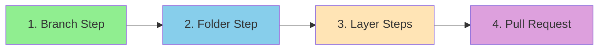
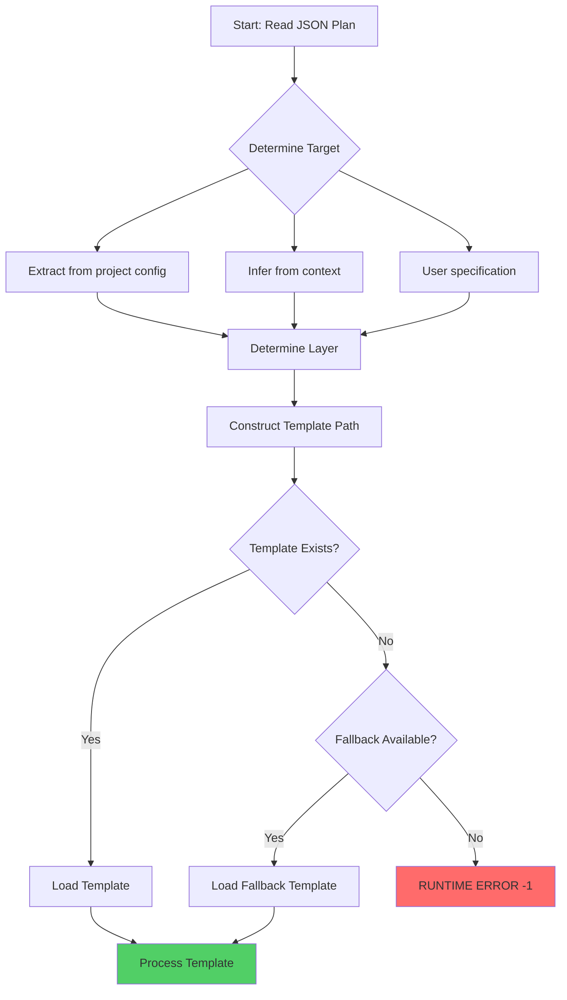
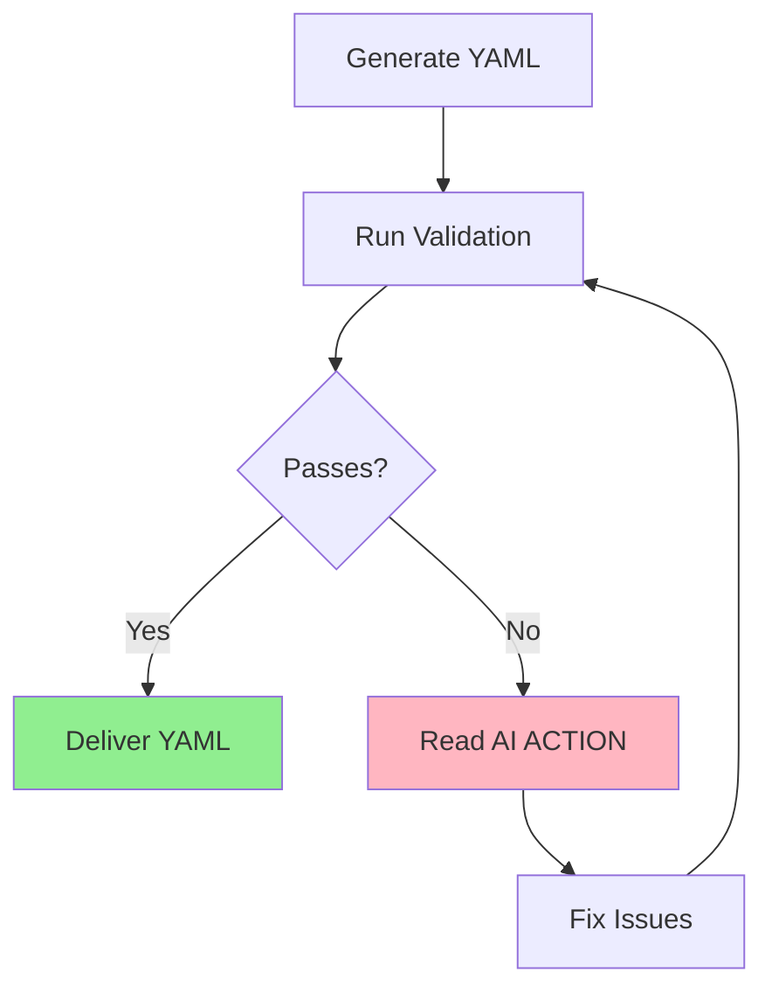
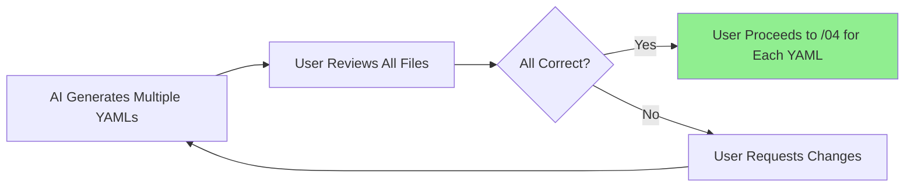

# Task: Generate Selected Layer Code

## 🤖 RLHF Scoring System

Your generated YAML will be scored from -2 to +2:

| Score | Level | Description | Common Causes |
|-------|-------|-------------|---------------|
| **+2** | PERFECT | Excellence achieved | Clean Architecture + DDD + ubiquitous language |
| **+1** | GOOD | Valid implementation | Missing DDD elements or ubiquitous language |
| **0** | LOW CONFIDENCE | Uncertain quality | Missing references, unclear concepts |
| **-1** | RUNTIME ERROR | Execution failure | Missing placeholders, lint failures |
| **-2** | CATASTROPHIC | Critical violation | Architecture violations, wrong REPLACE/WITH |

## 0. Input Processing

**CRITICAL**: Before proceeding with YAML generation, you must handle the input parameter correctly:

### Step 1: Determine Input Method

Check the command format to identify which input method is being used:

1. **If `--file` parameter is provided** (recommended):
   ```bash
   # Example: /03-generate-layer-code --layer=domain --file=spec/001-user-auth/domain/plan.json
   ```
   - **Action Required**: Use the Read tool to read the specified JSON file
   - **Example**: `Read("spec/001-user-auth/domain/plan.json")`
   - Parse the JSON content from the file
   - Proceed with YAML generation using the parsed JSON

2. **If inline JSON is provided** (legacy):
   ```bash
   # Example: /03-generate-layer-code create feature from json: {...}
   ```
   - Parse the JSON directly from the command arguments
   - Proceed with YAML generation

### Step 2: Validate File Exists (if using --file)

If `--file` parameter is used:
- Use Read tool to load the validated plan.json file
- If file doesn't exist, immediately return error message
- Suggest user to run validation first if file not found

### Step 3: Parse Validated JSON Plan

- Parse the JSON content (either from file or inline)
- Verify this is a validated plan from `/02-validate-layer-plan`
- If JSON parsing fails, return error and ask user to check the plan file

**Only after successfully loading and parsing the validated JSON should you proceed to section 1 (Your Deliverable) and beyond.**

## ⚠️ CRITICAL: Workflow Order

The generated YAML **MUST** follow this exact step order:



| Order | Step Type | Purpose | Required |
|-------|-----------|---------|----------|
| **FIRST** | `branch` | Creates feature branch | ✅ Mandatory |
| **SECOND** | `folder` | Creates layer structure | ✅ Mandatory |
| **MIDDLE** | `layer_steps` | Use cases, errors, test helpers | ✅ Variable count |
| **LAST** | `pull_request` | Creates PR to staging | ✅ Mandatory |

> 🚨 **WARNING**: Invalid step order will result in RUNTIME ERROR (-1)

## 1. Your Deliverable

Your output is **multiple modular YAML files** following Vertical Slice Architecture principles.

**Output Structure:**
```
./spec/__FEATURE_NUMBER__-__FEATURE_NAME__/__LAYER__/
├── shared-implementation.yaml              # Shared components (models, value objects, interfaces)
├── __USE_CASE_1__-implementation.yaml      # First use case slice
├── __USE_CASE_2__-implementation.yaml      # Second use case slice
└── ...                                     # One YAML per use case
```

**Naming Convention:**
| Component | Format | Example |
|-----------|--------|---------|
| FEATURE_NUMBER | Sequential 3-digit | 001, 002, 003 |
| FEATURE_NAME | kebab-case | product-catalog-management |
| USE_CASE_NAME | kebab-case | create-product, update-product |
| Shared Path | Combined | ./spec/001-product-catalog/__LAYER__/shared-implementation.yaml |
| Use Case Path | Combined | ./spec/001-product-catalog/__LAYER__/create-product-implementation.yaml |

## 1.1. YAML Separation Strategy 🎯

### Shared Components (`shared-implementation.yaml`)

Include in the shared YAML:
- **Domain Models**: Entities, Aggregates, Value Objects
- **Repository Interfaces**: Abstract data access contracts
- **Shared Domain Errors**: Base error classes, common domain errors
- **Domain Services**: Shared business logic (if any)

**Example shared-implementation.yaml structure:**
```yaml
steps:
  - type: branch
    name: create-feature-branch
    # ... branch configuration

  - type: folder
    name: create-shared-structure
    # ... folder configuration for shared components

  - type: create_file
    name: create-product-model
    # Product aggregate root

  - type: create_file
    name: create-sku-value-object
    # SKU value object

  - type: create_file
    name: create-product-repository-interface
    # Repository interface

  - type: create_file
    name: create-shared-domain-errors
    # Shared error classes

  - type: pull_request
    name: create-shared-components-pr
    # PR for shared components
```

### Use Case Slices (`__USE_CASE__-implementation.yaml`)

Include in each use case YAML:
- **Use Case Implementation**: The specific use case file
- **Use Case Errors**: Errors specific to this use case (if any)
- **Use Case Types**: Input/Output types specific to this use case

**Example create-product-implementation.yaml structure:**
```yaml
steps:
  - type: branch
    name: create-create-product-branch
    # ... branch configuration

  - type: folder
    name: create-create-product-structure
    # ... folder configuration for this use case

  - type: create_file
    name: create-create-product-use-case
    # CreateProduct use case implementation

  - type: create_file
    name: create-create-product-errors
    # CreateProduct-specific errors (if any)

  - type: pull_request
    name: create-create-product-pr
    # PR for CreateProduct use case
```

### Why This Matters

1. **Atomic Commits**: Each YAML generates one focused commit
2. **Parallel Execution**: Use cases can be implemented concurrently
3. **Better Reviews**: Small, focused PRs (50 lines vs 500 lines)
4. **Vertical Slices**: Each use case is self-contained and independently deployable

## 2. Prohibited Actions ❌

| Action | Status | Reason |
|--------|--------|--------|
| Execute validation_script commands | ❌ FORBIDDEN | You generate, not execute |
| Run `mkdir`, `yarn`, `git` commands | ❌ FORBIDDEN | Plan creation only |
| Create files other than YAML | ❌ FORBIDDEN | Single deliverable |
| Modify template rules | ❌ FORBIDDEN | Template is immutable |

> ⚠️ **Remember**: Your job is to **CREATE the plan**, not **EXECUTE the plan**

## 3. Source of Truth

| Component | Location | Purpose |
|-----------|----------|---------|
| **Template** | `.regent/templates/__TARGET__-__LAYER__-template.regent` | Master template (e.g., backend-domain-template.regent) |
| **Directives** | `# AI-NOTE:` comments | Must follow all |
| **Placeholders** | `__PLACEHOLDER__` variables | Must replace all |
| **Validation** | `.regent/config/validate-template.ts` | Must pass validation |

## 3.1 Template Resolution Strategy 🎯

### Multi-Target Clean Architecture Matrix

The Regent supports multiple targets and layers, creating a powerful matrix of architectural possibilities:

| Target | Layers | Template Example |
|--------|--------|------------------|
| **backend** | domain, data, infrastructure, presentation, main | `backend-domain-template.regent` |
| **frontend** | domain, data, infrastructure, presentation, main | `frontend-presentation-template.regent` |
| **fullstack** | All layers for both targets | `fullstack-domain-template.regent` |
| **mobile** | domain, data, infrastructure, presentation | `mobile-data-template.regent` |
| **api** | domain, data, infrastructure | `api-infrastructure-template.regent` |

### Template Discovery Algorithm



### Resolution Steps

1. **Target Determination**:
   ```
   Order of precedence:
   a) Explicit in command args: "target=backend"
   b) From project config: .regent/config/project.json
   c) From JSON plan metadata: plan.target field
   d) Inferred from context: CLI path suggests backend
   e) Default fallback: backend (most common)
   ```

2. **Layer Identification**:
   ```
   From JSON plan: plan.layer field (required)
   Valid values: domain | data | infrastructure | presentation | main
   ```

3. **Template Path Construction**:
   ```typescript
   const templatePath = `.regent/templates/${target}-${layer}-template.regent`;
   ```

4. **Validation Before Processing**:
   ```typescript
   if (!fs.existsSync(templatePath)) {
     // Check for fallback template
     const fallbackPath = `.regent/templates/generic-${layer}-template.regent`;
     if (!fs.existsSync(fallbackPath)) {
       throw new Error(`Template not found: ${templatePath}`);
       // Results in RLHF score: -1 (Runtime Error)
     }
   }
   ```

### RLHF Score Impact by Template Selection

| Scenario | Template Result | RLHF Score | Impact |
|----------|-----------------|------------|--------|
| Exact match found | `backend-domain-template.regent` | Path to +2 | Optimal generation |
| Fallback used | `generic-domain-template.regent` | Max +1 | Missing target optimizations |
| Wrong template | Using frontend template for backend | -2 | Architecture violation |
| Template missing | No template or fallback | -1 | Runtime error |

### Template Capabilities Matrix

Different templates have different capabilities based on their target:

| Template Type | Special Features | Use When |
|---------------|------------------|----------|
| **backend-*** | Prisma, Express, Node.js patterns | Building server-side features |
| **frontend-*** | React, Next.js, Component patterns | Building UI features |
| **fullstack-*** | Shared types, API contracts | Building end-to-end features |
| **mobile-*** | React Native, Expo patterns | Building mobile features |
| **api-*** | OpenAPI, GraphQL schemas | Building API-only features |

## 4. Input Parameters

### Required Input (Updated for Modular Generation):
```json
{
  "featureName": "string",
  "featureNumber": "string",  // e.g., "001", "002"
  "layer": "domain | data | infrastructure | presentation | main",  // Required
  "target": "backend | frontend | fullstack | mobile | api",  // Optional, defaults to backend
  "ubiquitousLanguage": {  // Optional but needed for +2 score
    "term": "definition"
  },
  "sharedComponents": {  // NEW: Identifies shared vs use-case-specific components
    "models": [...],           // Domain models, entities, aggregates
    "valueObjects": [...],     // Value objects
    "repositories": [...],     // Repository interfaces
    "sharedErrors": [...],     // Base error classes, common domain errors
    "services": [...]          // Domain services (optional)
  },
  "useCases": [...],  // Each use case gets its own YAML
  "errors": [...],    // Use case-specific errors
  "testHelpers": [...] // Optional test helpers
}
```

### Why `sharedComponents` is Critical

The `sharedComponents` object enables the command to separate:
- **Shared foundation** (models, value objects, interfaces) → `shared-implementation.yaml`
- **Use case implementations** (one per use case) → `__use-case__-implementation.yaml`

This separation is essential for:
1. **Atomic commits**: One commit per use case, not one massive commit
2. **Vertical slices**: Each use case is independently reviewable and deployable
3. **Parallel execution**: Multiple use cases can be implemented concurrently

### Optional Parameters:
| Parameter | Type | Purpose | When Used |
|-----------|------|---------|-----------|
| Current YAML State | YAML | Previous run output | Update iterations |
| Existing YAML | YAML | Pre-existing file | Update mode |

## 5. Generation Modes

### 📝 Create Mode (New Feature) - Multiple YAML Generation

<details>
<summary>Expand for Create Mode Steps</summary>

**CRITICAL: You MUST generate multiple YAML files, not a single monolithic file.**

#### Step 1: Analyze the Plan

Parse the validated `plan.json` to identify:
- **Shared Components**: Models, Value Objects, Repository Interfaces, Shared Errors
- **Use Cases**: Each use case with its specific implementation
- **Use Case Errors**: Errors specific to individual use cases

#### Step 2: Generate `shared-implementation.yaml`

1. **Initialize**: Use `.regent/templates/__TARGET__-__LAYER__-template.regent` as base
2. **Structure**:
   - Add `branch` step for shared components (e.g., `feat/001-product-catalog-shared`)
   - Add `folder` step for shared structure
   - Add `create_file` steps for each shared component:
     - Domain models (Entities, Aggregates)
     - Value Objects
     - Repository interfaces
     - Shared domain errors
   - Add `pull_request` step for shared components PR
3. **Populate Placeholders**: Replace all `__PLACEHOLDER__` with shared component data
4. **Add Ubiquitous Language**: Include domain vocabulary for +2 score

#### Step 3: Generate Per-Use-Case YAMLs

For each use case in the plan, generate `__use-case-name__-implementation.yaml`:

1. **Initialize**: Use the same template as base
2. **Structure**:
   - Add `branch` step for this use case (e.g., `feat/001-product-catalog-create-product`)
   - Add `folder` step for use case structure (if needed)
   - Add `create_file` step for the use case implementation
   - Add `create_file` steps for use-case-specific errors (if any)
   - Add `pull_request` step for this use case PR
3. **Populate Placeholders**: Replace all `__PLACEHOLDER__` with use case data
4. **Add Use Case Documentation**: JSDoc with `@layerConcept` tags

#### Step 4: Output All YAMLs

Output each YAML file using the Write tool:
- `./spec/__FEATURE_NUMBER__-__FEATURE_NAME__/__LAYER__/shared-implementation.yaml`
- `./spec/__FEATURE_NUMBER__-__FEATURE_NAME__/__LAYER__/__use-case-1__-implementation.yaml`
- `./spec/__FEATURE_NUMBER__-__FEATURE_NAME__/__LAYER__/__use-case-2__-implementation.yaml`
- ... (one per use case)

</details>

### 🔄 Update Mode (Existing YAML)

<details>
<summary>Expand for Update Mode Steps</summary>

1. **Initialize**: Load existing YAML content
2. **Apply Corrections**:
   - Find step corresponding to JSON useCase
   - Replace `__USE_CASE_INPUT_FIELDS__` with actual fields
   - Replace `__USE_CASE_OUTPUT_FIELDS__` with actual fields
   - Replace `__MOCK_INPUT_DATA__` with test data
   - Replace `__MOCK_OUTPUT_DATA__` with test data
3. **Preserve Immutable Sections**: Keep rules and documentation
4. **Maintain Step Order**: Ensure workflow order is preserved

</details>

## 6. Placeholder Replacement Guide

### Core Placeholders:

| Placeholder | Replace With | Example |
|-------------|--------------|---------|
| `__FEATURE_NAME_PASCAL_CASE__` | PascalCase feature | `UserRegistration` |
| `__FEATURE_NAME_KEBAB_CASE__` | kebab-case feature | `user-registration` |
| `__FEATURE_NAME_LOWER_CASE__` | lowercase feature | `user registration` |
| `__CURRENT_DATE__` | Today's date | `2024-01-15` |

### Use Case Placeholders:

| Placeholder | Replace With | Format |
|-------------|--------------|--------|
| `__USE_CASE_INPUT_FIELDS__` | Input field definitions | `email: string;`<br>`password: string;` |
| `__USE_CASE_OUTPUT_FIELDS__` | Output field definitions | `id: string;`<br>`createdAt: Date;` |
| `__MOCK_INPUT_DATA__` | Test input values | `email: 'test@example.com',`<br>`password: 'secure123'` |
| `__MOCK_OUTPUT_DATA__` | Test output values | `id: 'user-123',`<br>`createdAt: new Date()` |

## 7. Quality Guidelines for RLHF +2

### 🏆 To Achieve PERFECT Score (+2):

| Requirement | Implementation | Example |
|-------------|----------------|---------|
| **Ubiquitous Language** | Include in JSON and YAML | `"Registration": "Process of creating account"` |
| **JSDoc Comments** | Add layer concepts | `@layerConcept User Registration` |
| **DDD Terminology** | Use proper terms | Entity, Value Object, Aggregate |
| **Clean Architecture** | No external deps | No axios, prisma, express imports |
| **Meaningful Errors** | Business context | `UserAlreadyExistsError` not `Error409` |
| **Comprehensive Mocks** | Realistic test data | Full user objects, not just `{id: 1}` |

### ⚠️ Common Mistakes by Score:

| Score | Mistake Type | Examples | How to Fix |
|-------|--------------|----------|------------|
| **-2** | Critical violations | Wrong REPLACE/WITH format<br>External library imports | Follow template exactly<br>Keep layer pure |
| **-1** | Runtime issues | Missing placeholders<br>Failed lint/tests | Validate all replacements<br>Check syntax |
| **0** | Low quality | No pattern references<br>Missing context | Add references array<br>Include descriptions |
| **+1** | Good but generic | Valid but no ubiquitous language | Add layer vocabulary |
| **+2** | Perfect | All requirements met | Maintain excellence |

## 8. Validation Process

### Mandatory Validation Steps:

```bash
npx tsx .regent/config/validate-template.ts .regent/templates/__TARGET__-__LAYER__-template.regent <generated-yaml-path>
```

### Self-Correction Loop:



### Validation Checks:

| Check | Purpose | Impact if Failed |
|-------|---------|------------------|
| Step Order | Verify workflow sequence | -1 (Runtime Error) |
| Placeholders | All replaced correctly | -1 (Runtime Error) |
| References | Pattern documentation | 0 (Low Confidence) |
| Layer Purity | No external deps | -2 (Catastrophic) |
| Ubiquitous Language | Layer vocabulary | Limits to +1 max |

## 9. Example Invocations

### Example 1: Create Mode (Multiple Use Cases)

<details>
<summary>📝 Create Mode Example - Product Catalog</summary>

**Command:**
```bash
/03-generate-layer-code --layer=domain --file=spec/001-product-catalog/domain/plan.json
```

**Input JSON (plan.json):**
```json
{
  "featureName": "ProductCatalogManagement",
  "featureNumber": "001",
  "layer": "domain",
  "target": "backend",
  "ubiquitousLanguage": {
    "Product": "An item available for sale in the catalog",
    "SKU": "Stock Keeping Unit - unique identifier for products",
    "Inventory": "Stock levels for each product"
  },
  "sharedComponents": {
    "models": [
      { "name": "Product", "type": "AggregateRoot" }
    ],
    "valueObjects": [
      { "name": "SKU" },
      { "name": "Price" },
      { "name": "InventoryLevel" }
    ],
    "repositories": [
      { "name": "ProductRepository" }
    ],
    "sharedErrors": [
      "ProductNotFoundError",
      "InvalidSKUError",
      "InvalidPriceError"
    ]
  },
  "useCases": [
    {
      "name": "CreateProduct",
      "input": [
        { "name": "sku", "type": "string" },
        { "name": "name", "type": "string" },
        { "name": "price", "type": "number" }
      ],
      "output": [
        { "name": "id", "type": "string" },
        { "name": "sku", "type": "string" }
      ]
    },
    {
      "name": "UpdateProduct",
      "input": [
        { "name": "id", "type": "string" },
        { "name": "price", "type": "number" }
      ],
      "output": [
        { "name": "id", "type": "string" },
        { "name": "updated", "type": "boolean" }
      ]
    },
    {
      "name": "ArchiveProduct",
      "input": [
        { "name": "id", "type": "string" }
      ],
      "output": [
        { "name": "archived", "type": "boolean" }
      ]
    },
    {
      "name": "SearchProducts",
      "input": [
        { "name": "query", "type": "string" }
      ],
      "output": [
        { "name": "products", "type": "Product[]" }
      ]
    },
    {
      "name": "ManageInventory",
      "input": [
        { "name": "sku", "type": "string" },
        { "name": "quantity", "type": "number" }
      ],
      "output": [
        { "name": "inventoryLevel", "type": "number" }
      ]
    }
  ]
}
```

**Expected Output - 6 YAML Files:**

1. `spec/001-product-catalog/domain/shared-implementation.yaml` (shared components)
2. `spec/001-product-catalog/domain/create-product-implementation.yaml`
3. `spec/001-product-catalog/domain/update-product-implementation.yaml`
4. `spec/001-product-catalog/domain/archive-product-implementation.yaml`
5. `spec/001-product-catalog/domain/search-products-implementation.yaml`
6. `spec/001-product-catalog/domain/manage-inventory-implementation.yaml`

**Benefits:**
- ✅ Each use case can be reviewed independently (small PRs)
- ✅ Shared components are established first
- ✅ Use cases can be executed in parallel by /06-execute
- ✅ Atomic, focused commits per use case

</details>

### Example 2: Update Mode (Existing YAML)

<details>
<summary>🔄 Update Mode Example</summary>

**Command:**
```bash
/03-generate-layer-code update yaml:
```

**With existing YAML containing placeholders and new JSON data to populate them**

</details>

## 10. User Workflow

After you generate the multiple YAMLs:



### Execution Order Recommendation

1. **First**: Execute `shared-implementation.yaml` to establish foundation
2. **Then**: Execute use case YAMLs in parallel or sequentially as needed

## 📍 Next Step

After generating your multiple YAML files, you have two options:

### Option 1: Reflect on Each YAML (Recommended for Quality)

```bash
/04-reflect-layer-lessons from yaml: spec/001-product-catalog/domain/shared-implementation.yaml
/04-reflect-layer-lessons from yaml: spec/001-product-catalog/domain/create-product-implementation.yaml
# ... repeat for each use case YAML
```

### Option 2: Proceed Directly to Execution

```bash
/06-execute-layer-steps spec/001-product-catalog/domain/shared-implementation.yaml
# After shared components are created, execute use cases (in parallel if desired)
/06-execute-layer-steps spec/001-product-catalog/domain/create-product-implementation.yaml
/06-execute-layer-steps spec/001-product-catalog/domain/update-product-implementation.yaml
# ... etc
```

This modular approach enables:
- ✅ **Parallel execution** of independent use cases
- ✅ **Atomic commits** with clear, focused changes
- ✅ **Better code reviews** with small, manageable PRs
- ✅ **Vertical slice architecture** where each use case is self-contained

> 💡 **Pro Tip**: Always validate your YAML before delivery. A validated YAML with ubiquitous language and proper layer documentation achieves the coveted +2 RLHF score!
---

## 🚨 AI-NOTE: CRITICAL ENGINEERING PRINCIPLE

**FOR FUTURE CODE REVIEWERS AND EXECUTORS:**

### ❌ NEVER SUGGEST FALLBACK PATTERNS

If file reading fails or template processing fails, DO NOT suggest:
- Hardcoded fallback structures
- "If this fails, use default values"
- "Graceful degradation to previous behavior"
- Any form of "backup" structure

### ✅ CORRECT RESPONSE TO FAILURES

File reading or generation failures should FAIL LOUDLY:
```markdown
🚨 CRITICAL ERROR: Cannot read validated plan or generate YAML!
Action required: Check file path or ensure validation was completed.
DO NOT proceed with outdated assumptions or partial generation.
```

### 🎯 WHY THIS MATTERS

Fallbacks reintroduce the exact problem this command fixes:
1. **Original Problem**: Commands generated code without validation, bad architecture shipped
2. **Our Solution**: Generate only from validated plans
3. **Fallback Danger**: If generation fails, fallback = unvalidated code = SAME PROBLEM

### 📚 ENGINEERING PRINCIPLE

**"Fail fast and loud" > "Fail silently with wrong behavior"**

Validated plans are the ONLY source for generation. If they can't be read or processed correctly, the system must stop and demand intervention, not continue with potentially incorrect assumptions.

### 🎭 HISTORICAL CONTEXT

This generation command was created to fix architectural disasters caused by "helpful" generation from unvalidated or partial plans. Maintain discipline: Only generate from fully validated plans.

---

## 🔨 CRITICAL ARCHITECTURAL CHANGE (Issue #117)

### From Monolithic to Modular YAML Generation

**Previous Behavior (WRONG):**
- Generated **1 monolithic YAML** with all use cases mixed together
- 19 steps in a single file for 5 use cases
- Resulted in massive commits, difficult reviews, sequential execution

**Current Behavior (CORRECT):**
- Generates **N+1 modular YAMLs** (1 shared + 1 per use case)
- Each YAML is focused and atomic
- Enables vertical slice architecture, parallel execution, and better reviews

### Example from Issue #117

For a CRUD feature with 5 use cases:

**❌ Old Output:**
```
spec/001-product-catalog/domain/implementation.yaml (19 steps - all mixed)
```

**✅ New Output:**
```
spec/001-product-catalog/domain/
├── shared-implementation.yaml          # Shared domain foundation
├── create-product-implementation.yaml  # CreateProduct use case
├── update-product-implementation.yaml  # UpdateProduct use case
├── archive-product-implementation.yaml # ArchiveProduct use case
├── search-products-implementation.yaml # SearchProducts use case
└── manage-inventory-implementation.yaml # ManageInventory use case
```

### Why This Change is P0 (Critical)

1. **Atomic Commits**: Each use case → one focused commit
2. **Vertical Slice Architecture**: Each use case is self-contained
3. **Parallel Execution**: `/06-execute` can run use cases concurrently
4. **Review Quality**: Small PRs (50 lines) vs massive PRs (500+ lines)
5. **Team Velocity**: Multiple developers can work on different use cases simultaneously

### Migration Note

This change is **BREAKING** for any scripts or workflows that expect a single `implementation.yaml` file. Update downstream commands (`/04`, `/06`, etc.) to handle multiple YAML files.

**Reference**: [Issue #117 - Separate implementation.yml per use case](https://github.com/your-repo/issues/117)
