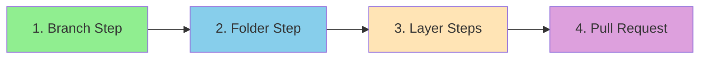
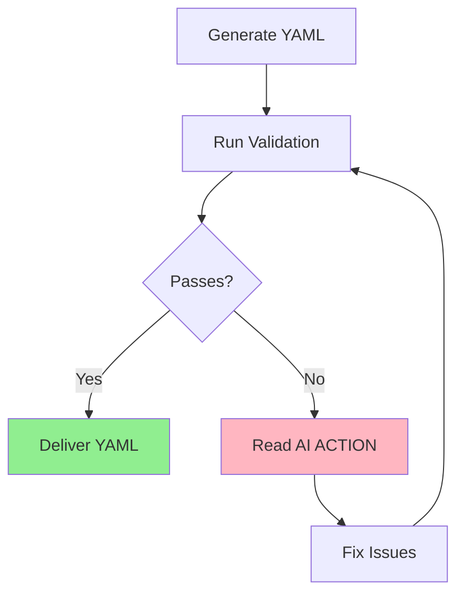
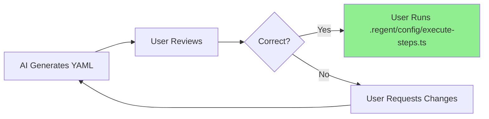

# Task: Generate Selected Layer Code

## 🤖 RLHF Scoring System

Your generated YAML will be scored from -2 to +2:

| Score | Level | Description | Common Causes |
|-------|-------|-------------|---------------|
| **+2** | PERFECT | Excellence achieved | Clean Architecture + DDD + ubiquitous language |
| **+1** | GOOD | Valid implementation | Missing DDD elements or ubiquitous language |
| **0** | LOW CONFIDENCE | Uncertain quality | Missing references, unclear concepts |
| **-1** | RUNTIME ERROR | Execution failure | Missing placeholders, lint failures |
| **-2** | CATASTROPHIC | Critical violation | Architecture violations, wrong REPLACE/WITH |

## ⚠️ CRITICAL: Workflow Order

The generated YAML **MUST** follow this exact step order:



| Order | Step Type | Purpose | Required |
|-------|-----------|---------|----------|
| **FIRST** | `branch` | Creates feature branch | ✅ Mandatory |
| **SECOND** | `folder` | Creates layer structure | ✅ Mandatory |
| **MIDDLE** | `layer_steps` | Use cases, errors, test helpers | ✅ Variable count |
| **LAST** | `pull_request` | Creates PR to staging | ✅ Mandatory |

> 🚨 **WARNING**: Invalid step order will result in RUNTIME ERROR (-1)

## 1. Your Deliverable

Your **only** output is a complete and valid YAML file content.

**Output Location:**
```
spec/[FEATURE_NUMBER]-[FEATURE_NAME]/[LAYER]/implementation.yaml
```

**Naming Convention:**
| Component | Format | Example |
|-----------|--------|---------|
| FEATURE_NUMBER | Sequential 3-digit | 001, 002, 003 |
| FEATURE_NAME | kebab-case | user-registration |
| Full Path | Combined | spec/001-user-registration/[LAYER]/implementation.yaml |

## 2. Prohibited Actions ❌

| Action | Status | Reason |
|--------|--------|--------|
| Execute validation_script commands | ❌ FORBIDDEN | You generate, not execute |
| Run `mkdir`, `yarn`, `git` commands | ❌ FORBIDDEN | Plan creation only |
| Create files other than YAML | ❌ FORBIDDEN | Single deliverable |
| Modify template rules | ❌ FORBIDDEN | Template is immutable |

> ⚠️ **Remember**: Your job is to **CREATE the plan**, not **EXECUTE the plan**

## 3. Source of Truth

| Component | Location | Purpose |
|-----------|----------|---------|
| **Template** | `.regent/templates/[LAYER]_TEMPLATE.yaml` | Master template |
| **Directives** | `# AI-NOTE:` comments | Must follow all |
| **Placeholders** | `__PLACEHOLDER__` variables | Must replace all |
| **Validation** | `validate-implementation.ts` | Must pass validation |

## 4. Input Parameters

### Required Input:
```json
{
  "featureName": "string",
  "ubiquitousLanguage": {  // Optional but needed for +2 score
    "term": "definition"
  },
  "useCases": [...],
  "errors": [...],
  "testHelpers": [...]
}
```

### Optional Parameters:
| Parameter | Type | Purpose | When Used |
|-----------|------|---------|-----------|
| Current YAML State | YAML | Previous run output | Update iterations |
| Existing YAML | YAML | Pre-existing file | Update mode |

## 5. Generation Modes

### 📝 Create Mode (New Feature)

<details>
<summary>Expand for Create Mode Steps</summary>

1. **Initialize**: Copy `.regent/templates/[LAYER]_TEMPLATE.yaml` verbatim
2. **Generate Steps**:
   - Keep `create-feature-branch` as FIRST step
   - Keep `create-structure` as SECOND step
   - For each Use Case/Error in JSON, replicate template blocks
   - Keep `create-pull-request` as LAST step
3. **Populate Placeholders**: Replace all `__PLACEHOLDER__` with JSON data
4. **Add Ubiquitous Language** (if provided) for +2 score
5. **Add Layer Documentation**: JSDoc with `@layerConcept` tags

</details>

### 🔄 Update Mode (Existing YAML)

<details>
<summary>Expand for Update Mode Steps</summary>

1. **Initialize**: Load existing YAML content
2. **Apply Corrections**:
   - Find step corresponding to JSON useCase
   - Replace `__USE_CASE_INPUT_FIELDS__` with actual fields
   - Replace `__USE_CASE_OUTPUT_FIELDS__` with actual fields
   - Replace `__MOCK_INPUT_DATA__` with test data
   - Replace `__MOCK_OUTPUT_DATA__` with test data
3. **Preserve Immutable Sections**: Keep rules and documentation
4. **Maintain Step Order**: Ensure workflow order is preserved

</details>

## 6. Placeholder Replacement Guide

### Core Placeholders:

| Placeholder | Replace With | Example |
|-------------|--------------|---------|
| `__FEATURE_NAME_PASCAL_CASE__` | PascalCase feature | `UserRegistration` |
| `__FEATURE_NAME_KEBAB_CASE__` | kebab-case feature | `user-registration` |
| `__FEATURE_NAME_LOWER_CASE__` | lowercase feature | `user registration` |
| `__CURRENT_DATE__` | Today's date | `2024-01-15` |

### Use Case Placeholders:

| Placeholder | Replace With | Format |
|-------------|--------------|--------|
| `__USE_CASE_INPUT_FIELDS__` | Input field definitions | `email: string;`<br>`password: string;` |
| `__USE_CASE_OUTPUT_FIELDS__` | Output field definitions | `id: string;`<br>`createdAt: Date;` |
| `__MOCK_INPUT_DATA__` | Test input values | `email: 'test@example.com',`<br>`password: 'secure123'` |
| `__MOCK_OUTPUT_DATA__` | Test output values | `id: 'user-123',`<br>`createdAt: new Date()` |

## 7. Quality Guidelines for RLHF +2

### 🏆 To Achieve PERFECT Score (+2):

| Requirement | Implementation | Example |
|-------------|----------------|---------|
| **Ubiquitous Language** | Include in JSON and YAML | `"Registration": "Process of creating account"` |
| **JSDoc Comments** | Add layer concepts | `@layerConcept User Registration` |
| **DDD Terminology** | Use proper terms | Entity, Value Object, Aggregate |
| **Clean Architecture** | No external deps | No axios, prisma, express imports |
| **Meaningful Errors** | Business context | `UserAlreadyExistsError` not `Error409` |
| **Comprehensive Mocks** | Realistic test data | Full user objects, not just `{id: 1}` |

### ⚠️ Common Mistakes by Score:

| Score | Mistake Type | Examples | How to Fix |
|-------|--------------|----------|------------|
| **-2** | Critical violations | Wrong REPLACE/WITH format<br>External library imports | Follow template exactly<br>Keep layer pure |
| **-1** | Runtime issues | Missing placeholders<br>Failed lint/tests | Validate all replacements<br>Check syntax |
| **0** | Low quality | No pattern references<br>Missing context | Add references array<br>Include descriptions |
| **+1** | Good but generic | Valid but no ubiquitous language | Add layer vocabulary |
| **+2** | Perfect | All requirements met | Maintain excellence |

## 8. Validation Process

### Mandatory Validation Steps:

```bash
npx tsx .regent/config/validate-template.ts .regent/templates/[LAYER]_TEMPLATE.yaml <generated-yaml-path>
```

### Self-Correction Loop:



### Validation Checks:

| Check | Purpose | Impact if Failed |
|-------|---------|------------------|
| Step Order | Verify workflow sequence | -1 (Runtime Error) |
| Placeholders | All replaced correctly | -1 (Runtime Error) |
| References | Pattern documentation | 0 (Low Confidence) |
| Layer Purity | No external deps | -2 (Catastrophic) |
| Ubiquitous Language | Layer vocabulary | Limits to +1 max |

## 9. Example Invocations

### Example 1: Create Mode (New Feature)

<details>
<summary>📝 Create Mode Example</summary>

**Command:**
```bash
/03-generate-layer-code create feature from json:
```

**Input JSON:**
```json
{
  "featureName": "UserRegistration",
  "ubiquitousLanguage": {
    "Registration": "The process of creating a new user account",
    "WelcomeEmail": "Initial email sent after successful registration"
  },
  "useCases": [
    {
      "name": "RegisterUser",
      "input": [
        { "name": "email", "type": "string" },
        { "name": "password", "type": "string" }
      ],
      "output": [
        { "name": "id", "type": "string" },
        { "name": "email", "type": "string" }
      ]
    }
  ]
}
```

**Expected Output:** Complete YAML with all placeholders replaced
</details>

### Example 2: Update Mode (Existing YAML)

<details>
<summary>🔄 Update Mode Example</summary>

**Command:**
```bash
/03-generate-layer-code update yaml:
```

**With existing YAML containing placeholders and new JSON data to populate them**

</details>

## 10. User Workflow

After you generate the YAML:



## 📍 Next Step

After generating your YAML plan, proceed to architectural reflection:

```bash
/04-reflect-layer-lessons from yaml: <your-generated-yaml>
```

This will refine your YAML plan using Clean Architecture principles and DDD patterns to optimize for RLHF score.

> 💡 **Pro Tip**: Always validate your YAML before delivery. A validated YAML with ubiquitous language and proper layer documentation achieves the coveted +2 RLHF score!