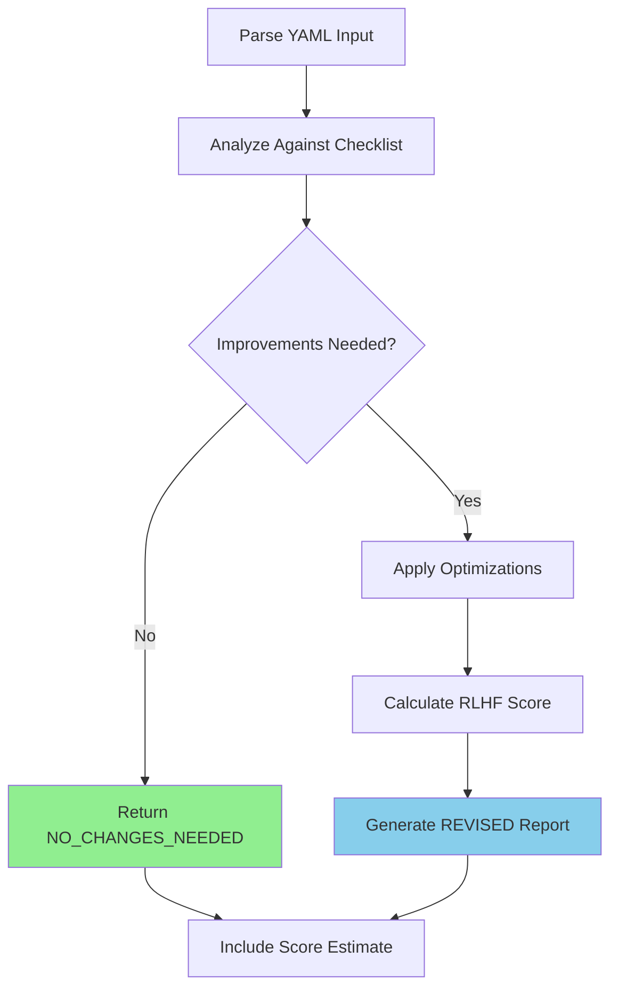

# Task: Reflect on Domain YAML Plan

## 🤖 RLHF Scoring Optimization

During reflection, optimize the plan for the highest RLHF score:

| Current Score | Target Score | Optimization Actions |
|--------------|--------------|---------------------|
| **-2 to 0** | **+1 to +2** | Fix violations, add references, document patterns |
| **+1** | **+2** | Add ubiquitous language, JSDoc tags, DDD patterns |
| **+2** | **+2** | Maintain excellence, ensure consistency |

## 1. Your Deliverable

Your output is a JSON object containing your reflections and optimization status.

### ✅ No Changes Needed:
```json
{
  "status": "NO_CHANGES_NEEDED",
  "reflection": "The plan is optimal and requires no changes.",
  "revised_yaml": null,
  "estimated_rlhf_score": 2
}
```

### 🔄 Revised Plan:
```json
{
  "status": "REVISED",
  "reflection": "Description of improvements made...",
  "revised_yaml": "Complete revised YAML content...",
  "estimated_rlhf_score": 2
}
```

## 2. Objective

Act as a **senior software architect** reviewing a detailed implementation plan. Your mission:

- **Analyze** for logical consistency, simplicity, and efficiency
- **Optimize** for maximum RLHF score (target: +2)
- **Refine** the plan without executing it
- **Document** improvements with clear reasoning

## 3. Input Parameters

| Parameter | Type | Location | Purpose |
|-----------|------|----------|---------|
| **YAML Plan** | YAML | `spec/[FEATURE_NUMBER]-[FEATURE_NAME]/domain/implementation.yaml` | Complete validated plan from /03-generate-domain-code |

## 4. Reflection Checklist (Guiding Questions)

### 🔄 Workflow Integrity

| Check | Question | Impact on Score |
|-------|----------|-----------------|
| **Branch Step** | Does plan start with `branch` type? | -1 if missing |
| **PR Step** | Does plan end with `pull_request` type? | -1 if missing |
| **Branch Naming** | Follows `feat/[feature-name]-domain`? | Style issue |
| **Target Branch** | PR targets correct branch (staging)? | Configuration issue |

### 💡 Simplicity (KISS Principle)

| Check | Question | Action if Violated |
|-------|----------|-------------------|
| **Step Count** | Can we achieve same with fewer steps? | Combine related steps |
| **Complexity** | Is any step doing too much? | Split or simplify |
| **Redundancy** | Multiple refactors on same file? | Consolidate changes |

### 🔗 Cohesion and Logic

| Check | Question | Risk if Wrong |
|-------|----------|---------------|
| **Dependencies** | Are files modified before creation? | Runtime error |
| **Step Order** | Does sequence make logical sense? | Execution failure |
| **Descriptions** | Are IDs and descriptions clear? | Maintenance issue |

### ✅ Completeness

| Check | Question | RLHF Impact |
|-------|----------|-------------|
| **Test Helpers** | Every use case has test helper? | -1 point |
| **Error Classes** | All errors defined? | Missing coverage |
| **Refactor Scope** | All consumers updated? | Breaking changes |
| **Cleanup** | Delete steps for failed artifacts? | Residual files |

### ⚡ Efficiency

| Check | Question | Optimization |
|-------|----------|--------------|
| **Redundant Steps** | Create then immediately refactor? | Single create step |
| **Commit Granularity** | Too many small commits? | Combine atomic units |
| **File Operations** | Multiple edits to same file? | Single refactor step |

### 📚 Ubiquitous Language Consistency (+2 Requirement)

| Check | Requirement | Score Impact |
|-------|-------------|--------------|
| **Defined** | `ubiquitousLanguage` object present? | Limits to +1 |
| **Consistent** | Terms used throughout plan? | Quality indicator |
| **Documentation** | JSDoc uses domain vocabulary? | +2 requirement |
| **Commit Messages** | Use domain terms? | Professional quality |

### 🏛️ Clean Architecture Compliance (-2 Prevention)

| Check | Violation | Score Impact |
|-------|-----------|--------------|
| **External Deps** | axios, fetch, prisma in domain? | -2 CATASTROPHIC |
| **REPLACE/WITH** | Incorrect format in refactors? | -2 CATASTROPHIC |
| **Use Case Pattern** | Classes instead of interfaces? | -2 CATASTROPHIC |
| **Domain Purity** | Implementation in domain? | -2 CATASTROPHIC |

### 📖 Domain Documentation Quality (+1 to +2)

| Documentation | Requirement | Score Boost |
|---------------|-------------|-------------|
| **@domainConcept** | Present in templates? | +0.5 to +1 |
| **@pattern tags** | Design patterns identified? | +0.5 |
| **Business Context** | Clear domain explanation? | +0.5 |
| **Error Messages** | Use business language? | Quality indicator |

## 5. Step-by-Step Execution Plan



### Execution Steps:

1. **Parse Input**: Load YAML plan into memory
2. **Analyze & Reflect**: Evaluate against all checklist categories
3. **Decide on Action**:
   - **Optimal**: No changes needed
   - **Improvable**: Create revised version
4. **Calculate RLHF Score**: Estimate based on quality indicators
5. **Generate Report**: Produce appropriate JSON output

## 6. Example Reflections

### Example 1: 🔧 Inefficient Steps

<details>
<summary>Input YAML with Inefficiency</summary>

```yaml
steps:
  - id: "create-feature-branch"
    type: "branch"
    # ...
  - id: "create-user-service"
    type: "create_file"
    # ...
  - id: "add-logging-to-user-service"
    type: "refactor_file"
    path: "same/file/as/above.ts"
    # Immediately refactoring just-created file
```
</details>

**Output:**
```json
{
  "status": "REVISED",
  "reflection": "Optimized by combining create and immediate refactor into single step. Added @domainConcept tags for +2 score. Workflow integrity maintained.",
  "revised_yaml": "Combined create-user-service-with-logging step...",
  "estimated_rlhf_score": 2
}
```

### Example 2: 🚨 Missing PR Step

<details>
<summary>Input YAML Missing PR</summary>

```yaml
steps:
  - id: "create-feature-branch"
    type: "branch"
  # ... other steps
  # Missing pull_request step at end
```
</details>

**Output:**
```json
{
  "status": "REVISED",
  "reflection": "Added missing pull_request step for complete workflow. Essential for Git flow completion.",
  "revised_yaml": "Added PR step targeting staging branch...",
  "estimated_rlhf_score": 1.5
}
```

### Example 3: ⛔ Architecture Violation

<details>
<summary>Input with External Dependency</summary>

```yaml
steps:
  - id: "create-fetch-user"
    template: |
      import axios from 'axios';  // VIOLATION!
      export interface FetchUser {
        execute(...): Promise<...>;
      }
```
</details>

**Output:**
```json
{
  "status": "REVISED",
  "reflection": "CRITICAL: Removed axios import (would cause -2 CATASTROPHIC). Added proper domain documentation for +2 score.",
  "revised_yaml": "Clean template with @domainConcept tags...",
  "estimated_rlhf_score": 2
}
```

## 7. Optimization Patterns

### 🎯 Common Improvements for +2 Score:

| Pattern | Before | After | Impact |
|---------|--------|-------|--------|
| **Add JSDoc** | Plain interface | `/** @domainConcept */` | +0.5 to +1 |
| **Combine Steps** | Create + Refactor | Single create | Efficiency |
| **Fix Violations** | External imports | Pure domain | Prevents -2 |
| **Add UL** | No vocabulary | Define terms | Enables +2 |
| **Document Patterns** | No tags | `@pattern Command` | +0.5 |

### ⚠️ Critical Fixes to Prevent Negative Scores:

| Issue | Detection | Fix | Score Saved |
|-------|-----------|-----|-------------|
| **axios/fetch** | Import statements | Remove completely | +2 points |
| **Wrong REPLACE** | Malformed blocks | Fix syntax | +2 points |
| **Class Use Cases** | `class` keyword | Change to `interface` | +2 points |
| **Missing Steps** | No branch/PR | Add workflow steps | +1 point |

## 8. RLHF Score Estimation Guide

| Score | Requirements | Indicators |
|-------|-------------|------------|
| **2.0** | Perfect | UL + JSDoc + Clean + Complete workflow |
| **1.5** | Very Good | Most requirements, minor gaps |
| **1.0** | Good | Valid but missing documentation |
| **0.5** | Fair | Some issues, missing references |
| **0.0** | Poor | Multiple issues, unclear |
| **-1.0** | Failed | Runtime errors expected |
| **-2.0** | Catastrophic | Architecture violations |

## 📍 Next Step

After reflection and optimization:

```bash
/05-evaluate-domain-results from yaml: <your-refined-yaml>
```

This will evaluate your refined YAML plan and determine if it's ready for execution or needs further refinement.

> 💡 **Pro Tip**: Focus on fixing violations first (-2 prevention), then optimize for excellence (+2 achievement). A well-reflected plan with proper documentation and architecture compliance achieves the maximum RLHF score!