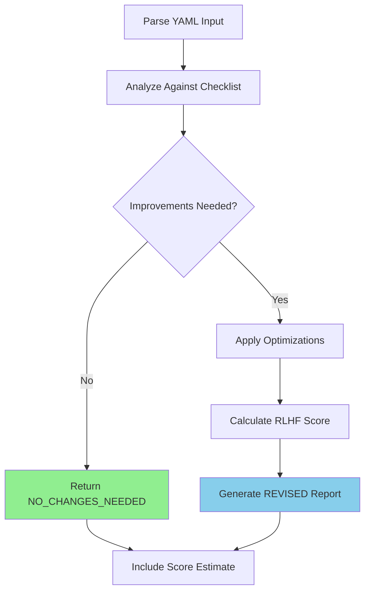

# Task: Reflect on Layer YAML Plan

## 🎯 Working with Multiple YAMLs (Issue #144)

Since `/03-generate-layer-code` now generates **multiple YAML files** (shared + per use case), you need to run this command **once for each YAML file**:

### Execution Pattern

```bash
# Reflect on shared components first
/04-reflect-layer-lessons from yaml: spec/001-product-catalog/domain/shared-implementation.yaml

# Then reflect on each use case YAML
/04-reflect-layer-lessons from yaml: spec/001-product-catalog/domain/create-product-implementation.yaml
/04-reflect-layer-lessons from yaml: spec/001-product-catalog/domain/update-product-implementation.yaml
```

### Recommended Order

1. **Shared YAML first** - Review foundation components
2. **Use case YAMLs next** - Review in dependency order
3. **Update YAMLs last** - Review modifications after base implementation

### Example Workflow

```bash
# Feature with shared components + 2 use cases
cd your-project/

# Step 1: Reflect on shared
/04-reflect-layer-lessons from yaml: spec/001-auth/domain/shared-implementation.yaml

# Step 2: Reflect on login use case
/04-reflect-layer-lessons from yaml: spec/001-auth/domain/login-implementation.yaml

# Step 3: Reflect on register use case
/04-reflect-layer-lessons from yaml: spec/001-auth/domain/register-implementation.yaml
```

### Batch Processing (Optional)

For convenience, you can iterate over all YAMLs in a directory:

```bash
# Reflect on all domain YAMLs in a feature
for yaml in spec/001-product-catalog/domain/*.yaml; do
  /04-reflect-layer-lessons from yaml: $yaml
done
```

**Note**: Each YAML is reflected independently. Ensure shared components are reflected and approved before use cases.

---

## 🤖 RLHF Scoring Optimization

During reflection, optimize the plan for the highest RLHF score:

| Current Score | Target Score | Optimization Actions |
|--------------|--------------|---------------------|
| **-2 to 0** | **+1 to +2** | Fix violations, add references, document patterns |
| **+1** | **+2** | Add ubiquitous language, JSDoc tags, DDD patterns |
| **+2** | **+2** | Maintain excellence, ensure consistency |

## 1. Your Deliverable

Your output is a JSON object containing your reflections and optimization status.

### ✅ No Changes Needed:
```json
{
  "status": "NO_CHANGES_NEEDED",
  "reflection": "The plan is optimal and requires no changes.",
  "revised_yaml": null,
  "estimated_rlhf_score": 2
}
```

### 🔄 Revised Plan:
```json
{
  "status": "REVISED",
  "reflection": "Description of improvements made...",
  "revised_yaml": "Complete revised YAML content...",
  "estimated_rlhf_score": 2
}
```

## 2. Objective

Act as a **senior software architect** reviewing a detailed implementation plan. Your mission:

- **Analyze** for logical consistency, simplicity, and efficiency
- **Optimize** for maximum RLHF score (target: +2)
- **Refine** the plan without executing it
- **Document** improvements with clear reasoning

## 3. Input Parameters

| Parameter | Type | Location | Purpose |
|-----------|------|----------|---------|
| **YAML Plan** | YAML | `./spec/__FEATURE_NUMBER__-__FEATURE_NAME__/__LAYER__/implementation.yaml` | Complete validated plan from /03-generate-layer-code |

## 4. Reflection Checklist (Guiding Questions)

### 🔄 Workflow Integrity

| Check | Question | Impact on Score |
|-------|----------|-----------------|
| **Branch Step** | Does plan start with `branch` type? | -1 if missing |
| **PR Step** | Does plan end with `pull_request` type? | -1 if missing |
| **Branch Naming** | Follows `feat/[feature-name]-[layer]`? | Style issue |
| **Target Branch** | PR targets correct branch (staging)? | Configuration issue |

### 💡 Simplicity (KISS Principle)

| Check | Question | Action if Violated |
|-------|----------|-------------------|
| **Step Count** | Can we achieve same with fewer steps? | Combine related steps |
| **Complexity** | Is any step doing too much? | Split or simplify |
| **Redundancy** | Multiple refactors on same file? | Consolidate changes |

### 🔗 Cohesion and Logic

| Check | Question | Risk if Wrong |
|-------|----------|---------------|
| **Dependencies** | Are files modified before creation? | Runtime error |
| **Step Order** | Does sequence make logical sense? | Execution failure |
| **Descriptions** | Are IDs and descriptions clear? | Maintenance issue |

### ✅ Completeness

| Check | Question | RLHF Impact |
|-------|----------|-------------|
| **Test Helpers** | Every use case has test helper? | -1 point |
| **Error Classes** | All errors defined? | Missing coverage |
| **Refactor Scope** | All consumers updated? | Breaking changes |
| **Cleanup** | Delete steps for failed artifacts? | Residual files |

### ⚡ Efficiency

| Check | Question | Optimization |
|-------|----------|--------------|
| **Redundant Steps** | Create then immediately refactor? | Single create step |
| **Commit Granularity** | Too many small commits? | Combine atomic units |
| **File Operations** | Multiple edits to same file? | Single refactor step |

### 📚 Ubiquitous Language Consistency (+2 Requirement)

| Check | Requirement | Score Impact |
|-------|-------------|--------------|
| **Defined** | `ubiquitousLanguage` object present? | Limits to +1 |
| **Consistent** | Terms used throughout plan? | Quality indicator |
| **Documentation** | JSDoc uses layer vocabulary? | +2 requirement |
| **Commit Messages** | Use layer terms? | Professional quality |

### 🏛️ Clean Architecture Compliance (-2 Prevention)

| Check | Violation | Score Impact |
|-------|-----------|--------------|
| **External Deps** | axios, fetch, prisma in layer? | -2 CATASTROPHIC |
| **REPLACE/WITH** | Incorrect format in refactors? | -2 CATASTROPHIC |
| **Use Case Pattern** | Classes instead of interfaces? | -2 CATASTROPHIC |
| **Layer Purity** | Implementation in selected layer? | -2 CATASTROPHIC |

### 📖 Layer Documentation Quality (+1 to +2)

| Documentation | Requirement | Score Boost |
|---------------|-------------|-------------|
| **@layerConcept** | Present in templates? | +0.5 to +1 |
| **@pattern tags** | Design patterns identified? | +0.5 |
| **Business Context** | Clear layer explanation? | +0.5 |
| **Error Messages** | Use business language? | Quality indicator |

## 5. Step-by-Step Execution Plan



### Execution Steps:

1. **Parse Input**: Load YAML plan into memory
2. **Analyze & Reflect**: Evaluate against all checklist categories
3. **Run Objective Validation**: Execute architectural validation tools (see section 6)
4. **Decide on Action**:
   - **Optimal**: No changes needed
   - **Improvable**: Create revised version
5. **Calculate RLHF Score**: Based on objective validation results
6. **Generate Report**: Produce appropriate JSON output

## 6. Objective Architectural Analysis

**CRITICAL CHANGE**: This section replaces subjective LLM evaluation with objective, tool-based validation.

### 6.1 Run Architectural Validation Tools

Execute both validation tools to get objective quality metrics:

```bash
# Run ESLint boundaries validation
npm run lint

# Run dependency-cruiser validation
npm run arch:validate

# Generate architecture graph (optional but recommended)
npm run arch:graph
```

### 6.2 Parse Validation Results

**ESLint Boundaries Output:**
- ✅ No violations = Clean Architecture compliance
- ❌ Violations = Record each with file path and description

**Dependency Cruiser Output:**
- ✅ "no dependency violations found" = +2 potential
- ❌ Layer violations = CATASTROPHIC (-2)
- ⚠️ Circular dependencies = WARNING (0) - should fix but not blocking
- ℹ️ Orphaned modules = INFO (0) - optional cleanup

### 6.3 Calculate Objective RLHF Score

**Deterministic scoring based on violations:**

| Violations | RLHF Score | Status | Notes |
|------------|------------|--------|-------|
| 0 errors, 0 warnings | **+2** | PERFECT | Clean Architecture fully compliant |
| 0 errors, 1-3 warnings | **+1** | GOOD | Minor issues (circular deps, etc.) |
| 0 errors, 4+ warnings | **0** | ACCEPTABLE | Needs cleanup but functional |
| RUNTIME errors | **-1** | FAILED | Missing fields, syntax errors |
| CATASTROPHIC errors | **-2** | FAILED | Layer violations, external deps |

**Scoring Logic with Severity Awareness:**
```javascript
// Pseudocode for objective scoring aligned with severity table
if (eslintLayerViolations > 0 || depCruiserLayerErrors > 0) {
  score = -2; // CATASTROPHIC - breaks Clean Architecture
} else if (runtimeErrors > 0) {
  score = -1; // RUNTIME - execution will fail
} else if (warnings === 0) {
  score = 2;  // PERFECT - no issues at all
} else if (warnings <= 3) {
  score = 1;  // GOOD - minor warnings (circular deps, orphaned modules)
} else {
  score = 0;  // ACCEPTABLE - many warnings, needs cleanup
}
```

**Severity-Based Classification:**

| Severity Type | Examples | RLHF Impact | Blocking? |
|--------------|----------|-------------|-----------|
| **CATASTROPHIC** | Layer violations, external deps in domain | -2 | ✅ YES |
| **RUNTIME** | Missing placeholders, invalid syntax | -1 | ✅ YES |
| **WARNING** | Circular deps, empty references, unclear concepts | 0 | ⚠️ NO |
| **INFO** | Orphaned modules, refactoring opportunities | 0 | ❌ NO |

**Key Insight on Circular Dependencies:**
- Circular dependencies are **WARNING (0)**, not errors
- They don't violate Clean Architecture layer rules
- They indicate design smell but don't block execution
- Should be fixed during refactoring but not critical
- Tools report them as warnings, not catastrophic errors

### 6.4 Include Architecture Graph

If architecture graph was generated:
- Location: `docs/architecture-graph.svg`
- Include reference in reflection report
- Visual validation of layer separation
- Useful for onboarding and code reviews

### 6.5 Report Format with Objective Metrics

**Success Example (No Violations):**
```json
{
  "status": "NO_CHANGES_NEEDED",
  "reflection": "Objective validation passed with 0 violations. ESLint boundaries: ✅ clean. Dependency cruiser: ✅ 0 errors, 0 warnings. Architecture graph generated at docs/architecture-graph.svg.",
  "revised_yaml": null,
  "estimated_rlhf_score": 2,
  "validation_results": {
    "eslint_violations": 0,
    "dependency_cruiser_errors": 0,
    "dependency_cruiser_warnings": 0,
    "architecture_graph": "docs/architecture-graph.svg"
  }
}
```

**Failure Example (Violations Detected):**
```json
{
  "status": "REVISED",
  "reflection": "Detected 2 architectural violations that must be fixed. ESLint found domain layer importing from data layer (src/domain/user.ts:5). Dependency cruiser detected circular dependency in use-cases. Fixed by removing data layer import and breaking circular dependency.",
  "revised_yaml": "... fixed YAML ...",
  "estimated_rlhf_score": 2,
  "validation_results": {
    "eslint_violations": 1,
    "dependency_cruiser_errors": 0,
    "dependency_cruiser_warnings": 1,
    "fixes_applied": [
      "Removed data layer import from domain/user.ts",
      "Broke circular dependency by introducing interface"
    ]
  }
}
```

### 6.6 Benefits of Objective Validation

| Benefit | Description |
|---------|-------------|
| **Deterministic** | Same code always produces same score |
| **No Circular Logic** | Tools validate code, not LLM validating LLM |
| **Actionable Feedback** | Specific file paths and line numbers |
| **IDE Integration** | Real-time feedback during development |
| **CI/CD Ready** | Automated quality gates |
| **Zero Maintenance** | Mature, battle-tested tools |

**Important:** The RLHF score is now based on **objective metrics**, not subjective LLM opinions. This provides reliable, reproducible quality gates for Clean Architecture compliance.

## 7. Example Reflections

### Example 1: 🔧 Inefficient Steps

<details>
<summary>Input YAML with Inefficiency</summary>

```yaml
steps:
  - id: "create-feature-branch"
    type: "branch"
    # ...
  - id: "create-user-service"
    type: "create_file"
    # ...
  - id: "add-logging-to-user-service"
    type: "refactor_file"
    path: "same/file/as/above.ts"
    # Immediately refactoring just-created file
```
</details>

**Output:**
```json
{
  "status": "REVISED",
  "reflection": "Optimized by combining create and immediate refactor into single step. Added @layerConcept tags for +2 score. Workflow integrity maintained.",
  "revised_yaml": "Combined create-user-service-with-logging step...",
  "estimated_rlhf_score": 2
}
```

### Example 2: 🚨 Missing PR Step

<details>
<summary>Input YAML Missing PR</summary>

```yaml
steps:
  - id: "create-feature-branch"
    type: "branch"
  # ... other steps
  # Missing pull_request step at end
```
</details>

**Output:**
```json
{
  "status": "REVISED",
  "reflection": "Added missing pull_request step for complete workflow. Essential for Git flow completion.",
  "revised_yaml": "Added PR step targeting staging branch...",
  "estimated_rlhf_score": 1.5
}
```

### Example 3: ⛔ Architecture Violation

<details>
<summary>Input with External Dependency</summary>

```yaml
steps:
  - id: "create-fetch-user"
    template: |
      import axios from 'axios';  // VIOLATION!
      export interface FetchUser {
        execute(...): Promise<...>;
      }
```
</details>

**Output:**
```json
{
  "status": "REVISED",
  "reflection": "CRITICAL: Removed axios import (would cause -2 CATASTROPHIC). Added proper layer documentation for +2 score.",
  "revised_yaml": "Clean template with @layerConcept tags...",
  "estimated_rlhf_score": 2
}
```

## 8. Optimization Patterns

### 🎯 Common Improvements for +2 Score:

| Pattern | Before | After | Impact |
|---------|--------|-------|--------|
| **Add JSDoc** | Plain interface | `/** @layerConcept */` | +0.5 to +1 |
| **Combine Steps** | Create + Refactor | Single create | Efficiency |
| **Fix Violations** | External imports | Pure layer | Prevents -2 |
| **Add UL** | No vocabulary | Define terms | Enables +2 |
| **Document Patterns** | No tags | `@pattern Command` | +0.5 |

### ⚠️ Critical Fixes to Prevent Negative Scores:

| Issue | Detection | Fix | Score Saved |
|-------|-----------|-----|-------------|
| **axios/fetch** | Import statements | Remove completely | +2 points |
| **Wrong REPLACE** | Malformed blocks | Fix syntax | +2 points |
| **Class Use Cases** | `class` keyword | Change to `interface` | +2 points |
| **Missing Steps** | No branch/PR | Add workflow steps | +1 point |

## 9. RLHF Score Estimation Guide

| Score | Requirements | Indicators |
|-------|-------------|------------|
| **2.0** | Perfect | UL + JSDoc + Clean + Complete workflow |
| **1.5** | Very Good | Most requirements, minor gaps |
| **1.0** | Good | Valid but missing documentation |
| **0.5** | Fair | Some issues, missing references |
| **0.0** | Poor | Multiple issues, unclear |
| **-1.0** | Failed | Runtime errors expected |
| **-2.0** | Catastrophic | Architecture violations |

## 📍 Next Step

After reflection and optimization:

```bash
/05-evaluate-layer-results from yaml: <your-refined-yaml>
```

This will evaluate your refined YAML plan and determine if it's ready for execution or needs further refinement.

> 💡 **Pro Tip**: Focus on fixing violations first (-2 prevention), then optimize for excellence (+2 achievement). A well-reflected plan with proper documentation and architecture compliance achieves the maximum RLHF score!## 6. YAML Quality Indicators (Reflective Analysis)

**IMPORTANT**: This section performs YAML-level reflection, NOT code validation.

### 6.1 Why Not Run Validation Tools Here?

**Timing Mismatch**:
- `/04` runs during YAML reflection phase (after `/03` generates YAML)
- Validation tools (ESLint, dependency-cruiser) validate **code**, not YAML
- Code doesn't exist yet (code gets generated in `/06`)
- **Cannot validate code before it exists**

**Context Mismatch**:
- `/04` may run in dogfooding/test directories
- Validation scripts (`npm run lint`, `arch:validate`) may not be configured
- Tools expect source code in `src/`, not YAML files in `spec/`

### 6.2 What We DO Here: Reflective Analysis

Instead of executing tools, perform **YAML structure analysis**:

```typescript
// Pseudo-code for YAML reflection
function analyzeYAML(yaml: YAML): QualityScore {
  let score = 0;

  // Check YAML structure quality
  if (hasUbiquitousLanguage(yaml)) score += 1;
  if (hasProperWorkflowOrder(yaml)) score += 1;
  if (usesCleanArchitecturePrinciples(yaml)) score += 1;
  if (hasComprehensiveReferences(yaml)) score += 0.5;
  if (avoidsCatastrophicPatterns(yaml)) score += 0.5;

  return score; // Estimated RLHF score
}
```

### 6.3 Quality Indicators to Check

| Indicator | Check | Score Impact |
|-----------|-------|--------------|
| **Workflow Order** | branch → folder → files → PR | +1 if correct |
| **Layer Purity** | No external libs in templates | +1 if pure |
| **Ubiquitous Language** | Domain terms documented | +1 if comprehensive |
| **References** | Pattern documentation present | +0.5 if present |
| **Step Efficiency** | No redundant steps | +0.5 if optimized |

### 6.4 Estimated vs Actual RLHF Score

**Estimated Score** (from `/04`):
- Based on YAML structure analysis
- Predicts likely score after code generation
- Range: -2 to +2

**Actual Score** (from `/06` execution):
- Based on generated code
- Measured by validation tools
- Confirmed by TypeScript compilation

**Note**: Create `/07-validate-generated-code` command for actual validation after code generation.

### 6.5 Report Format (Reflective)

```json
{
  "status": "NO_CHANGES_NEEDED",
  "reflection": "YAML structure analysis shows high quality. Proper workflow order, ubiquitous language present, Clean Architecture principles followed. No catastrophic patterns detected.",
  "revised_yaml": null,
  "estimated_rlhf_score": 2,
  "quality_indicators": {
    "workflow_order": "correct",
    "layer_purity": "clean",
    "ubiquitous_language": "comprehensive",
    "references": "documented",
    "efficiency": "optimized"
  },
  "notes": "Actual RLHF score will be confirmed after code generation and validation (Phase 6)"
}
```

