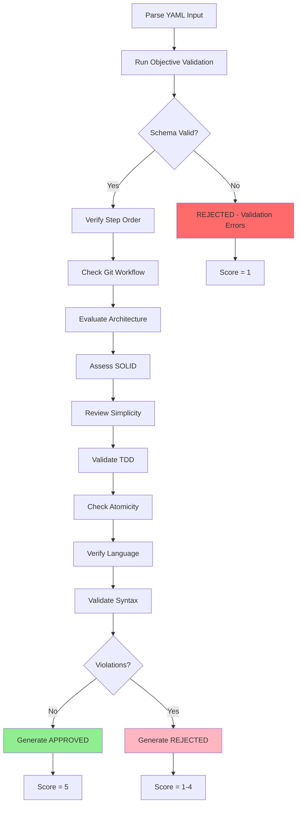

# Task: Evaluate Domain YAML Plan

## 🚨 AI-NOTE: MANDATORY OBJECTIVE VALIDATION

**CRITICAL**: You MUST run objective validation FIRST, before any subjective analysis.

**Command** (use Bash tool):
```bash
tsx .regent/config/validate-template.ts --file=<yaml-path> --json
```

**If validation fails (valid: false):**
- ✋ **IMMEDIATELY return REJECTED**
- 🚫 **DO NOT proceed with subjective analysis**
- 📋 **Include all validation errors in the violations array**

**Why This Matters:**
- ✅ Objective validation catches concrete errors (syntax, schema, dependencies)
- ⚠️ LLM analysis is subjective and can miss technical violations
- 🔄 "LLM validating LLM" creates circular validation
- 🎯 Objective checks provide ground truth

**Example Flow:**
```bash
# 1. Run validation
tsx .regent/config/validate-template.ts --file=spec/001-feature/domain/implementation.yaml --json

# 2. Parse JSON output
# If valid: false → REJECT immediately with errors
# If valid: true → Continue with subjective review
```

---

## 🚨 AI-NOTE: CRITICAL ENGINEERING PRINCIPLE

**FOR FUTURE CODE REVIEWERS AND EXECUTORS:**

### ❌ NEVER SUGGEST FALLBACK PATTERNS

If template reading fails (searchPattern, file not found, etc.), DO NOT suggest:
- Hardcoded fallback structures
- "If this fails, use default values"
- "Graceful degradation to previous behavior"
- Any form of "backup" structure

### ✅ CORRECT RESPONSE TO FAILURES

Template reading failures should FAIL LOUDLY:
```markdown
🚨 CRITICAL ERROR: Template section not found!
Template structure has changed.
Action required: Update command to match new template.
DO NOT proceed with outdated assumptions.
```

### 🎯 WHY THIS MATTERS

Fallbacks reintroduce the exact problem this command fixes:
1. **Original Problem**: Commands hardcoded, templates ignored
2. **Our Solution**: Commands read templates as source of truth
3. **Fallback Danger**: If reading fails, fallback = back to hardcoded = SAME PROBLEM

### 📚 ENGINEERING PRINCIPLE

**"Fail fast and loud" > "Fail silently with wrong behavior"**

Templates are the ONLY source of truth. If they can't be read correctly, the system must stop and demand human intervention, not continue with potentially incorrect assumptions.

### 🎭 HISTORICAL CONTEXT

This command was created to fix a 3-week architectural disaster caused by exactly this type of "helpful" fallback thinking. Maintain discipline: Templates define reality, not code.

---

## 🤖 RLHF Score Correlation

The evaluation score directly correlates with expected RLHF execution scores:

| Score | Evaluation | Expected RLHF | Description |
|-------|------------|---------------|-------------|
| **5** | PERFECT | +2 | All principles met, proper workflow order |
| **4** | GOOD | +1 | Good execution, minor improvements possible |
| **3** | FAIR | 0 | Uncertain quality, missing best practices |
| **2** | POOR | -1 | Runtime errors expected |
| **1** | CRITICAL | -2 | Catastrophic architecture violations |

## 1. Your Deliverable

Your output is a JSON object representing a final quality evaluation.

### ✅ Approved Plan:
```json
{
  "status": "APPROVED",
  "score": 5,
  "report": "The plan adheres to all engineering principles.",
  "violations": [],
  "expected_rlhf_score": 2
}
```

### ❌ Rejected Plan:
```json
{
  "status": "REJECTED",
  "score": 1,
  "report": "...",
  "violations": ["violation 1", "violation 2"],
  "expected_rlhf_score": -2
}
```

## 2. Objective

Act as a **Principal Engineer** performing a final architectural review on an implementation plan. You are the last line of defense before execution. Evaluate the YAML plan against a strict set of non-negotiable engineering principles.

## 3. Input Parameters

| Parameter | Type | Location | Description |
|-----------|------|----------|-------------|
| **YAML Plan** | YAML | `./spec/__FEATURE_NUMBER__-__FEATURE_NAME__/__LAYER__/implementation.yaml` | Complete, potentially revised YAML from /04-reflect-layer-lessons |

## 4. Evaluation Principles (The Constitution)

Evaluate the **entire plan** against these core principles. Each violation impacts the score and RLHF prediction.

### 📋 Git Workflow Compliance

| Check | Requirement | Impact if Wrong |
|-------|-------------|-----------------|
| **First Step** | Must be type `branch` | Score ≤ 2 |
| **Branch Name** | Format: `feat/[feature-name]-domain` | Score ≤ 4 |
| **Last Step** | Must be type `pull_request` | Score ≤ 2 |
| **PR Target** | Usually `staging` branch | Score ≤ 3 |
| **Commit Quality** | Atomic and well-described | Score ≤ 4 |

### 🏛️ Clean Architecture (RLHF -2 if violated)

| Violation | Example | Impact |
|-----------|---------|--------|
| **External Dependencies** | `import axios from 'axios'` | RLHF -2, Score = 1 |
| **Database in Domain** | `import { PrismaClient }` | RLHF -2, Score = 1 |
| **Framework Dependencies** | `import express` | RLHF -2, Score = 1 |
| **UI Concerns** | `import React` | RLHF -2, Score = 1 |

### 🎯 SOLID Principles

| Principle | Check | Example Violation | Impact |
|-----------|-------|-------------------|--------|
| **Single Responsibility** | One purpose per use case | "Create User and Send Email" | Score ≤ 3 |
| **Open/Closed** | Favor composition | Excessive refactors | Score ≤ 4 |
| **Interface Segregation** | Focused interfaces | Bloated interfaces | Score ≤ 3 |
| **Dependency Inversion** | Depend on abstractions | Concrete dependencies | Score ≤ 2 |

### 💡 Simplicity (KISS & YAGNI)

| Check | Question | Impact |
|-------|----------|--------|
| **Complexity** | Is solution simplest possible? | Score ≤ 4 |
| **YAGNI** | Features not requested? | Score ≤ 3 |
| **Over-engineering** | Unnecessary abstractions? | Score ≤ 3 |

### 🧪 Test-Driven Development

| Requirement | Check | Impact |
|-------------|-------|--------|
| **Test Helpers** | One per use case | Missing = Score ≤ 2 |
| **Mock Quality** | Realistic test data | Poor mocks = Score ≤ 4 |
| **Coverage** | All use cases covered | Gaps = Score ≤ 3 |

### 📝 Atomic Commits

| Check | Requirement | Impact |
|-------|-------------|--------|
| **Granularity** | Single logical change per step | Score ≤ 4 |
| **Messages** | Accurate and concise | Score ≤ 4 |
| **Order** | Dependencies before dependents | Score ≤ 2 |

### 📚 Ubiquitous Language (RLHF +2 requirement)

| Check | Requirement | Impact |
|-------|-------------|--------|
| **Consistency** | Terms used uniformly | Score ≤ 4 |
| **Business Alignment** | Matches domain vocabulary | Score ≤ 3 |
| **Documentation** | @layerConcept tags present | Limits to +1 |

### ⚠️ REPLACE/WITH Syntax (RLHF -2 if wrong)

| Check | Requirement | Impact |
|-------|-------------|--------|
| **Format** | Exactly one <<<REPLACE>>> and <<<WITH>>> | RLHF -2, Score = 1 |
| **Matching** | REPLACE content must match existing | Score ≤ 2 |
| **Syntax** | Correct delimiters | RLHF -2, Score = 1 |

## 5. Step-by-Step Execution Plan



### Execution Steps:

1. **Parse Input**: Receive and load YAML plan
2. **Run Objective Validation** (NEW - Critical Step):
   - Execute `tsx validate-template.ts --file=<yaml-file> --json` via Bash tool
   - Parse the JSON output to extract validation results
   - Check for schema errors, syntax issues, and layer violations
   - If `valid: false`, IMMEDIATELY return REJECTED with validation errors
3. **Verify Step Order** (only if objective validation passes):
   - First step = `branch`
   - Second step = `folder`
   - Last step = `pull_request`
4. **Evaluate Against Principles**: Systematic review of entire `steps` array
5. **Document Violations**: Clear messages with specific step `id` references (combine objective + subjective)
6. **Calculate Score and RLHF Prediction**:
   - Apply scoring correlation table
   - Predict RLHF outcome
   - Account for objective validation results
7. **Generate Report**:
   - APPROVED if score = 5 AND objective validation passed
   - REJECTED if score < 5 OR objective validation failed

## 6. Example Evaluations

### Example 0: 🚨 Objective Validation Failure (Score: 1)

<details>
<summary>Validation Process with Objective Checker</summary>

**Step 1: Run Objective Validation**
```bash
tsx validate-template.ts --file=spec/001-product-catalog/domain/implementation.yaml --json
```

**Validator Output (JSON):**
```json
{
  "valid": false,
  "errors": [
    "Domain layer violation in step 'create-product-repository': External dependencies not allowed",
    "Unreplaced placeholders found: __FEATURE_NAME__, __USE_CASE__",
    "Malformed FIND/REPLACE block: missing closing tag"
  ],
  "warnings": [
    "Step 'create-product-use-case': RLHF score 0 out of range (-2 to 2)"
  ],
  "schemaUsed": "templates/parts/backend/steps/01-domain.part.schema.json",
  "layerValidated": "domain",
  "targetValidated": "backend"
}
```

**Step 2: Parse Results and Block Execution**

Since `valid: false`, the evaluation MUST immediately return REJECTED without proceeding to subjective analysis.

</details>

**Output:**
```json
{
  "status": "REJECTED",
  "score": 1,
  "report": "CRITICAL: The plan failed objective validation with the schema validator. These are concrete technical errors that must be fixed before subjective architectural review.",
  "violations": [
    "Schema Validation Error: Domain layer violation in step 'create-product-repository': External dependencies not allowed",
    "Schema Validation Error: Unreplaced placeholders found: __FEATURE_NAME__, __USE_CASE__",
    "Schema Validation Error: Malformed FIND/REPLACE block: missing closing tag"
  ],
  "expected_rlhf_score": -2,
  "objective_validation": {
    "passed": false,
    "errors": 3,
    "warnings": 1
  }
}
```

---

### Example 1: ❌ Missing Branch Step (Score: 2)

<details>
<summary>Input YAML with Missing Branch</summary>

```yaml
# YAML plan missing the branch creation step
steps:
  - id: "create-structure"
    type: "folder"
    description: "Create domain folder structure"
    # ... (other steps but no branch as first step)
```
</details>

**Output:**
```json
{
  "status": "REJECTED",
  "score": 2,
  "report": "The plan was rejected due to missing Git workflow steps. This will likely result in runtime errors.",
  "violations": [
    "Git Workflow Violation: The first step must be a 'branch' type step to create the feature branch.",
    "Git Workflow Violation: Missing 'pull_request' step at the end of the plan."
  ],
  "expected_rlhf_score": -1
}
```

### Example 2: ⚠️ Single Responsibility Violation (Score: 3)

<details>
<summary>Input YAML with SRP Violation</summary>

```yaml
steps:
  - id: "create-feature-branch"
    type: "branch"
    # ... (correct branch step)
  - id: "create-use-case-register-user-and-send-email"
    type: "create_file"
    description: "Creates a new user and sends a welcome email"
    # ...
```
</details>

**Output:**
```json
{
  "status": "REJECTED",
  "score": 3,
  "report": "The plan was rejected due to a violation of the Single Responsibility Principle. This affects code quality but won't cause runtime errors.",
  "violations": [
    "SOLID Violation (Single Responsibility): The step 'create-use-case-register-user-and-send-email' combines two distinct responsibilities (user registration and sending emails). This should be split into two separate use cases."
  ],
  "expected_rlhf_score": 0
}
```

### Example 3: 🚨 Architecture Violation (Score: 1)

<details>
<summary>Input YAML with External Dependency</summary>

```yaml
steps:
  - id: "create-feature-branch"
    type: "branch"
    # ... (correct branch step)
  - id: "create-use-case-with-axios"
    type: "create_file"
    path: "src/features/user/__LAYER__/use-cases/fetch-user.ts"
    template: |
      import axios from 'axios';

      export interface FetchUser {
        execute(input: FetchUserInput): Promise<FetchUserOutput>;
      }
    # ...
```
</details>

**Objective Validation Output:**
```json
{
  "valid": false,
  "errors": [
    "Domain layer violation in step 'create-use-case-with-axios': External dependencies not allowed"
  ],
  "warnings": [],
  "schemaUsed": "templates/parts/backend/steps/01-domain.part.schema.json",
  "layerValidated": "domain",
  "targetValidated": "backend"
}
```

**Output:**
```json
{
  "status": "REJECTED",
  "score": 1,
  "report": "CRITICAL: The plan failed objective schema validation. External dependencies detected in domain layer - this is a catastrophic architecture violation that will cause RLHF -2 scoring.",
  "violations": [
    "Schema Validation Error: Domain layer violation in step 'create-use-case-with-axios': External dependencies not allowed",
    "Clean Architecture Violation: The step 'create-use-case-with-axios' imports 'axios' in the domain layer. External dependencies are strictly prohibited (RLHF -2)."
  ],
  "expected_rlhf_score": -2,
  "objective_validation": {
    "passed": false,
    "errors": 1,
    "warnings": 0
  }
}
```

## 7. Violation Severity Matrix

| Severity | Score | RLHF | Examples | Recovery |
|----------|-------|------|----------|----------|
| **CRITICAL** | 1 | -2 | External deps, wrong syntax | Complete redesign |
| **MAJOR** | 2 | -1 | Missing workflow steps | Add required steps |
| **MODERATE** | 3 | 0 | SOLID violations | Refactor structure |
| **MINOR** | 4 | +1 | Naming issues | Simple fixes |
| **NONE** | 5 | +2 | Perfect plan | Ready to execute |

## 📍 Next Steps

Based on your evaluation results:

### ✅ If APPROVED (Score = 5):
Proceed to execution:
```bash
/06-execute-layer-steps from yaml: <your-approved-yaml>
```

### ❌ If REJECTED (Score < 5):

#### For architectural issues:
Return to reflection to fix issues:
```bash
/04-reflect-layer-lessons from yaml: <your-yaml>
```

#### For structural issues:
Go back to planning:
```bash
/01-plan-domain-features <modify-your-request>
```

> 💡 **Pro Tip**: Address violations in order of severity. Fix CRITICAL issues first, then MAJOR, MODERATE, and finally MINOR. A perfect score of 5 ensures smooth execution with RLHF +2!