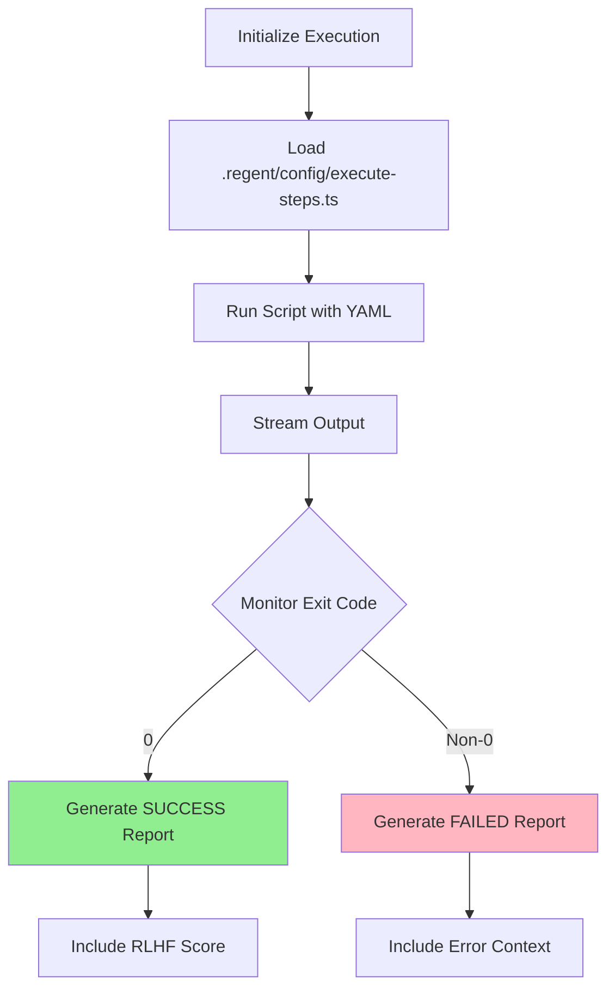

# Task: Execute Domain YAML Plan

## 🤖 RLHF Scoring During Execution

The .regent/config/execute-steps.ts script automatically calculates RLHF scores for each step:

| Score | Level | Emoji | Meaning |
|-------|-------|-------|---------|
| **+2** | PERFECT | 🏆 | Clean Architecture + DDD + ubiquitous language |
| **+1** | GOOD | ✅ | Valid implementation following patterns |
| **0** | LOW CONFIDENCE | ⚠️ | Missing references, unclear implementation |
| **-1** | RUNTIME ERROR | ❌ | Lint failures, test failures, git errors |
| **-2** | CATASTROPHIC | 💥 | Architecture violations, wrong REPLACE/WITH format |

## 1. Your Deliverable

Your output is a stream of logs from the execution process, followed by a final JSON status report.

### ✅ Success Output:
```json
{
  "status": "SUCCESS",
  "message": "All steps executed successfully.",
  "commit_hashes": ["hash1", "hash2", ...],
  "final_rlhf_score": 2
}
```

### ❌ Failure Output:
```json
{
  "status": "FAILED",
  "failed_step_id": "...",
  "error_log": "...",
  "commit_hashes": ["hash1", ...],
  "failed_step_rlhf_score": -1
}
```

## 2. Objective

Act as an **automated build engineer**. Execute the approved YAML implementation plan step by step, exactly as written, without modifications.

## 3. Input Parameters

| Parameter | Description | Example |
|-----------|-------------|---------|
| **YAML Plan** | Complete approved YAML from /05-evaluate-layer-results | Full YAML content |
| **Working Directory** | Base path for all file operations | `spec/001-user-registration/[LAYER]/` |

### ⚠️ Important Path Resolution:
When the plan specifies:
```
path: "src/features/user-registration/[LAYER]/usecases/register-user.ts"
```

Actually create at:
```
spec/001-user-registration/[LAYER]/src/features/user-registration/[LAYER]/usecases/register-user.ts
```

## 4. Prohibited Actions ❌

| Action | Status | Reason |
|--------|--------|--------|
| Modify step logic | ❌ FORBIDDEN | Execute as-is only |
| Skip pending steps | ❌ FORBIDDEN | All must be attempted |
| Fix failures | ❌ FORBIDDEN | Report only, no fixes |
| Change order | ❌ FORBIDDEN | Sequential execution required |

## 5. Step-by-Step Execution Plan



### Execution Steps:

1. **Initialize**: Announce start of execution
2. **Load Script**: Load `.regent/config/execute-steps.ts` from toolchain
3. **Execute Script**:
   ```bash
   npx tsx .regent/config/execute-steps.ts {{path_to_input_yaml}}
   ```
4. **Stream Output**: Real-time stdout/stderr with RLHF scores
5. **Monitor Exit Code**: Wait for completion
6. **Generate Report**:
   - Exit 0 → SUCCESS report with scores
   - Exit non-0 → FAILED report with guidance

## 6. Execution Output Examples

### Example 1: ✅ Successful Execution

<details>
<summary>Success Output with RLHF Scoring</summary>

```
🚀 Loading implementation file: spec/001-user-registration/[LAYER]/implementation.yaml
🚀 Starting execution of 2 steps...

▶️  Processing Step 1/2: create-structure
   📁 Creating directory: src/features/user/domain
   ✅ Step 'create-structure' completed successfully. RLHF Score: 1

▶️  Processing Step 2/2: create-use-case-create-user
   📄 Creating file: src/features/user/[LAYER]/use-cases/create-user.ts
   🔍 Running lint check...
   ✅ Lint check passed
   🏆 Step 'create-use-case-create-user' completed successfully. RLHF Score: 2

🎉 All steps completed successfully!

🤖 Running RLHF analysis...
📊 Final RLHF Score: 1.5/2

{
  "status": "SUCCESS",
  "message": "All steps executed successfully.",
  "commit_hashes": ["e7e4cb9", "f666bd0"],
  "final_rlhf_score": 1.5
}
```
</details>

### Example 2: ❌ Failed Execution (Architecture Violation)

<details>
<summary>Failure Output with RLHF -2</summary>

```
🚀 Loading implementation file: spec/001-user-registration/[LAYER]/implementation.yaml
🚀 Starting execution of 2 steps...

▶️  Processing Step 1/2: create-structure
   📁 Creating directory: src/features/user/domain
   ✅ Step 'create-structure' completed successfully. RLHF Score: 1

▶️  Processing Step 2/2: create-use-case-with-axios
   📄 Creating file: src/features/user/[LAYER]/use-cases/fetch-user.ts
   🔍 Running architecture check...

💥 ERROR: Step 'create-use-case-with-axios' failed. RLHF Score: -2
🚨 CATASTROPHIC ERROR: Architecture violation detected
💡 Check: Clean Architecture violations, external dependencies in selected layer

Aborting execution. The YAML file has been updated with the failure details.

{
  "status": "FAILED",
  "failed_step_id": "create-use-case-with-axios",
  "error_log": "Architecture violation: axios import found in selected layer",
  "failed_step_rlhf_score": -2
}
```
</details>

## 7. RLHF Score Guidance

| Score | Guidance | Action Required |
|-------|----------|-----------------|
| **-2** | Check Clean Architecture violations | Major refactoring needed |
| **-1** | Fix runtime errors (lint/test) | Correct syntax and logic |
| **0** | Add missing documentation/references | Enhance clarity |
| **+1** | Working solution, can be improved | Add DDD patterns |
| **+2** | Excellence achieved | No action needed |

## 8. Script Capabilities

The `.regent/config/execute-steps.ts` script provides:

| Feature | Description |
|---------|-------------|
| **Atomic Commits** | Each step = one Git commit |
| **Lint Checks** | Automatic TypeScript validation |
| **Architecture Validation** | Detects selected layer violations |
| **RLHF Scoring** | Real-time score calculation |
| **Progress Tracking** | Visual step-by-step progress |
| **Error Recovery** | Updates YAML with failure state |

## 9. Common Execution Scenarios

### Scenario 1: Partial Execution
If execution fails at step 5 of 10:
- Steps 1-4: Committed successfully
- Step 5: Failed and marked in YAML
- Steps 6-10: Remain PENDING
- Action: Fix step 5, re-run from step 5

### Scenario 2: Architecture Violation
If external dependency detected:
- Immediate CATASTROPHIC failure (-2)
- No commit created for failed step
- Clear error message with violation
- Action: Return to planning phase

### Scenario 3: Perfect Execution
If all steps succeed with +2:
- All commits created atomically
- Final score = 2.0
- Ready for production
- Action: Consider improvements

## 📍 Next Steps

Based on execution results:

### ✅ If SUCCESS:
Your selected layer is complete! Consider running RLHF improvements:
```bash
/08-apply-layer-improvements
```

Or generate a learning report:
```bash
npx tsx rlhf-system.ts report
```

### ❌ If FAILED:

#### For error fixes:
```bash
/07-fix-layer-errors from yaml: <your-yaml-with-failed-step>
```

#### After fixing, re-run:
```bash
/06-execute-layer-steps from yaml: <your-fixed-yaml>
```

> 💡 **Pro Tip**: The execution script maintains state in the YAML. Failed steps are marked, allowing you to fix and resume from the failure point without re-executing successful steps!