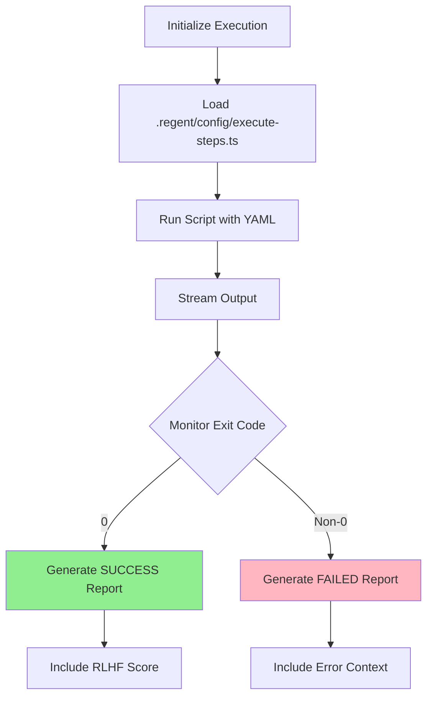

# Task: Execute Domain YAML Plan

## 🎯 Working with Multiple YAMLs (Issue #144)

Since `/03-generate-layer-code` now generates **multiple YAML files** (shared + per use case), you need to run this command **once for each YAML file**:

### Execution Pattern

```bash
# Execute shared components FIRST (required by use cases)
/06-execute-layer-steps spec/001-product-catalog/domain/shared-implementation.yaml

# Then execute use cases in dependency order
/06-execute-layer-steps spec/001-product-catalog/domain/create-product-implementation.yaml
/06-execute-layer-steps spec/001-product-catalog/domain/update-product-implementation.yaml
```

### Critical Execution Order

1. **Shared YAML first** - Creates foundation (entities, VOs, errors, repositories)
2. **Use case YAMLs next** - Implement use cases that depend on shared components
3. **Update YAMLs last** - Modifications to shared components after base implementation

**⚠️ Important**: Executing use cases before shared components will cause errors because:
- Use cases import from shared components
- TypeScript compilation will fail if shared types don't exist
- Tests will fail if shared helpers aren't available

### Example Workflow

```bash
# Feature: Authentication with shared + 2 use cases
cd your-project/

# Step 1: Execute shared components (entities, VOs, errors)
/06-execute-layer-steps spec/001-auth/domain/shared-implementation.yaml
# ✅ Creates: User entity, Email VO, Password VO, AuthErrors, UserRepository

# Step 2: Execute login use case (depends on shared)
/06-execute-layer-steps spec/001-auth/domain/login-implementation.yaml
# ✅ Creates: LoginUseCase, tests, imports from shared components

# Step 3: Execute register use case (depends on shared)
/06-execute-layer-steps spec/001-auth/domain/register-implementation.yaml
# ✅ Creates: RegisterUseCase, tests, imports from shared components
```

### Batch Processing (Advanced)

For automated execution of all YAMLs in a feature:

```bash
# Execute all YAMLs in correct order
# Shared first, then use cases
cd your-project/

# Execute shared
/06-execute-layer-steps spec/001-product-catalog/domain/shared-implementation.yaml

# Execute use cases (after shared completes)
for yaml in spec/001-product-catalog/domain/*-implementation.yaml; do
  # Skip shared (already executed)
  if [[ ! "$yaml" =~ "shared" ]]; then
    /06-execute-layer-steps "$yaml"
  fi
done
```

### Dependency Tracking (Future Enhancement)

YAML files include `dependencies` metadata to enforce execution order:

```yaml
# use-case-implementation.yaml
metadata:
  dependencies:
    - shared-implementation.yaml  # Must be executed first
```

The executor will verify dependencies before execution.

---

## 🤖 RLHF Scoring During Execution

The .regent/config/execute-steps.ts script automatically calculates RLHF scores for each step:

| Score | Level | Emoji | Meaning |
|-------|-------|-------|---------|
| **+2** | PERFECT | 🏆 | Clean Architecture + DDD + ubiquitous language |
| **+1** | GOOD | ✅ | Valid implementation following patterns |
| **0** | LOW CONFIDENCE | ⚠️ | Missing references, unclear implementation |
| **-1** | RUNTIME ERROR | ❌ | Lint failures, test failures, git errors |
| **-2** | CATASTROPHIC | 💥 | Architecture violations, wrong REPLACE/WITH format |

## 1. Your Deliverable

Your output is a stream of logs from the execution process, followed by a final JSON status report.

### ✅ Success Output:
```json
{
  "status": "SUCCESS",
  "message": "All steps executed successfully.",
  "commit_hashes": ["hash1", "hash2", ...],
  "final_rlhf_score": 2
}
```

### ❌ Failure Output:
```json
{
  "status": "FAILED",
  "failed_step_id": "...",
  "error_log": "...",
  "commit_hashes": ["hash1", ...],
  "failed_step_rlhf_score": -1
}
```

## 2. Objective

Act as an **automated build engineer**. Execute the approved YAML implementation plan step by step, exactly as written, without modifications.

## 3. Input Parameters

| Parameter | Description | Example |
|-----------|-------------|---------|
| **YAML Plan** | Complete approved YAML from /05-evaluate-layer-results | Full YAML content |
| **Working Directory** | Base path for all file operations | `./spec/001-user-registration/__LAYER__/` |

### ⚠️ Important Path Resolution:
When the plan specifies:
```
path: "src/features/user-registration/__LAYER__/usecases/register-user.ts"
```

Actually create at:
```
./spec/001-user-registration/__LAYER__/src/features/user-registration/__LAYER__/usecases/register-user.ts
```

## 4. Prohibited Actions ❌

| Action | Status | Reason |
|--------|--------|--------|
| Modify step logic | ❌ FORBIDDEN | Execute as-is only |
| Skip pending steps | ❌ FORBIDDEN | All must be attempted |
| Fix failures | ❌ FORBIDDEN | Report only, no fixes |
| Change order | ❌ FORBIDDEN | Sequential execution required |

## 5. Step-by-Step Execution Plan



### Execution Steps:

1. **Initialize**: Announce start of execution
2. **Load Script**: Load `.regent/config/execute-steps.ts` from toolchain
3. **Execute Script**:
   ```bash
   npx tsx .regent/config/execute-steps.ts {{path_to_input_yaml}}
   ```
4. **Stream Output**: Real-time stdout/stderr with RLHF scores
5. **Monitor Exit Code**: Wait for completion
6. **Generate Report**:
   - Exit 0 → SUCCESS report with scores
   - Exit non-0 → FAILED report with guidance

## 6. Execution Output Examples

### Example 1: ✅ Successful Execution

<details>
<summary>Success Output with RLHF Scoring</summary>

```
🚀 Loading implementation file: ./spec/001-user-registration/__LAYER__/implementation.yaml
🚀 Starting execution of 2 steps...

▶️  Processing Step 1/2: create-structure
   📁 Creating directory: src/features/user/domain
   ✅ Step 'create-structure' completed successfully. RLHF Score: 1

▶️  Processing Step 2/2: create-use-case-create-user
   📄 Creating file: src/features/user/__LAYER__/use-cases/create-user.ts
   ℹ️  Using package manager: npm
   🔍 Running lint check...
   ✅ Lint check passed
   🧪 Running tests...
   ✅ Tests passed
   💾 Committing: feat(domain): create user use case
   🏆 Step 'create-use-case-create-user' completed successfully. RLHF Score: 2

🎉 All steps completed successfully!

🤖 Running RLHF analysis...
📊 Final RLHF Score: 1.5/2

{
  "status": "SUCCESS",
  "message": "All steps executed successfully.",
  "commit_hashes": ["e7e4cb9", "f666bd0"],
  "final_rlhf_score": 1.5
}
```
</details>

### Example 2: ❌ Failed Execution (Architecture Violation)

<details>
<summary>Failure Output with RLHF -2</summary>

```
🚀 Loading implementation file: ./spec/001-user-registration/__LAYER__/implementation.yaml
🚀 Starting execution of 2 steps...

▶️  Processing Step 1/2: create-structure
   📁 Creating directory: src/features/user/domain
   ✅ Step 'create-structure' completed successfully. RLHF Score: 1

▶️  Processing Step 2/2: create-use-case-with-axios
   📄 Creating file: src/features/user/__LAYER__/use-cases/fetch-user.ts
   ℹ️  Using package manager: npm
   🔍 Running lint check...
   ❌ Lint check failed
   📋 Lint errors:
      error: 'axios' should be listed in dependencies (import/no-extraneous-dependencies)
      error: Direct HTTP imports violate Clean Architecture
   🔄 Rolling back changes...
   ↩️  Removed newly created src/features/user/__LAYER__/use-cases/fetch-user.ts
   ✅ Rollback complete

💥 ERROR: Step 'create-use-case-with-axios' failed. RLHF Score: -1
🚨 RUNTIME ERROR: Quality checks failed
💡 Check: Lint failures - external dependencies in domain layer

Aborting execution. The YAML file has been updated with the failure details.

{
  "status": "FAILED",
  "failed_step_id": "create-use-case-with-axios",
  "error_log": "Quality checks failed: Lint errors detected. External dependencies in domain layer violate Clean Architecture.",
  "commit_hashes": ["e7e4cb9"],
  "failed_step_rlhf_score": -1
}
```
</details>

## 7. RLHF Score Guidance

| Score | Guidance | Action Required |
|-------|----------|-----------------|
| **-2** | Check Clean Architecture violations | Major refactoring needed |
| **-1** | Fix runtime errors (lint/test) | Correct syntax and logic |
| **0** | Add missing documentation/references | Enhance clarity |
| **+1** | Working solution, can be improved | Add DDD patterns |
| **+2** | Excellence achieved | No action needed |

## 8. Script Capabilities

The `.regent/config/execute-steps.ts` script provides:

| Feature | Description |
|---------|-------------|
| **Smart Commits** | Conventional commits with automatic scope detection |
| **Quality Gates** | Parallel lint + test checks before each commit |
| **Interactive Safety** | Prompts for confirmation on risky operations |
| **Safe Rollback** | Restores pre-existing files, removes only new ones |
| **Error Boundaries** | Graceful failure handling without crashes |
| **Git Retry Logic** | Exponential backoff for transient git errors |
| **Package Manager Detection** | Auto-detects npm/yarn/pnpm with secure execution |
| **Path Validation** | Prevents path traversal and injection attacks |
| **RLHF Scoring** | Real-time score calculation |
| **Progress Tracking** | Visual step-by-step progress |
| **Error Recovery** | Updates YAML with failure state |

## 9. Configuration

The execution behavior can be customized via `.regent/config/execute.yml`:

```yaml
commit:
  enabled: true                    # Enable/disable automatic commits

  quality_checks:
    lint: true                     # Run lint before commit
    test: true                     # Run tests before commit

  conventional_commits:
    enabled: true                  # Use conventional commit format
    type_mapping:
      create_file: 'feat'          # Map step types to commit types
      refactor_file: 'refactor'

  co_author: 'Claude <noreply@anthropic.com>'  # Commit co-author

  emoji:
    enabled: true                  # Include emoji in commits
    robot: '🤖'                    # Robot emoji to use

  interactive_safety: true         # Prompt before risky operations (disable for CI/CD)
```

### Configuration Options:

| Option | Default | Description |
|--------|---------|-------------|
| `commit.enabled` | `true` | Enable automatic commits after each step |
| `quality_checks.lint` | `true` | Run lint checks before committing |
| `quality_checks.test` | `true` | Run test suite before committing |
| `conventional_commits.enabled` | `true` | Use conventional commit format (feat/fix/refactor) |
| `emoji.enabled` | `true` | Include emoji in commit messages |
| `emoji.robot` | `🤖` | Robot emoji for automated commits |
| `interactive_safety` | `true` | Ask for confirmation on uncommitted changes (set false for CI/CD) |
| `co_author` | `Claude <...>` | Co-author line in commits (must be "Name <email@example.com>") |

### Quality Gates:

When quality checks are enabled, each commit is protected by:
1. **Parallel Execution**: Lint and test run simultaneously for speed
2. **Automatic Rollback**: Failed checks restore working directory
3. **Error Reporting**: Detailed output with first 10 errors
4. **Safe Failures**: Quality check crashes are caught and treated as failures

### Git Safety:

Before execution, the script checks for uncommitted changes:
- **Interactive Mode** (default): Prompts user to continue or abort
- **Non-Interactive Mode** (CI/CD): 5-second warning before continuing
- **Clean State**: Recommended to commit/stash before execution

## 10. Common Execution Scenarios

### Scenario 1: Partial Execution
If execution fails at step 5 of 10:
- Steps 1-4: Committed successfully
- Step 5: Failed and marked in YAML
- Steps 6-10: Remain PENDING
- Action: Fix step 5, re-run from step 5

### Scenario 2: Architecture Violation
If external dependency detected:
- Immediate CATASTROPHIC failure (-2)
- No commit created for failed step
- Clear error message with violation
- Action: Return to planning phase

### Scenario 3: Perfect Execution
If all steps succeed with +2:
- All commits created atomically
- Final score = 2.0
- Ready for production
- Action: Consider improvements

### Scenario 4: Quality Check Failures
If lint or tests fail:
- **Automatic Rollback**: Changes are reverted safely
- **Pre-existing Files**: Restored from git history
- **New Files**: Removed completely
- **Detailed Errors**: First 10 errors shown for debugging
- Action: Fix code issues, update YAML, re-run

### Scenario 5: Git Safety Warning
If uncommitted changes exist:
- **Interactive Prompt**: "Do you want to continue anyway?"
- **User Choice**: Continue or abort execution
- **Non-Interactive**: Automatic 5-second delay (CI/CD mode)
- Recommendation: Commit or stash before running

## 📍 Next Steps

Based on execution results:

### ✅ If SUCCESS:
Your selected layer is complete! Validate the generated code:
```bash
/07-validate-generated-code
```

Then consider running RLHF improvements:
```bash
/09-apply-layer-improvements
```

Or generate a learning report:
```bash
npx tsx rlhf-system.ts report
```

### ❌ If FAILED:

#### For error fixes:
```bash
/08-fix-layer-errors from yaml: <your-yaml-with-failed-step>
```

#### After fixing, re-run:
```bash
/06-execute-layer-steps from yaml: <your-fixed-yaml>
```

> 💡 **Pro Tip**: The execution script maintains state in the YAML. Failed steps are marked, allowing you to fix and resume from the failure point without re-executing successful steps!