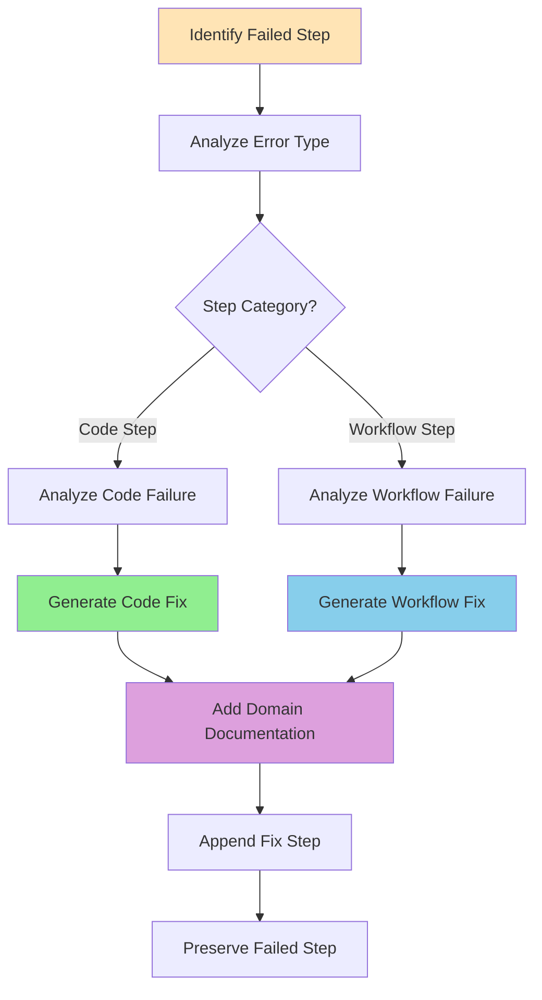

# Task: Fix Failed Domain Steps

## 🤖 RLHF Score Recovery Strategy

When fixing failed steps, understand the score impact and recovery path:

| Current Score | Level | Target Score | Recovery Strategy |
|---------------|-------|--------------|-------------------|
| **-2** | CATASTROPHIC | +2 | Remove violations + add domain docs |
| **-1** | RUNTIME ERROR | +1 | Fix errors + improve implementation |
| **0** | LOW CONFIDENCE | +2 | Add references + enhance documentation |

## 1. Your Objective

Analyze a failed step in a YAML implementation plan and generate a **new corrective step** to fix the issue while improving the RLHF score.

## 2. Context

| Input | Description |
|-------|-------------|
| **YAML with Failures** | Contains steps with `status: 'FAILED'` |
| **Working Directory** | `spec/[FEATURE_NUMBER]-[FEATURE_NAME]/[LAYER]/` |
| **Fix Strategy** | Append new fix step, preserve failed step |

## 3. Step-by-Step Execution Plan



### Execution Steps:

1. **Identify the Failure**: Find last step with `status: 'FAILED'`
2. **Analyze the Error**:
   - Read `execution_log` for root cause
   - Check `rlhf_score` for severity
3. **Analyze Step Type**:
   - Regular steps: `create_file`, `refactor_file`
   - Workflow steps: `branch`, `pull_request`
4. **Formulate Correction**:
   - **Code Steps**: Refactor, create dependency, or delete artifact
   - **Workflow Steps**: Resolve conflicts, fix PR config, or configure permissions
5. **Generate Fix Step** (Target RLHF +2):
   - Create descriptive `id`: `fix-for-[failed-step-id]`
   - Choose appropriate `type` for fix
   - **Add `references` for +1 score**
   - **Add JSDoc with `@layerConcept` for +2 score**
6. **Append New Step**: Add to end of `steps` array
7. **Preserve History**: Keep failed step untouched

## 4. Common Failure Scenarios and Solutions

### 🌿 Branch Step Failures

| Error | Likely Cause | Fix Strategy | RLHF Impact |
|-------|--------------|--------------|-------------|
| **"branch already exists"** | Name conflict | Checkout existing branch | 0 → +1 |
| **"uncommitted changes"** | Dirty working directory | Stash changes first | -1 → +1 |
| **"permission denied"** | Git permissions | Configure credentials | -1 → +1 |

### 🔄 Pull Request Step Failures

| Error | Likely Cause | Fix Strategy | RLHF Impact |
|-------|--------------|--------------|-------------|
| **"nothing to commit"** | No changes | Create meaningful change | 0 → +1 |
| **"gh: command not found"** | GitHub CLI missing | Use git push fallback | -1 → +1 |
| **"PR already exists"** | Duplicate PR | Update existing PR | 0 → +1 |

### 💻 Code Step Failures

| Error | Likely Cause | Fix Strategy | RLHF Impact |
|-------|--------------|--------------|-------------|
| **"lint errors"** | Code style issues | Refactor with fixes | -1 → +1 |
| **"type errors"** | TypeScript issues | Fix type definitions | -1 → +1 |
| **"test failures"** | Breaking changes | Update test/implementation | -1 → +1 |
| **"import violation"** | External deps in domain | Remove dependencies | -2 → +2 |
| **"REPLACE/WITH syntax"** | Wrong template format | Fix template syntax | -2 → +1 |

## 5. Example Fix Steps

### Example 1: 🌿 Fixing Failed Branch Step

<details>
<summary>Branch Already Exists Fix</summary>

```yaml
- id: 'fix-for-create-feature-branch'
  type: 'branch'
  description: 'Checkout existing branch instead of creating new one'
  status: 'PENDING'
  rlhf_score: null
  execution_log: ''
  action:
    branch_name: 'feat/user-profile-domain'
  validation_script: |
    echo "🌿 Checking out existing branch..."
    git checkout feat/user-profile-domain
    if [ $? -eq 0 ]; then
      echo "✅ Successfully switched to existing branch"
    else
      echo "❌ Failed to checkout branch"
      exit 1
    fi
  references:
    - type: 'internal_correction'
      source: 'self'
      description: 'Branch already exists, switching to checkout instead of create'
```
</details>

### Example 2: 🔄 Fixing Failed PR Step

<details>
<summary>GitHub CLI Not Available Fix</summary>

```yaml
- id: 'fix-for-create-pull-request'
  type: 'pull_request'
  description: 'Create PR using git and web fallback'
  status: 'PENDING'
  rlhf_score: null
  execution_log: ''
  action:
    target_branch: 'staging'
    source_branch: 'feat/user-profile-domain'
    title: 'feat(user-profile): implement selected layer'
  validation_script: |
    echo "📤 Pushing branch to remote..."
    git push --set-upstream origin feat/user-profile-domain

    echo "📋 GitHub CLI not available. Please create PR manually at:"
    echo "https://github.com/$(git remote get-url origin | sed 's/.*github.com[:/]\(.*\)\.git/\1/')/pull/new/feat/user-profile-domain"
    echo "✅ Branch pushed successfully. Manual PR creation required."
  references:
    - type: 'internal_correction'
      source: 'self'
      description: 'GitHub CLI not available, using git push with manual PR instructions'
```
</details>

### Example 3: 🏆 Fixing Lint Error (Target RLHF +2)

<details>
<summary>Lint Error Fix with Domain Documentation</summary>

```yaml
- id: 'fix-for-create-use-case-get-user'
  type: 'refactor_file'
  description: 'Fix lint errors in GetUser use case with domain documentation'
  status: 'PENDING'
  rlhf_score: null
  execution_log: ''
  path: 'src/features/user/[LAYER]/use-cases/get-user.ts'
  template: |
    <<<REPLACE>>>
    export interface GetUser {
      execute(input: GetUserInput): Promise<GetUserOutput>
    }
    <<</REPLACE>>>
    <<<WITH>>>
    /**
     * @layerConcept User Retrieval
     * @pattern Use Case Interface
     * @description Retrieves user information from the domain
     */
    export interface GetUser {
      execute(input: GetUserInput): Promise<GetUserOutput>;
    }
    <<</WITH>>>
  validation_script: |
    echo "🔍 Running lint check..."
    yarn lint
    echo "✅ Lint check passed"
    echo "🏆 Added domain documentation for RLHF +2 score"
  references:
    - type: 'internal_correction'
      source: 'self'
      description: 'Added missing semicolon to fix lint error'
    - type: 'quality_improvement'
      source: 'ddd_best_practices'
      description: 'Added JSDoc with @layerConcept for RLHF +2 score'
```
</details>

### Example 4: 🚨 Fixing Catastrophic Error (RLHF -2 → +2)

<details>
<summary>Architecture Violation Fix</summary>

```yaml
- id: 'fix-for-create-use-case-with-axios'
  type: 'refactor_file'
  description: 'Remove external dependency from selected layer'
  status: 'PENDING'
  rlhf_score: null
  execution_log: ''
  path: 'src/features/user/[LAYER]/use-cases/fetch-user.ts'
  template: |
    <<<REPLACE>>>
    import axios from 'axios';

    export interface FetchUser {
      execute(input: FetchUserInput): Promise<FetchUserOutput>;
    }
    <<</REPLACE>>>
    <<<WITH>>>
    /**
     * @layerConcept User Fetching
     * @pattern Clean Architecture - Selected Layer
     * @principle No external dependencies in domain
     */
    export interface FetchUser {
      execute(input: FetchUserInput): Promise<FetchUserOutput>;
    }
    <<</WITH>>>
  validation_script: |
    echo "🏗️ Verifying Clean Architecture compliance..."
    grep -r "import.*from.*axios" src/features/*/[LAYER]/ && echo "❌ Found axios in domain" && exit 1
    echo "✅ Domain layer is clean - no external dependencies"
    echo "🏆 Architecture violation fixed for RLHF +2 score"
  references:
    - type: 'architecture_fix'
      source: 'clean_architecture'
      description: 'Removed axios import - external deps not allowed in selected layer (was RLHF -2)'
```
</details>

## 6. Fix Step Requirements

### Mandatory Fields

| Field | Description | Example |
|-------|-------------|---------|
| **id** | Descriptive identifier | `fix-for-[failed-step-id]` |
| **type** | Step type | `refactor_file`, `branch`, etc. |
| **description** | Clear explanation | "Fix lint errors in use case" |
| **status** | Always PENDING | `'PENDING'` |
| **rlhf_score** | Initially null | `null` |
| **execution_log** | Initially empty | `''` |

### Type-Specific Fields

| Step Type | Required Fields |
|-----------|----------------|
| **File Steps** | `path`, `template` |
| **Branch Steps** | `action.branch_name` |
| **PR Steps** | `action.target_branch`, `action.source_branch` |

### RLHF Score Boosters

| Addition | Score Impact | Example |
|----------|--------------|---------|
| **References** | 0 → +1 | Explain why fix is correct |
| **JSDoc Comments** | +1 → +2 | Add `@layerConcept` tags |
| **Validation Script** | +0.5 | Include verification steps |
| **Clean Architecture** | -2 → +2 | Remove all violations |

## 7. Your Deliverable

Your **only** output is the complete **updated YAML file** with:
- Original failed step preserved (untouched)
- New fix step appended at the end
- All fields properly formatted
- References explaining the fix
- Domain documentation for +2 score

## 📍 Next Step

After generating the fix, return to execution:

```bash
/06-execute-layer-steps from yaml: <your-yaml-with-fix>
```

This will re-execute your plan with the fix applied. The execution will:
1. Skip already successful steps
2. Skip the failed step (preserved for history)
3. Execute your new fix step
4. Continue with remaining steps

> 💡 **Pro Tip**: Always aim for RLHF +2 when fixing errors. Add domain documentation, references, and validation scripts to turn a failure into an opportunity for excellence!