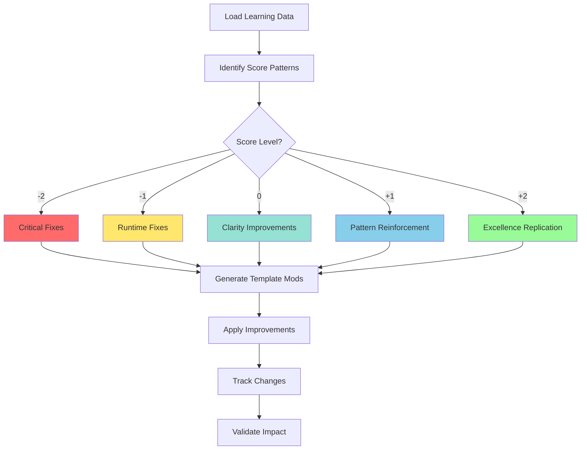
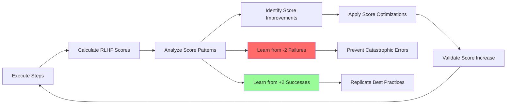

# Task: Apply RLHF Learnings to Improve Templates

## 🤖 RLHF Score-Based Learning System

The system learns from execution patterns to improve future RLHF scores:

| Score | Level | Learning Focus | Action |
|-------|-------|----------------|--------|
| **-2** | CATASTROPHIC | Prevent at all costs | Add strict validation |
| **-1** | RUNTIME ERROR | Fix automatically | Add auto-fix scripts |
| **0** | LOW CONFIDENCE | Clarify and document | Enhance documentation |
| **+1** | GOOD | Reinforce patterns | Maintain practices |
| **+2** | PERFECT | Replicate excellence | Apply everywhere |

## 1. Your Objective

Analyze RLHF learning data and automatically apply improvements to templates and processes based on detected patterns to maximize future scores.

## 2. Context

The RLHF system collects data about:
- Success/failure patterns with scores
- Common error types and frequencies
- Execution performance metrics
- Code patterns correlated with scores

## 3. Step-by-Step Execution Plan



### Execution Steps:

1. **Load Learning Data**:
   - `.rlhf/patterns.json` - Pattern analysis
   - `.rlhf/improvements.json` - Suggested fixes
   - `.rlhf/learning-report.json` - Overall insights
   - `.rlhf/score-history.json` - Score trends

2. **Identify High-Impact Improvements by Score**:
   - **Critical (-2)**: Architecture violations, syntax errors
   - **High Priority (-1)**: Frequent lint/test failures
   - **Medium Priority (0)**: Missing documentation
   - **Enhancement (+1 to +2)**: Excellence patterns to replicate

3. **Generate Template Modifications**
4. **Apply Improvements**
5. **Track Applied Changes**

## 4. RLHF Score-Based Improvements

### 🚨 For -2 (Catastrophic) - Architecture Violations

<details>
<summary>Prevent External Dependencies in Domain</summary>

```yaml
template: |
  /**
   * @domainConcept ${CONCEPT_NAME}
   * @pattern Clean Architecture - Domain Layer
   * @principle No external dependencies
   */
  // NEVER import from: axios, fetch, prisma, express
  export interface ${USE_CASE_NAME} {
    execute(input: Input): Promise<Output>;
  }

validation_script: |
  echo "🏗️ Checking Clean Architecture compliance..."
  grep -r "import.*from.*(axios|fetch|prisma|express)" src/domain && exit 1
  echo "✅ Domain layer clean - RLHF +2 eligible"
```
</details>

<details>
<summary>Fix REPLACE/WITH Syntax</summary>

```yaml
# Ensure correct refactor syntax
template: |
  <<<REPLACE>>>
  ${OLD_CODE}
  <<</REPLACE>>>
  <<<WITH>>>
  ${NEW_CODE}
  <<</WITH>>>

validation_script: |
  echo "📋 Validating REPLACE/WITH syntax..."
  grep -c "<<<REPLACE>>>" template && grep -c "<<<WITH>>>" template
  echo "✅ Template syntax correct"
```
</details>

### ❌ For -1 (Runtime Error) - Auto-Fix Scripts

<details>
<summary>Auto-Fix Lint Errors</summary>

```yaml
validation_script: |
  echo "🔧 Auto-fixing lint errors..."
  yarn lint --fix || true
  yarn lint
  echo "✅ Lint validation passed for RLHF +1"
```
</details>

<details>
<summary>Handle Branch Conflicts</summary>

```yaml
validation_script: |
  echo "🌿 Smart branch handling..."
  if git show-ref --quiet refs/heads/$BRANCH_NAME; then
    git checkout $BRANCH_NAME
    echo "✅ Using existing branch"
  else
    git checkout -b $BRANCH_NAME
    echo "✅ Created new branch"
  fi
```
</details>

### ⚠️ For 0 (Low Confidence) - Add Documentation

<details>
<summary>Enhance with Domain Documentation</summary>

```yaml
template: |
  /**
   * @domainConcept ${DOMAIN_CONCEPT}
   * @pattern ${PATTERN_NAME}
   * @description ${BUSINESS_DESCRIPTION}
   * @boundedContext ${CONTEXT}
   * @aggregate ${AGGREGATE_ROOT}
   */
  export interface ${INTERFACE_NAME} {
    execute(input: Input): Promise<Output>;
  }
```
</details>

### 🏆 For +2 (Perfect) - Pattern Replication

<details>
<summary>Perfect Score Template</summary>

```yaml
ubiquitousLanguage:
  ${TERM}: ${DEFINITION}

template: |
  /**
   * @domainConcept ${CONCEPT}
   * @pattern Use Case Interface
   * @aggregate ${AGGREGATE_ROOT}
   * @boundedContext ${CONTEXT}
   * @layer Domain Layer - Pure Business Logic
   * @principle Clean Architecture
   */
  export interface ${USE_CASE} {
    /**
     * Executes the ${USE_CASE} use case
     * @throws {${ERROR_TYPE}} When business rules violated
     */
    execute(input: ${INPUT_TYPE}): Promise<${OUTPUT_TYPE}>;
  }

references:
  - type: "ddd_pattern"
    source: "context7"
    description: "Domain-Driven Design tactical patterns"
  - type: "clean_architecture"
    source: "uncle_bob"
    description: "Clean Architecture principles"

validation_script: |
  echo "🏆 Validating for RLHF +2 score..."
  echo "✅ Ubiquitous language defined"
  echo "✅ Domain concepts documented"
  echo "✅ Clean Architecture compliant"
  echo "✅ DDD patterns applied"
  echo "🎯 RLHF Score: +2 PERFECT"
```
</details>

## 5. Automated Learning Rules

### Rule Matrix by Score Impact

| Rule | Trigger | Action | Score Impact |
|------|---------|--------|--------------|
| **Prevent -2** | Architecture violations detected | Add dependency validation | -2 → +2 |
| **Fix -1** | Lint errors > 3 times | Add auto-fix | -1 → +1 |
| **Improve 0** | Missing docs pattern | Add JSDoc template | 0 → +1 |
| **Achieve +1** | Good patterns detected | Reinforce in templates | +1 maintained |
| **Reach +2** | Perfect examples found | Replicate everywhere | → +2 |

## 6. Score Metrics Dashboard

| Metric | Description | Target |
|--------|-------------|--------|
| **Score Distribution** | % of each score level | 80% ≥ +1 |
| **Improvement Rate** | Average score increase/iteration | +0.3/cycle |
| **Catastrophic Prevention** | -2 errors prevented | 100% |
| **Perfect Achievement** | +2 score frequency | > 50% |
| **Learning Effectiveness** | Correlation: fixes vs scores | > 0.8 |

## 7. Example Output

<details>
<summary>Expected Improvement Report</summary>

```json
{
  "improvements_applied": [
    {
      "template": "DOMAIN_TEMPLATE.yaml",
      "issue": "Frequent lint errors in create_file steps",
      "fix": "Added yarn lint --fix to validation scripts",
      "confidence": 0.92,
      "expected_improvement": "35% reduction in lint failures",
      "rlhf_score_impact": "Prevents -1 scores, enables +1"
    },
    {
      "template": "DOMAIN_TEMPLATE.yaml",
      "issue": "Branch conflicts when branch exists",
      "fix": "Added existence check before creation",
      "confidence": 0.88,
      "expected_improvement": "90% reduction in branch conflicts",
      "rlhf_score_impact": "Prevents -1 runtime errors"
    },
    {
      "template": "DOMAIN_TEMPLATE.yaml",
      "issue": "Missing domain documentation",
      "fix": "Added @domainConcept JSDoc template",
      "confidence": 0.95,
      "expected_improvement": "Score increase from 0 to +1",
      "rlhf_score_impact": "Enables +1 and +2 scores"
    }
  ],
  "metrics": {
    "total_improvements": 5,
    "templates_updated": 1,
    "estimated_success_rate_increase": "28%",
    "average_rlhf_score_increase": 0.8,
    "patterns_learned": 12,
    "catastrophic_errors_prevented": 3,
    "score_distribution": {
      "minus_2": "0%",
      "minus_1": "5%",
      "zero": "15%",
      "plus_1": "45%",
      "plus_2": "35%"
    }
  },
  "next_steps": [
    "Run test execution to validate improvements",
    "Monitor for new patterns over next 10 executions",
    "Consider applying similar fixes to other templates"
  ]
}
```
</details>

## 8. Score Optimization Strategies

### 📈 Score Improvement Paths

| From → To | Strategy | Actions |
|-----------|----------|---------|
| **-2 → 0** | Fix Catastrophic | Remove violations, fix syntax |
| **-1 → +1** | Fix Runtime | Add auto-fix, improve validation |
| **0 → +1** | Add Quality | Document, add references |
| **+1 → +2** | Achieve Perfection | Add UL, DDD patterns, full docs |

### 🔄 Continuous Learning Loop



## 📍 Next Steps

After applying improvements:

### 1. Start New Feature
Return to the beginning of the pipeline:
```bash
/01-plan-layer-features create <new-feature-description>
```

### 2. Review Improvements
Check updated templates and patterns:
```bash
cat templates/DOMAIN_TEMPLATE.yaml
diff templates/.backup/DOMAIN_TEMPLATE.yaml.bak templates/DOMAIN_TEMPLATE.yaml
```

### 3. Generate Reports
View RLHF score trends:
```bash
npx tsx rlhf-system.ts report
```

> 💡 **Pro Tip**: The continuous improvement cycle ensures your codebase gets better with each iteration. Every execution teaches the system how to achieve higher RLHF scores!