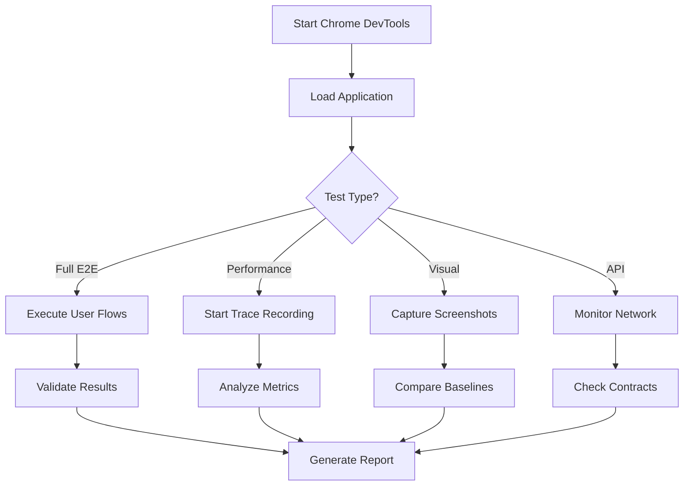

# Task: E2E Performance Testing

## 🎯 Objective

Use Chrome DevTools MCP to perform comprehensive end-to-end testing and performance validation of generated Clean Architecture code.

## 📋 Prerequisites

### Required MCP Server
```bash
# Install Chrome DevTools MCP
claude mcp add chrome-devtools -- npx chrome-devtools-mcp@latest

# Optional configuration flags:
# --channel=canary    # Use Chrome Canary
# --headless=true     # Run in headless mode
# --isolated=true     # Use isolated user data directory
```

## 🧪 Test Types

### 1. Full E2E Test Suite
Complete user journey validation across all layers:

```javascript
// Test complete authentication flow
async function testAuthenticationFlow() {
  // Navigate to application
  await new_page({ url: "http://localhost:3000/login" });

  // Take initial snapshot
  await take_snapshot();

  // Fill login form
  await fill_form({
    elements: [
      { uid: "email-input", value: "test@example.com" },
      { uid: "password-input", value: "SecurePass123!" }
    ]
  });

  // Submit form
  await click({ uid: "submit-button" });

  // Wait for success
  await wait_for({ text: "Welcome back!" });

  // Verify network calls
  const requests = await list_network_requests();
  assert(requests.some(r => r.url.includes('/api/auth/login')));

  // Check console for errors
  const messages = await list_console_messages();
  assert(!messages.some(m => m.level === 'error'));
}
```

### 2. Performance Testing
Validate Clean Architecture performance characteristics:

```javascript
// Performance validation for each layer
async function validateLayerPerformance() {
  // Start tracing
  await performance_start_trace({
    autoStop: false,
    reload: true
  });

  // Execute layer interactions
  await navigate_page({ url: "/products" });
  await wait_for({ text: "Product Catalog" });

  // Stop and analyze
  await performance_stop_trace();

  // Check specific metrics
  const lcpInsight = await performance_analyze_insight({
    insightName: "LCPBreakdown"
  });

  const docLatency = await performance_analyze_insight({
    insightName: "DocumentLatency"
  });

  // Validate against thresholds
  assert(lcpInsight.value < 2500, "LCP should be under 2.5s");
}
```

### 3. Visual Testing
Screenshot-based validation:

```javascript
// Visual regression testing
async function visualValidation() {
  const pages = [
    "/",
    "/products",
    "/cart",
    "/checkout"
  ];

  for (const page of pages) {
    await navigate_page({ url: `http://localhost:3000${page}` });
    await wait_for({ text: "loaded" });

    // Take screenshots
    const screenshot = await take_screenshot({
      format: "png",
      fullPage: true
    });

    // Save for comparison
    saveScreenshot(screenshot, `${page.replace('/', '')}-baseline.png`);
  }
}
```

### 4. API Layer Testing
Validate API contracts and responses:

```javascript
// API boundary testing
async function validateAPILayer() {
  await new_page({ url: "http://localhost:3000" });

  // Execute API calls through UI
  await click({ uid: "fetch-products" });

  // Monitor network
  const requests = await list_network_requests();

  // Validate Clean Architecture API patterns
  const apiCalls = requests.filter(r => r.url.includes('/api/'));

  for (const call of apiCalls) {
    const details = await get_network_request({ url: call.url });

    // Check response structure follows DTO pattern
    assert(details.response.data, "Response should have data wrapper");
    assert(details.response.meta, "Response should have metadata");

    // Validate no domain leakage
    assert(!details.response.includes('_id'), "No database IDs in response");
    assert(!details.response.includes('password'), "No sensitive data");
  }
}
```

## 🔄 Test Workflow



## 📊 Performance Thresholds

### Clean Architecture Performance Targets

| Metric | Target | Layer Impact |
|--------|--------|--------------|
| **LCP** | < 2.5s | Presentation layer efficiency |
| **FID** | < 100ms | Domain layer responsiveness |
| **CLS** | < 0.1 | UI stability |
| **TTI** | < 3.8s | Overall architecture |
| **API Response** | < 200ms | Data layer optimization |

## 🛠️ Emulation Testing

### Network Conditions
Test under different network speeds:

```javascript
// Test on slow connections
await emulate_network({ throttlingOption: "Slow 3G" });
await performUserFlow();
assert(pageLoaded, "Should work on slow network");

await emulate_network({ throttlingOption: "Fast 4G" });
await performUserFlow();
assert(responseTime < 1000, "Should be fast on 4G");
```

### CPU Throttling
Test on lower-end devices:

```javascript
// Emulate slower CPU
await emulate_cpu({ throttlingRate: 4 });  // 4x slowdown
await executeComplexOperation();
assert(completed, "Should handle CPU constraints");
```

## 📈 RLHF Score Integration

### How E2E Testing Affects RLHF Scores

| Test Result | Score Impact | Description |
|-------------|--------------|-------------|
| **All Pass** | +2 | Perfect implementation |
| **Performance Pass** | +1 | Good but needs optimization |
| **Some Failures** | 0 | Functional but issues exist |
| **Critical Failures** | -1 | Runtime errors detected |
| **Architecture Violations** | -2 | Layer boundaries broken |

## 🔍 Debugging Failed Tests

When tests fail, use these debugging tools:

```javascript
// Debug test failures
async function debugFailure() {
  // Check console errors
  const logs = await list_console_messages();
  const errors = logs.filter(l => l.level === 'error');
  console.log("Errors found:", errors);

  // Evaluate custom scripts
  const domainCheck = await evaluate_script({
    function: "() => { return window.__LAYER_VIOLATIONS__ || [] }"
  });

  // Take diagnostic screenshot
  const screenshot = await take_screenshot({
    format: "png",
    fullPage: true
  });

  // Check network failures
  const requests = await list_network_requests();
  const failed = requests.filter(r => r.status >= 400);
  console.log("Failed requests:", failed);
}
```

## 📝 Test Report Generation

### Automated Report Structure
```yaml
test_report:
  timestamp: "2024-01-27T10:00:00Z"
  feature: "user-authentication"
  results:
    e2e_tests:
      passed: 15
      failed: 0
      skipped: 2
    performance:
      lcp: 2.1s
      fid: 85ms
      cls: 0.05
      tti: 3.2s
    api_validation:
      clean_architecture: PASS
      dto_compliance: PASS
      no_domain_leakage: PASS
    visual_tests:
      screenshots_captured: 8
      regressions_found: 0
  rlhf_score: +2
  recommendations:
    - "Consider lazy loading for product images"
    - "Add caching headers to API responses"
```

## 🎯 Best Practices

1. **Test After Each Layer Implementation**
   - Don't wait until all layers are complete
   - Test incrementally to catch issues early

2. **Use Realistic Data**
   - Test with production-like data volumes
   - Include edge cases and error scenarios

3. **Automate Regression Testing**
   - Save baselines for visual comparison
   - Track performance metrics over time

4. **Test Cross-Layer Interactions**
   - Verify data flow from UI to database
   - Check error propagation through layers

5. **Monitor Memory Usage**
   - Detect memory leaks in long-running operations
   - Validate proper cleanup in components

## 💡 Integration with CI/CD

```yaml
# GitHub Actions example
- name: E2E Performance Testing
  run: |
    # Start application
    npm run dev &

    # Wait for server
    npx wait-on http://localhost:3000

    # Run E2E tests with Chrome DevTools MCP
    claude run /09-e2e-performance-testing \
      --feature_path="features/authentication" \
      --test_type="full" \
      --environment="http://localhost:3000"

    # Check results
    if [ -f "test-report.json" ]; then
      score=$(jq '.rlhf_score' test-report.json)
      if [ "$score" -lt 1 ]; then
        echo "Tests failed with RLHF score: $score"
        exit 1
      fi
    fi
```

## 🚀 Next Steps

After successful E2E testing:
1. Review performance insights
2. Apply recommended optimizations
3. Update templates with learnings
4. Run `/09-apply-layer-improvements`

> 💡 **Pro Tip**: Use Chrome DevTools MCP throughout development, not just at the end. Early testing prevents architectural drift and ensures consistent quality across all layers.