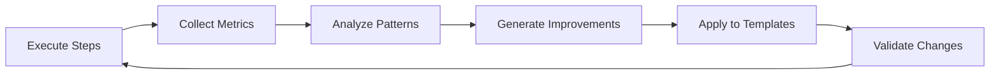

# Task: Apply RLHF Learnings to Improve Templates

## 1. Your Objective

Analyze RLHF learning data and automatically apply improvements to templates and processes based on detected patterns.

## 2. Context

The RLHF system has been collecting data about:
- Success/failure patterns
- Common error types
- Execution performance
- Code patterns that frequently fail

Your task is to analyze this data and generate improvements.

## 3. Step-by-Step Execution Plan

1. **Load Learning Data:**
   - Read `.rlhf/patterns.json` for pattern analysis
   - Read `.rlhf/improvements.json` for suggested fixes
   - Read `.rlhf/learning-report.json` for overall insights

2. **Identify High-Impact Improvements:**
   - Patterns with success rate < 30% and occurrences > 5
   - Errors that repeat across multiple executions
   - Steps that consistently take too long

3. **Generate Template Modifications:**
   For each identified issue:
   - Locate the problematic template section
   - Apply the learned fix
   - Add preventive measures

4. **Common Improvements to Apply:**

   **For Lint Errors:**
   ```yaml
   validation_script: |
     # Auto-fix lint errors before validation
     yarn lint --fix || true
     yarn lint
   ```

   **For Branch Conflicts:**
   ```yaml
   validation_script: |
     # Check if branch exists before creating
     if git show-ref --quiet refs/heads/$BRANCH_NAME; then
       git checkout $BRANCH_NAME
     else
       git checkout -b $BRANCH_NAME
     fi
   ```

   **For Type Errors:**
   ```yaml
   # Add explicit type definitions
   template: |
     export interface UseCase {
       execute(input: Input): Promise<Output>;
     }
   ```

   **For Test Failures:**
   ```yaml
   # Ensure mock data matches interface
   mockOutput: {
     "id": "test-id",
     "createdAt": "new Date().toISOString()"
   }
   ```

5. **Apply Improvements:**
   - Update `templates/DOMAIN_TEMPLATE.yaml`
   - Add error prevention steps
   - Enhance validation scripts

6. **Track Applied Improvements:**
   - Mark improvements as applied in `.rlhf/applied-improvements.json`
   - Document changes made
   - Create backup of original templates

## 4. Automated Improvement Rules

### Rule 1: Auto-Add Lint Fix
If `lint` errors occur > 3 times:
```yaml
Add to validation_script:
  yarn lint --fix
```

### Rule 2: Branch Safety Check
If `branch_conflict` errors occur > 2 times:
```yaml
Replace branch creation with:
  git checkout -b $BRANCH || git checkout $BRANCH
```

### Rule 3: Type Safety
If `typescript` errors occur > 3 times:
```yaml
Add to template:
  // @ts-check at top of file
```

### Rule 4: Git Status Verification
If `git_operation` errors occur > 2 times:
```yaml
Add before commit:
  git status --porcelain || echo "Clean"
```

### Rule 5: Dependency Check
If `missing_dependency` errors occur:
```yaml
Add to validation_script:
  yarn install || npm install
```

## 5. Learning Metrics to Monitor

- **Success Rate Improvement:** Track if applied fixes improve success rate
- **Error Reduction:** Monitor if specific error types decrease
- **Performance Gains:** Measure if steps execute faster
- **Pattern Evolution:** Identify new patterns emerging

## 6. Deliverables

1. **Updated Template Files:** With improvements applied
2. **Learning Report:** Summary of what was learned and applied
3. **Metrics Dashboard:** Visual representation of improvements

## Example Invocation

```bash
# Analyze RLHF data and apply learnings
/apply-rlhf-learnings

# Expected Output:
{
  "improvements_applied": [
    {
      "template": "DOMAIN_TEMPLATE.yaml",
      "issue": "Frequent lint errors in create_file steps",
      "fix": "Added yarn lint --fix to validation scripts",
      "confidence": 0.92,
      "expected_improvement": "35% reduction in lint failures"
    },
    {
      "template": "DOMAIN_TEMPLATE.yaml",
      "issue": "Branch conflicts when branch exists",
      "fix": "Added existence check before creation",
      "confidence": 0.88,
      "expected_improvement": "90% reduction in branch conflicts"
    }
  ],
  "metrics": {
    "total_improvements": 5,
    "templates_updated": 1,
    "estimated_success_rate_increase": "28%",
    "patterns_learned": 12
  },
  "next_steps": [
    "Run test execution to validate improvements",
    "Monitor for new patterns over next 10 executions",
    "Consider applying similar fixes to other templates"
  ]
}
```

## 7. Continuous Learning Loop



The system continuously learns and improves with each execution cycle.