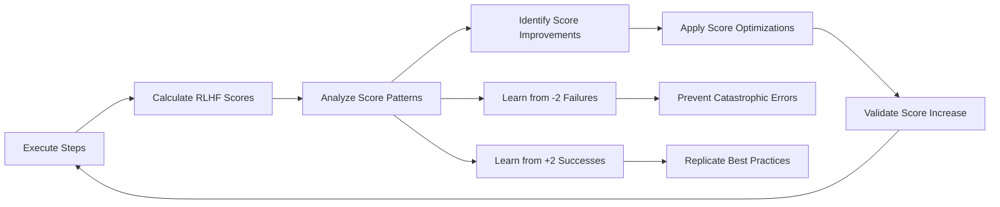

# Task: Apply RLHF Learnings to Improve Templates

## 🤖 RLHF Score-Based Learning System

The system learns from execution patterns to improve future RLHF scores:
- **-2 patterns**: Catastrophic failures to prevent at all costs
- **-1 patterns**: Runtime errors to fix automatically
- **0 patterns**: Low confidence areas needing clarity
- **+1 patterns**: Good practices to reinforce
- **+2 patterns**: Perfect examples to replicate

## 1. Your Objective

Analyze RLHF learning data and automatically apply improvements to templates and processes based on detected patterns.

## 2. Context

The RLHF system has been collecting data about:
- Success/failure patterns
- Common error types
- Execution performance
- Code patterns that frequently fail

Your task is to analyze this data and generate improvements.

## 3. Step-by-Step Execution Plan

1. **Load Learning Data:**
   - Read `.rlhf/patterns.json` for pattern analysis
   - Read `.rlhf/improvements.json` for suggested fixes
   - Read `.rlhf/learning-report.json` for overall insights
   - Read `.rlhf/score-history.json` for RLHF score trends

2. **Identify High-Impact Improvements by RLHF Score:**
   - **Critical (-2 scores)**: Architecture violations, REPLACE/WITH syntax errors
   - **High Priority (-1 scores)**: Lint/test failures with frequency > 3
   - **Medium Priority (0 scores)**: Missing documentation patterns
   - **Enhancement (+1 to +2)**: Patterns that achieve high scores to replicate

3. **Generate Template Modifications:**
   For each identified issue:
   - Locate the problematic template section
   - Apply the learned fix
   - Add preventive measures

4. **RLHF Score-Based Improvements:**

   **For -2 (Catastrophic) Errors - Architecture Violations:**
   ```yaml
   # Prevent external dependencies in domain
   template: |
     /**
      * @domainConcept ${CONCEPT_NAME}
      * @pattern Clean Architecture - Domain Layer
      * @principle No external dependencies
      */
     // NEVER import from: axios, fetch, prisma, express
     export interface ${USE_CASE_NAME} {
       execute(input: Input): Promise<Output>;
     }
   ```

   **For -2 (Catastrophic) Errors - REPLACE/WITH Syntax:**
   ```yaml
   # Ensure correct refactor syntax
   template: |
     <<<REPLACE>>>
     ${OLD_CODE}
     <<</REPLACE>>>
     <<<WITH>>>
     ${NEW_CODE}
     <<</WITH>>>
   ```

   **For -1 (Runtime) Errors - Lint Failures:**
   ```yaml
   validation_script: |
     # Auto-fix lint errors before validation
     yarn lint --fix || true
     yarn lint
     echo "🏆 Lint validation passed for RLHF +1"
   ```

   **For Branch Conflicts:**
   ```yaml
   validation_script: |
     # Check if branch exists before creating
     if git show-ref --quiet refs/heads/$BRANCH_NAME; then
       git checkout $BRANCH_NAME
     else
       git checkout -b $BRANCH_NAME
     fi
   ```

   **For 0 (Low Confidence) - Missing Documentation:**
   ```yaml
   # Add domain documentation for clarity
   template: |
     /**
      * @domainConcept ${DOMAIN_CONCEPT}
      * @pattern ${PATTERN_NAME}
      * @description ${BUSINESS_DESCRIPTION}
      */
     export interface ${INTERFACE_NAME} {
       execute(input: Input): Promise<Output>;
     }
   ```

   **For +2 (Perfect) Pattern Replication:**
   ```yaml
   # Template with all best practices
   ubiquitousLanguage:
     ${TERM}: ${DEFINITION}

   template: |
     /**
      * @domainConcept ${CONCEPT}
      * @pattern Use Case Interface
      * @aggregate ${AGGREGATE_ROOT}
      * @boundedContext ${CONTEXT}
      */
     export interface ${USE_CASE} {
       execute(input: ${INPUT_TYPE}): Promise<${OUTPUT_TYPE}>;
     }
   ```

   **For Test Failures:**
   ```yaml
   # Ensure mock data matches interface
   mockOutput: {
     "id": "test-id",
     "createdAt": "new Date().toISOString()"
   }
   ```

5. **Apply Improvements:**
   - Update `templates/DOMAIN_TEMPLATE.yaml`
   - Add error prevention steps
   - Enhance validation scripts

6. **Track Applied Improvements:**
   - Mark improvements as applied in `.rlhf/applied-improvements.json`
   - Document changes made
   - Create backup of original templates

## 4. RLHF Score-Based Automated Rules

### Rule 1: Prevent -2 Scores (Catastrophic)
If architecture violations detected:
```yaml
Add validation to prevent external dependencies:
  grep -r "import.*from.*(axios|fetch|prisma)" src/domain && exit 1
  echo "✅ Domain layer clean - RLHF +2 eligible"
```

### Rule 2: Branch Safety Check
If `branch_conflict` errors occur > 2 times:
```yaml
Replace branch creation with:
  git checkout -b $BRANCH || git checkout $BRANCH
```

### Rule 3: Achieve +1 Score (Good)
If missing documentation patterns:
```yaml
Add to all templates:
  /**
   * @domainConcept Required for RLHF +1
   * @pattern Design pattern identification
   */
```

### Rule 4: Git Status Verification
If `git_operation` errors occur > 2 times:
```yaml
Add before commit:
  git status --porcelain || echo "Clean"
```

### Rule 5: Achieve +2 Score (Perfect)
For maximum RLHF score:
```yaml
Ensure template includes:
  - Ubiquitous language definitions
  - JSDoc with @domainConcept tags
  - Clean Architecture compliance
  - DDD tactical patterns
  - Comprehensive test helpers
```

## 5. RLHF Score Metrics to Monitor

- **Score Distribution:** Track percentage of -2, -1, 0, +1, +2 scores
- **Score Improvement Rate:** Monitor average score increase over time
- **Catastrophic Prevention:** Count -2 errors prevented
- **Perfect Achievement:** Track +2 score frequency
- **Learning Effectiveness:** Correlation between applied fixes and score improvements

## 6. Deliverables

1. **Updated Template Files:** With improvements applied
2. **Learning Report:** Summary of what was learned and applied
3. **Metrics Dashboard:** Visual representation of improvements

## Example Invocation

```bash
# Analyze RLHF data and apply learnings
/apply-rlhf-learnings

# Expected Output:
{
  "improvements_applied": [
    {
      "template": "DOMAIN_TEMPLATE.yaml",
      "issue": "Frequent lint errors in create_file steps",
      "fix": "Added yarn lint --fix to validation scripts",
      "confidence": 0.92,
      "expected_improvement": "35% reduction in lint failures",
      "rlhf_score_impact": "Prevents -1 scores, enables +1"
    },
    {
      "template": "DOMAIN_TEMPLATE.yaml",
      "issue": "Branch conflicts when branch exists",
      "fix": "Added existence check before creation",
      "confidence": 0.88,
      "expected_improvement": "90% reduction in branch conflicts",
      "rlhf_score_impact": "Prevents -1 runtime errors"
    }
  ],
  "metrics": {
    "total_improvements": 5,
    "templates_updated": 1,
    "estimated_success_rate_increase": "28%",
    "average_rlhf_score_increase": 0.8,
    "patterns_learned": 12,
    "catastrophic_errors_prevented": 3
  },
  "next_steps": [
    "Run test execution to validate improvements",
    "Monitor for new patterns over next 10 executions",
    "Consider applying similar fixes to other templates"
  ]
}
```

## 7. RLHF Score Optimization Loop



## 8. Score Improvement Strategies

### From -2 to 0 (Fix Catastrophic):
1. Remove external dependencies from domain
2. Fix REPLACE/WITH syntax errors
3. Ensure Clean Architecture boundaries

### From 0 to +1 (Add Quality):
1. Add domain documentation
2. Include pattern references
3. Improve test coverage

### From +1 to +2 (Achieve Perfection):
1. Define ubiquitous language
2. Apply DDD tactical patterns
3. Add comprehensive JSDoc with all tags
4. Ensure 100% Clean Architecture compliance

The system continuously learns to maximize RLHF scores with each execution cycle.