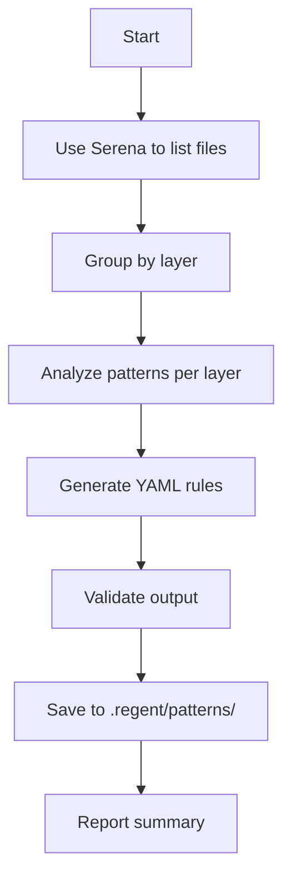

# Task: Extract Clean Architecture Patterns from Codebase

## 1. Objective

Analyze existing codebase using Serena MCP and automatically generate validation patterns in YAML format.

## 2. Execution Flow



## 3. Implementation

Execute this command:

```bash
npx tsx .regent/scripts/extract-patterns.ts --target=./src --output=.regent/patterns/auto-generated.yaml
```

## 4. Expected Output

```yaml
# Auto-generated patterns from codebase analysis
# Generated: 2025-01-02T10:30:00Z
# Files analyzed: 47

patterns:
  domain:
    - id: "DOM001"
      name: "use-case-single-method"
      regex: "export interface \\w+.*execute.*Promise"
      severity: "high"

  data:
    - id: "DAT001"
      name: "repository-pattern"
      regex: "class \\w+Repository implements"
      severity: "medium"

  # ... more patterns
```

## 5. Next Steps

After extraction:

```bash
# Validate patterns
npx tsx .regent/scripts/validate-patterns.ts

# Apply to new code generation
/03-generate-layer-code --use-patterns=auto-generated
```
