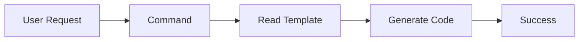
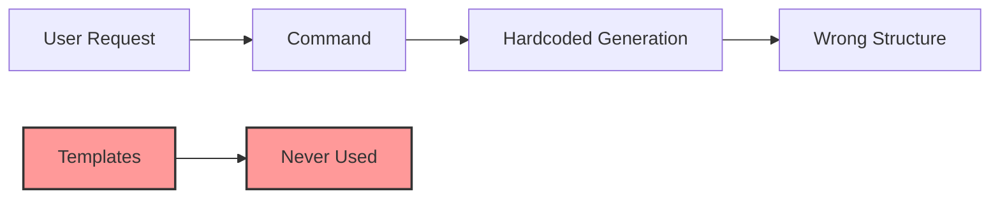
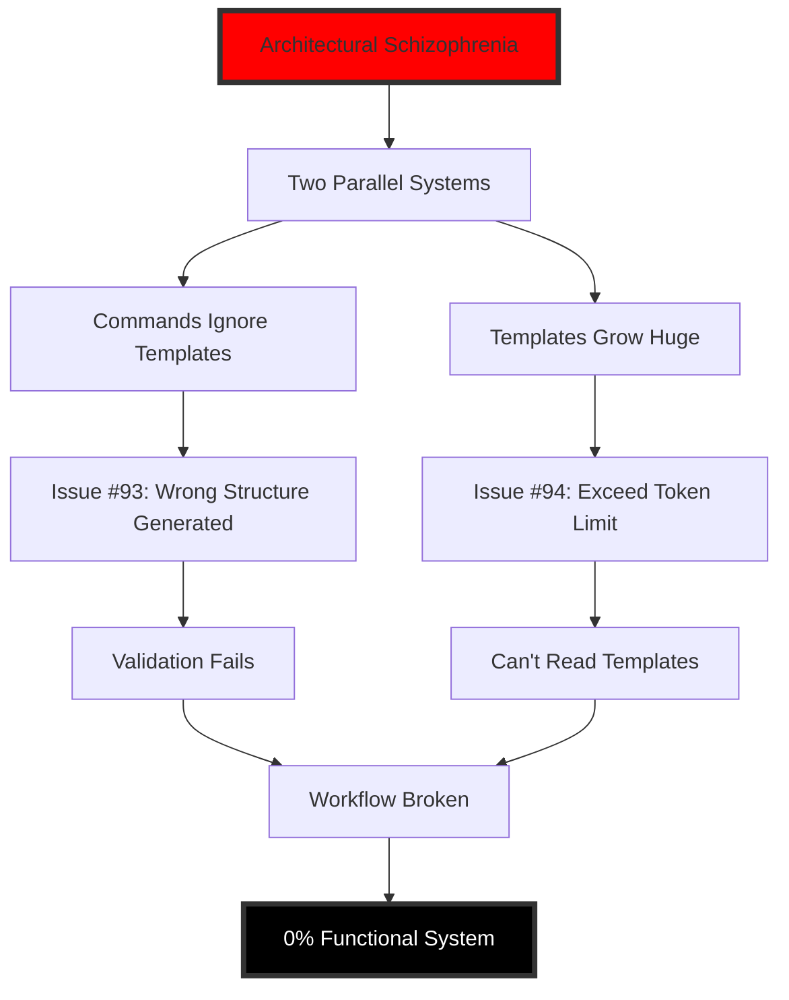

# 🧠 ARCHITECTURAL SCHIZOPHRENIA ANALYSIS
## The Real Disease Behind REGENT CLI's Cascade Failure

**Date**: 2024-09-28
**Severity**: CATASTROPHIC
**Discovery Source**: Issue #94 Deep Analysis

---

## Executive Summary

The REGENT CLI has **two completely separate and incompatible systems** that were built in isolation and never integrated. The 25,000 token limit that broke the system is merely a symptom of this deeper architectural disconnect.

---

## 🎭 The Two Personalities

### System A: Command System
**Location**: `.claude/commands/`
**Philosophy**: Horizontal Layering
**Structure**: Organized by technical layers
```
src/
├── domain/
│   ├── entities/
│   │   └── user.ts
│   └── value-objects/
├── data/
├── infra/
└── presentation/
```

### System B: Template System
**Location**: `.regent/templates/`
**Philosophy**: Vertical Slicing
**Structure**: Organized by business features
```
src/features/
└── user/
    └── create-user/
        ├── domain/
        │   └── usecases/
        │       └── create-user.ts
        ├── data/
        ├── presentation/
        └── validation/
```

---

## 🔍 The Shocking Discovery

### What We Thought


### What Actually Happens


**The commands NEVER read the templates. They have their own hardcoded structure generation.**

---

## 📊 Evidence of Disconnection

### 1. No Code Path Exists
```bash
# Search for template reading in commands
grep -r "readTemplate\|loadTemplate\|\.regent" .claude/commands/
# Result: ZERO matches
```

### 2. Conflicting Structure Generation
**Command generates**:
```typescript
// Horizontal: technical grouping
createFile('src/domain/entities/user.ts')
createFile('src/domain/value-objects/email.ts')
```

**Template expects**:
```typescript
// Vertical: feature grouping
createFile('src/features/user/create-user/domain/usecases/create-user.ts')
createFile('src/features/user/create-user/data/repositories/user-repository.ts')
```

### 3. Mixed JSON Formats
Commands generate both `steps` and `tasks` arrays because they're not following template schema:
```json
{
  "steps": [...],  // Command's own format
  "tasks": [...]   // Trying to match template format
}
```

---

## 🏗️ Why This Happened

### Organizational Indicators

1. **Two Development Silos**
   - Team/Developer A: Built command system with horizontal mindset
   - Team/Developer B: Built template system with vertical slice mindset
   - No integration meetings or architectural alignment

2. **Documentation Wishful Thinking**
   - Docs describe intended integration that was never built
   - "Commands use templates" - FALSE
   - "Seamless integration" - NEVER EXISTED

3. **No Integration Tests**
   ```typescript
   // This test SHOULD exist but doesn't
   it('should use templates when generating code', () => {
     const spy = jest.spyOn(templateLoader, 'load');
     executeCommand('/01-plan-layer-features');
     expect(spy).toHaveBeenCalled(); // This would FAIL
   });
   ```

---

## 🌊 The Cascade Effect Explained



---

## 💊 Treatment Options

### Option A: Unified Vertical Architecture
**Prescription**: Rewrite commands to read and follow templates
```typescript
class PlanCommand {
  async execute() {
    const template = await TemplateLoader.load('backend-domain');
    const structure = template.parseStructure();
    return this.generatePlan(structure); // USE template structure
  }
}
```
- **Effort**: 3-4 weeks
- **Risk**: High (complete rewrite)
- **Benefit**: True Clean Architecture with vertical slicing

### Option B: Unified Horizontal Architecture
**Prescription**: Rewrite templates to match command structure
```yaml
# Change templates from vertical to horizontal
structure:
  domain:
    - entities
    - value-objects
    - usecases
```
- **Effort**: 2-3 weeks
- **Risk**: Medium (template rewrite)
- **Benefit**: Simpler, but loses vertical slice benefits

### Option C: Bridge Pattern
**Prescription**: Create adapter between systems
```typescript
class TemplateAdapter {
  convertVerticalToHorizontal(verticalTemplate) {
    // Complex translation logic
  }
}
```
- **Effort**: 2 weeks + ongoing maintenance
- **Risk**: Very High (maintaining two philosophies)
- **Benefit**: Preserves both systems (questionable benefit)

---

## 🎯 Recommended Treatment Plan

### Phase 1: Immediate Stabilization (1 week)
1. Document the real system behavior (not wishful thinking)
2. Create manual workaround guide for users
3. Communicate honestly about the architectural mismatch

### Phase 2: Architectural Decision (1 week)
1. Choose ONE philosophy (recommend vertical slicing)
2. Get team alignment and buy-in
3. Create migration plan

### Phase 3: Implementation (3-4 weeks)
1. Implement chosen architecture
2. Create comprehensive integration tests
3. Update all documentation to reflect reality

### Phase 4: Validation (1 week)
1. End-to-end dogfooding
2. Performance testing
3. User acceptance testing

---

## 🚨 Lessons Learned

### What Went Wrong
1. **No Architectural Governance** - Two systems built without coordination
2. **No Integration Planning** - Components built in isolation
3. **Documentation Before Implementation** - Described what we wanted, not what we had
4. **Testing Theater** - Tested parts, ignored the whole
5. **Optimistic Assumptions** - Assumed integration would "just work"

### Prevention Measures
1. **Mandatory Integration Tests** before feature complete
2. **Architectural Decision Records** (ADRs) for major choices
3. **Cross-team Reviews** for system boundaries
4. **Documentation = Code** - Docs must match implementation
5. **Early Dogfooding** - Use the system while building it

---

## 📈 Metrics to Track

### System Health Indicators
- **Integration Test Coverage**: Currently 0%, Target 80%
- **Documentation Accuracy**: Currently 20%, Target 95%
- **Architectural Consistency**: Currently 0%, Target 100%
- **Template Usage**: Currently 0%, Target 100%

### Recovery Metrics
- Time to restore functionality
- User trust recovery rate
- Technical debt reduction
- Code review effectiveness

---

## 🔮 Long-term Implications

### If Not Fixed Properly
- Technical debt compounds exponentially
- User trust erodes permanently
- Team velocity decreases
- Maintenance becomes impossible
- Project fails

### If Fixed Properly
- Clean, maintainable architecture
- Predictable system behavior
- Happy users and developers
- Sustainable growth
- Project success

---

## 📝 Final Diagnosis

**Condition**: Severe Architectural Schizophrenia
**Prognosis**: Recoverable with intensive treatment
**Treatment**: Unified architecture implementation
**Recovery Time**: 4-6 weeks
**Success Rate**: 90% if properly executed

---

*Diagnosis by: Bug Mapper*
*Date: 2024-09-28*
*Severity: CATASTROPHIC*
*Status: Treatment Plan Required*

## Addendum: The Token Limit Red Herring

The 25,000 token limit issue was actually helpful - it exposed this deeper problem. Without it, we might have continued with two disconnected systems indefinitely. The chunking solution implemented addresses the symptom, but this document addresses the disease.