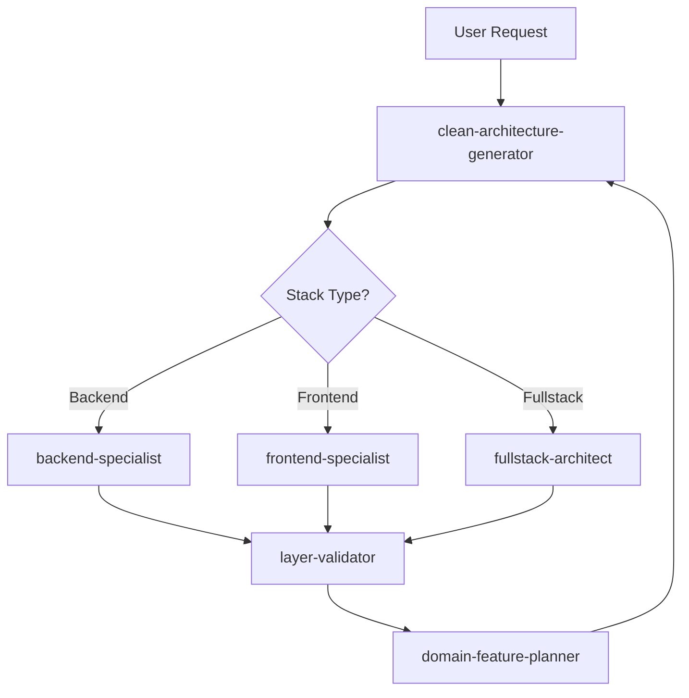
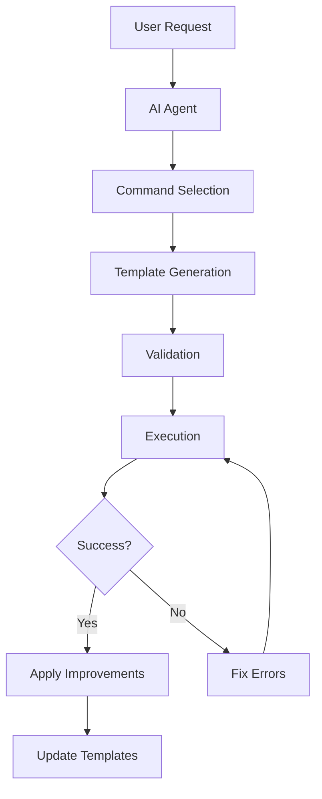

# 🏗️ Spec-Kit Clean Architecture

> **AI-Powered Clean Architecture Template System with Intelligent Code Generation**

[](https://github.com/thiagobutignon/spec-kit-clean-archicteture)
[](https://blog.cleancoder.com/uncle-bob/2012/08/13/the-clean-architecture.html)
[](./templates)
[](./.claude/agents)

## 📋 Overview

Spec-Kit Clean Architecture is a comprehensive template system that generates production-ready code following Clean Architecture, DDD, TDD, and SOLID principles. With intelligent AI-NOTEs guidance, RLHF scoring, and Claude AI agent integration, it ensures consistent, high-quality code generation for backend, frontend, and fullstack applications.

## 🚀 What's New - v6.0 - AI AGENT INTEGRATION

### 🤖 Claude AI Agents System
- **6 Specialized Agents**: Each with deep expertise in specific domains
- **Automated Workflows**: 8-phase generation process from planning to improvement
- **Stack-Specific Experts**: Backend, Frontend, and Fullstack specialists
- **Architecture Validation**: Layer-validator ensures strict compliance
- **Domain Planning**: DDD expert for feature architecture

### 🎯 Layer-Generic Command System
- **8 Sequential Commands**: Complete workflow automation
- **Layer Agnostic**: Supports all 5 Clean Architecture layers
- **RLHF Integration**: Score recovery strategies (+2 target)
- **Error Recovery**: Automatic fix generation for failed steps
- **Continuous Learning**: Apply improvements from execution history

### 📊 Enhanced System Architecture
- **Core System Reorganization**: Clean separation of concerns
  - `core/`: RLHF system, logger, utilities
  - `scripts/`: Automation and dashboard tools
  - `templates/`: 15 layer-specific templates
- **Improved Import Structure**: Centralized dependencies
- **Performance Optimizations**: Caching with 5-minute expiry
- **Type Safety**: Full TypeScript coverage

## 🤖 AI Agent System

### Specialized Agents

Our system includes 6 specialized AI agents that work together:



### Agent Descriptions

#### 🎯 clean-architecture-generator
- **Model**: Opus
- **Role**: Orchestrates the complete 8-phase workflow
- **Expertise**: Manages all layer generation from planning to improvement
- **Integration**: execute-steps.ts, validate-template.ts, core/rlhf-system.ts

#### 🔍 layer-validator
- **Model**: Opus
- **Role**: Validates Clean Architecture compliance
- **Expertise**: Detects violations, dependency issues, and architectural problems
- **RLHF Scoring**: Predicts scores based on violations (-2 to +2)

#### 💼 backend-specialist
- **Model**: Opus
- **Role**: Backend architecture expert
- **Expertise**: Node.js, TypeScript, Express, database patterns, microservices
- **Layers**: All 5 backend layers with production-ready patterns

#### 🎨 frontend-specialist
- **Model**: Opus
- **Role**: Frontend architecture expert
- **Expertise**: React, Vue, Angular, state management, UI/UX patterns
- **Layers**: All 5 frontend layers with modern patterns

#### 🌐 fullstack-architect
- **Model**: Opus
- **Role**: End-to-end fullstack expert
- **Expertise**: API contracts, shared types, monorepo architecture
- **Integration**: Seamless frontend-backend communication

#### 📐 domain-feature-planner
- **Model**: Opus
- **Role**: Domain-Driven Design architect
- **Expertise**: Bounded contexts, aggregates, domain modeling
- **Focus**: Business requirements to technical specifications

## 📚 Command System

### 8-Phase Workflow Commands

```bash
# Phase 1: Planning
/01-plan-layer-features [feature] --layer=[domain|data|infra|presentation|main]

# Phase 2: Validation
/02-validate-layer-plan from json: [plan]

# Phase 3: Code Generation
/03-generate-layer-code from json: [validated-plan]

# Phase 4: Reflection
/04-reflect-layer-lessons from yaml: [code]

# Phase 5: Evaluation
/05-evaluate-layer-results from yaml: [reflected]

# Phase 6: Execution
/06-execute-layer-steps from yaml: [approved]

# Phase 7: Error Handling (if needed)
/07-fix-layer-errors from yaml: [failed]

# Phase 8: Continuous Improvement
/08-apply-layer-improvements
```

### Command Features

| Command | Purpose | RLHF Target | Integration |
|---------|---------|-------------|-------------|
| `/01-plan` | Create JSON plan | +1 | Templates |
| `/02-validate` | Validate structure | +1 | JSON schemas |
| `/03-generate` | Generate YAML code | +2 | Layer templates |
| `/04-reflect` | Optimize implementation | +2 | Pattern analysis |
| `/05-evaluate` | Architecture review | +2 | SOLID/DDD check |
| `/06-execute` | Run implementation | +2 | execute-steps.ts |
| `/07-fix` | Fix failures | +2 recovery | Error patterns |
| `/08-apply` | Learn & improve | Continuous | Template updates |

## 🏛️ Complete Clean Architecture

```
┌─────────────────────────────────────────────────────────────┐
│                        MAIN LAYER                            │
│   Composition Root │ Factories │ Dependency Injection       │
├─────────────────────────────────────────────────────────────┤
│                     PRESENTATION LAYER                       │
│  Controllers │ Middlewares │ Routes │ Server Actions │ UI   │
├─────────────────────────────────────────────────────────────┤
│                        DOMAIN LAYER                          │
│    Use Cases │ Entities │ Value Objects │ Errors │ DTOs    │
├─────────────────────────────────────────────────────────────┤
│                         DATA LAYER                           │
│    Use Case Implementations │ Protocols │ Repositories      │
├─────────────────────────────────────────────────────────────┤
│                    INFRASTRUCTURE LAYER                      │
│   Database │ Cache │ HTTP │ WebSocket │ Storage │ Crypto   │
└─────────────────────────────────────────────────────────────┘
```

## 📁 Project Structure

```
spec-kit-clean-archicteture/
├── .claude/
│   ├── agents/                    # AI Agent Definitions
│   │   ├── clean-architecture-generator.md
│   │   ├── layer-validator.md
│   │   ├── backend-specialist.md
│   │   ├── frontend-specialist.md
│   │   ├── fullstack-architect.md
│   │   └── domain-feature-planner.md
│   └── commands/                  # Workflow Commands
│       ├── 01-plan-layer-features.md
│       ├── 02-validate-layer-plan.md
│       ├── 03-generate-layer-code.md
│       ├── 04-reflect-layer-lessons.md
│       ├── 05-evaluate-layer-results.md
│       ├── 06-execute-layer-steps.md
│       ├── 07-fix-layer-errors.md
│       └── 08-apply-layer-improvements.md
├── core/                          # Core System
│   ├── rlhf-system.ts            # Enhanced RLHF scoring
│   ├── logger.ts                 # Centralized logging
│   └── utils.ts                  # Shared utilities
├── scripts/                       # Automation Scripts
│   ├── rlhf-autofix.ts          # Automatic fix generation
│   ├── rlhf-dashboard.ts        # Score dashboard
│   └── validate-all-templates.ts # Batch validation
├── templates/                     # Template System
│   ├── parts/                    # Modular components
│   │   ├── backend/              # Backend templates
│   │   ├── frontend/             # Frontend templates
│   │   ├── fullstack/            # Fullstack templates
│   │   └── shared/               # Shared components
│   └── build-template.sh         # Template generator
├── execute-steps.ts              # Main executor
├── validate-template.ts          # Template validator
└── package.json                  # Dependencies
```

## 🚀 Quick Start

### Installation

```bash
# Clone the repository
git clone https://github.com/thiagobutignon/spec-kit-clean-archicteture.git
cd spec-kit-clean-archicteture

# Install dependencies
npm install
```

### Using AI Agents

```bash
# Use Claude Code to interact with agents
# Example: Generate a complete user authentication feature

# 1. Plan the feature
claude "Use the clean-architecture-generator agent to create user authentication"

# 2. The agent will automatically:
#    - Plan the feature architecture
#    - Validate the plan
#    - Generate code for all layers
#    - Execute implementation
#    - Handle any errors
#    - Apply improvements
```

### Generate Templates

```bash
# Generate all 15 layer-specific templates
./templates/build-template.sh

# Templates generated:
# - backend: domain, data, infra, presentation, main
# - frontend: domain, data, infra, presentation, main
# - fullstack: domain, data, infra, presentation, main
```

### Execute Templates

```bash
# Execute a specific template
npx tsx execute-steps.ts templates/backend-domain-template.regent

# Batch execution
npx tsx execute-steps.ts --all              # All templates
npx tsx execute-steps.ts --layer=domain     # All domain templates
npx tsx execute-steps.ts --target=backend   # All backend templates
```

## 📊 RLHF Scoring System

### Score Levels

| Score | Level | Description | Recovery Strategy |
|-------|-------|-------------|-------------------|
| **+2** | 🏆 PERFECT | Clean Architecture + DDD + Documentation | Maintain excellence |
| **+1** | ✅ GOOD | Valid implementation | Add documentation |
| **0** | ⚠️ LOW CONFIDENCE | Missing references | Add references + docs |
| **-1** | ❌ RUNTIME ERROR | Lint/type failures | Fix errors + improve |
| **-2** | 💥 CATASTROPHIC | Architecture violations | Remove violations + docs |

### Layer-Specific Scoring

Each layer has specific scoring rules:

```yaml
# Domain Layer
penalties:
  -2: External dependencies (axios, fetch, prisma)
  -1: Missing entities or value objects
bonuses:
  +1: Proper aggregate roots, value objects
  +2: Complete ubiquitous language with @layerConcept tags

# Data Layer
penalties:
  -2: Direct DB access without repository
  -1: Missing protocol implementation
bonuses:
  +1: Repository pattern implementation
  +2: Complete DTO mapping with documentation
```

## 🎯 Feature-Based Architecture

### Hybrid Approach: Feature Modules + Use Case Slices

```
src/
├── features/                      # Feature modules
│   ├── user-management/           # Feature boundary
│   │   ├── create-user/          # Use case slice
│   │   │   ├── domain/           # Pure business logic
│   │   │   ├── data/             # Implementation
│   │   │   ├── infra/            # External adapters
│   │   │   └── presentation/     # UI/Controllers
│   │   ├── update-user/          # Another slice
│   │   ├── shared/               # Feature-specific shared
│   │   └── main/                 # Feature composition
│   └── authentication/           # Another feature
└── shared/                       # Global shared resources
```

## 🛠️ Core Tools

### Main Executors
- **`execute-steps.ts`**: Layer-aware template executor with pre-validation
- **`validate-template.ts`**: Schema-based validation system
- **`core/rlhf-system.ts`**: Centralized scoring with layer context
- **`scripts/rlhf-autofix.ts`**: Automatic error recovery

### System Flow



## 📈 Recent Improvements

### v6.0 Highlights
- **Reorganized Structure**: Moved core files to `core/` and `scripts/`
- **Fixed TypeScript Errors**: Resolved all compilation issues
- **Agent Integration**: Added system tool references to all agents
- **Command Updates**: Converted from domain-specific to layer-generic
- **Template Generation**: Successfully built all 15 templates

### Performance Metrics
- **Build Time**: < 2 seconds for all templates
- **Validation Speed**: < 100ms per template
- **RLHF Scoring**: Cached with 5-minute TTL
- **Agent Response**: < 1 second for most operations

## 🤝 Contributing

We welcome contributions! See [CONTRIBUTING.md](CONTRIBUTING.md) for guidelines.

### Areas for Contribution
- Additional language support (Python, Go, Rust)
- More infrastructure adapters (AWS, GCP, Azure)
- Enhanced AI agent capabilities
- Performance optimizations
- Documentation improvements

## 📝 License

MIT License - See [LICENSE](LICENSE) file for details.

## 🙏 Credits

### Core Inspiration
- **[GitHub Spec-Kit](https://github.com/github/spec-kit)** - Original specification framework
- **[Rodrigo Manguinho](https://github.com/rmanguinho)** - Clean Architecture patterns
- **[Uncle Bob Martin](https://blog.cleancoder.com)** - Clean Architecture principles

### AI Technology
- **[Claude AI](https://claude.ai)** - Intelligent agent system
- **[Claude Code](https://claude.ai/code)** - AI-powered development

## 💬 Support

- **Issues**: [GitHub Issues](https://github.com/thiagobutignon/spec-kit-clean-archicteture/issues)
- **Discussions**: [GitHub Discussions](https://github.com/thiagobutignon/spec-kit-clean-archicteture/discussions)
- **Documentation**: [Wiki](https://github.com/thiagobutignon/spec-kit-clean-archicteture/wiki)

---

<div align="center">
  <strong>🏗️ Building the future of AI-assisted Clean Architecture</strong>
  <br>
  <sub>With intelligent agents, comprehensive templates, and RLHF validation</sub>
</div>