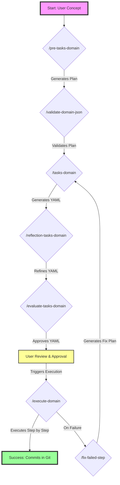

# 🏗️ Spec-Kit Clean Architecture

> **Deterministic Software Development with AI-Powered RLHF and Clean Architecture**

[](https://github.com/thiagobutignon/spec-kit-clean-archicteture)
[](https://blog.cleancoder.com/uncle-bob/2012/08/13/the-clean-architecture.html)
[](https://martinfowler.com/tags/domain%20driven%20design.html)

## 📋 Overview

Spec-Kit Clean Architecture is an evolution of [GitHub's Spec-Kit](https://github.com/github/spec-kit), enhanced with intelligent RLHF (Reinforcement Learning from Human Feedback) scoring system for deterministic software development. This framework ensures your code follows Clean Architecture, DDD, TDD, and SOLID principles through automated validation and continuous improvement.

## 🎯 The Core Problem: Beyond the Black Box

Current AI coding assistants operate as a "black box": a prompt goes in, a large volume of code comes out. This process lacks the predictability, auditability, and quality control required for professional software engineering. Key failures include:

- **Lack of Predictability:** The same prompt can yield different results, making automation unreliable.
- **No Atomic Changes:** Large, monolithic code dumps make reviews difficult and rollbacks impossible.
- **Absence of Quality Gates:** Code is generated without guarantees that it adheres to architectural principles or coding standards.
- **Ignoring Existing Context:** Solutions often fail in brownfield projects because they don't deeply understand the existing codebase.

**Spec-Kit Clean Architecture was built to solve this.** We replace the black box with a transparent, step-by-step, and fully validated engineering workflow.

### 🎯 Key Features

- **🤖 Intelligent RLHF Scoring System** (-2 to +2) for automated quality assessment
- **🏛️ Clean Architecture Enforcement** with domain layer purity validation
- **🔄 Self-Healing Capabilities** with auto-fix for common issues
- **📊 Performance Optimization** with pattern caching and progress reporting
- **🛡️ Rollback Mechanism** for safe recovery from failures
- **🔍 Deep Code Search** using [Serena](https://github.com/sapientinc/HRM) and Context7 for external libraries
- **📚 Ubiquitous Language Support** for Domain-Driven Design
- **✅ Works for both Green Field and Brown Field projects**

## 🚀 Quick Start

```bash
# Clone the repository
git clone https://github.com/thiagobutignon/spec-kit-clean-archicteture.git
cd spec-kit-clean-archicteture

# Install dependencies
yarn install

# Run domain generation
npx tsx execute-steps.ts implementation.yaml

# View RLHF dashboard
npx tsx rlhf-dashboard.ts
```

## 🔄 The ReAct Lifecycle: From Concept to Commit

Our system models the workflow of a senior engineering team using the Reason-Act (ReAct) framework. Each feature is built through a series of auditable, single-responsibility commands:



### Three Critical Phases:

1. **Reasoning Loop (Phases A-F):** The AI researches, plans, validates, and refines a detailed implementation plan (the YAML). This entire loop operates on configuration data, not code.

2. **User Approval (Phase G):** A human engineer reviews the final, approved plan. This is the critical "go/no-go" decision point.

3. **Action Loop (Phases H-J):** Only after approval does the system act on the codebase, executing the plan step-by-step, with a built-in loop for fixing failures.

## 💾 Stateless and Resumable by Design

Unlike chat-based workflows that lose context, our system is fundamentally stateless. The `implementation.yaml` file **is the state**.

### Key Benefits:

- **Resumable Execution:** If the `execute-steps.ts` script fails or is interrupted on step 7, the YAML file is saved with step 7 marked as `FAILED`. You can simply re-run the script, and it will automatically skip the first 6 successful steps and retry from step 7.

- **No Context Overload:** The AI doesn't need to hold the entire project history in its context window. Each command (`/pre-tasks`, `/evaluate`, etc.) is a discrete task that operates on a well-defined input (JSON or YAML), making the process scalable and predictable.

- **Audit Trail:** Every step, success, or failure is recorded in the YAML with timestamps, RLHF scores, and execution logs. This creates a complete audit trail of the development process.

- **Parallel Development:** Multiple developers can work on different features simultaneously, each with their own YAML state file, without interference.

## 📖 Architecture Principles

This framework enforces best practices through automated validation:

- **Clean Architecture** - Separation of concerns with pure domain layer
- **DDD (Domain-Driven Design)** - Ubiquitous language and bounded contexts
- **TDD (Test-Driven Development)** - Test helpers for every use case
- **SOLID Principles** - Single responsibility, open/closed, etc.
- **KISS (Keep It Simple, Stupid)** - Simplicity over complexity
- **YAGNI (You Aren't Gonna Need It)** - No premature optimization
- **DRY (Don't Repeat Yourself)** - Code reusability

## 🤖 RLHF Scoring System

The intelligent scoring system evaluates code quality in real-time:

| Score  | Level             | Description                                    |
| ------ | ----------------- | ---------------------------------------------- |
| **+2** | 🏆 PERFECT        | Clean Architecture + DDD + Ubiquitous Language |
| **+1** | ✅ GOOD           | Valid implementation following patterns        |
| **0**  | ⚠️ LOW CONFIDENCE | Missing references or documentation            |
| **-1** | ❌ RUNTIME ERROR  | Lint failures, test failures                   |
| **-2** | 💥 CATASTROPHIC   | Architecture violations                        |

## 📁 Project Structure

```
spec-kit-clean-archicteture/
├── .claude/
│   └── commands/        # AI command documentation
├── templates/           # Domain generation templates
├── .rlhf/              # RLHF learning data and metrics
├── *.ts                # Core system files
└── README.md
```

**Note**: The `backend/`, `frontend/`, and `src/` directories are example implementations and should be ignored for framework usage.

## 📚 Commands Documentation

### Core Commands

All commands are documented in `.claude/commands/` for AI-assisted development:

#### Domain Generation Commands

- **`pre-tasks-domain.md`** - Transforms a concept into a structured JSON plan

  - **Greenfield/Ideation Input:**
    ```bash
    /pre-tasks-domain create a multi-tenant user authentication system
    ```
  - **Brownfield/Modification Input:**
    ```bash
    /pre-tasks-domain add email verification to existing user registration
    ```

- **`validate-domain-json.md`** - JSON validation with score impact assessment (-2 to +2)

  ```bash
  /validate-domain-json from json: {...}
  ```

- **`tasks-domain.md`** - Main domain generation with quality guidelines

  ```bash
  /tasks-domain create feature from json: {...}
  # or
  /tasks-domain update yaml: {...} with json: {...}
  ```

- **`reflection-tasks-domain.md`** - Architectural reflection with score optimization

  ```bash
  /reflection-tasks-domain from yaml: {...}
  ```

- **`evaluate-tasks-domain.md`** - Pre-execution evaluation with score prediction

  ```bash
  /evaluate-tasks-domain from yaml: {...}
  ```

- **`execute-domain.md`** - Execution with real-time RLHF scoring

  ```bash
  /execute-domain from yaml: {...}
  ```

- **`fix-failed-step.md`** - Intelligent fix suggestions for failed steps

  ```bash
  /fix-failed-step from yaml: {...}
  ```

- **`apply-rlhf-learnings.md`** - Apply learned patterns for continuous improvement
  ```bash
  /apply-rlhf-learnings
  ```

### System Tools

#### Core Executors

- **`execute-steps.ts`** - Main step executor with RLHF scoring
- **`validate-implementation.ts`** - Template validation with quality indicators
- **`rlhf-system.ts`** - RLHF scoring engine with pattern learning
- **`rlhf-dashboard.ts`** - Visual dashboard for metrics and scores
- **`rlhf-autofix.ts`** - Automatic fix system for common issues
- **`rollback-manager.ts`** - Safe rollback and recovery system
- **`logger.ts`** - Centralized logging with audit trails

## 🔧 Configuration

### Templates

The main template `templates/DOMAIN_TEMPLATE.yaml` includes:

- Ubiquitous language definitions
- Git workflow automation (branch → implementation → PR)
- Domain layer structure
- Use case interfaces
- Error classes
- Test helpers with mock data

### RLHF Learning

The system continuously learns from executions:

- Pattern analysis and caching
- Success/failure tracking
- Automatic improvements
- Performance optimization

## 🌟 Features

### For Green Field Projects

- Generate complete domain layer from scratch
- Enforce Clean Architecture from day one
- Automated test helper generation
- Git workflow automation

### For Brown Field Projects

- Gradual refactoring with safety checks
- Architecture violation detection
- Rollback capabilities for failed changes
- Incremental improvements with RLHF scoring

## 🛠️ Advanced Usage

### Auto-Fix System

```bash
# Automatically fix common issues
npx tsx rlhf-autofix.ts implementation.yaml --validate
```

### Rollback Management

```bash
# Create backup before risky operations
npx tsx rollback-manager.ts backup

# Rollback failed step
npx tsx rollback-manager.ts rollback <step-id>

# Rollback all failed steps
npx tsx rollback-manager.ts rollback-all implementation.yaml
```

### RLHF Analytics

```bash
# View dashboard
npx tsx rlhf-dashboard.ts

# Export HTML report
npx tsx rlhf-dashboard.ts export

# Apply learned improvements
npx tsx rlhf-system.ts apply
```

## 🔍 Deep Search Integration with HRM (Hierarchical Reasoning Model)

### Understanding HRM in Software Engineering

The [Hierarchical Reasoning Model (HRM)](https://github.com/sapientinc/HRM) from Sapient Inc. introduces a revolutionary approach to code analysis through hierarchical reasoning. Unlike traditional RLHF which focuses on model training, our implementation leverages HRM concepts for:

#### 🧠 Hierarchical Code Analysis

```
High-Level Planning → Domain Understanding → Use Case Mapping
         ↓                    ↓                    ↓
Low-Level Execution → Code Generation → Pattern Recognition
```

- **Level 1 (Strategic)**: Architectural patterns and domain boundaries
- **Level 2 (Tactical)**: Use cases, entities, and value objects
- **Level 3 (Implementation)**: Specific code patterns and syntax

#### 🎯 HRM Application in Clean Architecture

1. **Pattern Recognition Hierarchy**

   - **Domain Layer**: Pure business logic patterns (RLHF +2)
   - **Application Layer**: Use case orchestration patterns (RLHF +1)
   - **Infrastructure Layer**: Integration patterns (RLHF 0)

2. **Recursive Reasoning**

   - Analyze code at multiple abstraction levels simultaneously
   - Detect architectural violations through hierarchical pattern matching
   - Self-correct based on learned patterns from successful implementations

3. **Adaptive Learning Cycles**

   ```typescript
   // HRM-inspired learning cycle
   for (let cycle = 0; cycle < MAX_CYCLES; cycle++) {
     const analysis = analyzeCodeHierarchy(implementation);
     const score = calculateRLHFScore(analysis);

     if (score >= TARGET_SCORE) break;

     const improvements = generateImprovements(analysis);
     implementation = applyImprovements(implementation, improvements);
   }
   ```

### Serena Integration

The framework integrates with Serena for semantic code search:

- **Hierarchical Symbol Analysis**: Navigate code at different abstraction levels
- **Pattern Matching**: Find similar patterns across the codebase
- **Context-Aware Refactoring**: Understand impact across architectural layers
- **Memory System**: Retain project knowledge for future reasoning

### Context7 Integration

External library documentation through Context7:

- **Real-time Library Analysis**: Understand external dependencies
- **Pattern Extraction**: Learn from library best practices
- **API Mapping**: Connect domain concepts to library implementations
- **Cross-Reference Learning**: Apply patterns from successful libraries

### 🔬 Deep Learning Without Training

Our HRM implementation differs from traditional ML approaches:

| Traditional RLHF        | Our HRM Implementation    |
| ----------------------- | ------------------------- |
| Model training required | No training needed        |
| Large datasets needed   | Works with single project |
| GPU intensive           | Runs on CPU               |
| Static after training   | Continuously adapts       |
| General purpose         | Domain-specific           |

#### Key Innovations:

1. **Hierarchical Pattern Database**

   ```yaml
   patterns:
     architectural:
       - clean_architecture: weight: 1.0
       - ddd_boundaries: weight: 0.9
     tactical:
       - use_case_interface: weight: 0.8
       - value_object_pattern: weight: 0.7
     implementation:
       - typescript_types: weight: 0.6
       - test_coverage: weight: 0.5
   ```

2. **Multi-Level Scoring**

   - Each hierarchical level contributes to final RLHF score
   - Weighted average based on architectural importance
   - Self-balancing based on project characteristics

3. **Reasoning Chains**
   - Traces decision paths through code
   - Explains why certain patterns are preferred
   - Provides actionable improvement suggestions

## 📊 Performance

- **Pattern Caching**: 5-minute cache with LRU eviction
- **Progress Reporting**: Visual progress bars with persistence
- **Memory Management**: Bounded cache size (100 entries max)
- **Resumable Operations**: Progress saved for recovery

## 🤝 Credits

This project builds upon excellent work from the community:

### Core Inspiration

- **[GitHub Spec-Kit](https://github.com/github/spec-kit)** - The original specification framework that inspired this project
- **[Rodrigo Manguinho](https://github.com/rmanguinho)** - Clean Architecture patterns and TDD best practices
- **[Sapient HRM](https://github.com/sapientinc/HRM)** - Deep search capabilities and semantic understanding

### Technologies

- **TypeScript** - Type-safe development
- **YAML** - Configuration and templates
- **Claude AI** - Intelligent code generation
- **MCP Servers** - Serena and Context7 integration

## 📈 Roadmap

- [ ] Visual Studio Code extension
- [ ] GitHub Actions integration
- [ ] Multi-language support (Python, Go, Rust)
- [ ] Cloud deployment templates
- [ ] Advanced RLHF training modes

## 📝 License

MIT License - See [LICENSE](LICENSE) file for details

## 🤝 Contributing

Contributions are welcome! Please read our [Contributing Guide](CONTRIBUTING.md) for details.

## 💬 Support

- **Issues**: [GitHub Issues](https://github.com/thiagobutignon/spec-kit-clean-archicteture/issues)
- **Discussions**: [GitHub Discussions](https://github.com/thiagobutignon/spec-kit-clean-archicteture/discussions)
- **Documentation**: [Wiki](https://github.com/thiagobutignon/spec-kit-clean-archicteture/wiki)

## ❓ Why Not Just Use Chat-Based AI?

### The Fundamental Difference:

| Chat-Based AI (GPT, Claude, etc.)                              | Spec-Kit Clean Architecture                                  |
| -------------------------------------------------------------- | ------------------------------------------------------------ |
| **Monolithic Output**: Generates entire files/features at once | **Atomic Steps**: Each change is a single, reviewable commit |
| **Context Decay**: Loses context over long conversations       | **Stateless**: YAML file maintains complete state            |
| **No Quality Gates**: Output quality varies                    | **RLHF Scoring**: Every step validated (-2 to +2)            |
| **Manual Rollback**: Developer must undo changes manually      | **Automatic Rollback**: Failed steps can be rolled back      |
| **Opaque Process**: "Black box" generation                     | **Transparent Pipeline**: Every decision is auditable        |
| **Generic Solutions**: Not aware of your architecture          | **Architecture-Aware**: Enforces your specific patterns      |

### Real-World Example:

**Chat-Based Approach:**

```
You: "Create a user registration feature"
AI: [Generates 500+ lines across 10 files]
Result: All-or-nothing - if one part is wrong, manual fixes needed
```

**Spec-Kit Approach:**

```yaml
steps:
  - id: create-branch # ✅ Step 1: Git branch created
  - id: create-use-case # ✅ Step 2: Use case interface created
  - id: create-errors # ✅ Step 3: Error classes created
  - id: create-test-helper # ❌ Step 4: Failed - auto-rollback
  - id: fix-test-helper # ✅ Step 5: Fixed and continued
```

## 🏆 Why Use Spec-Kit Clean Architecture?

1. **Deterministic Development**: Predictable, repeatable results
2. **Quality Assurance**: Automated RLHF scoring ensures high quality
3. **Architecture Compliance**: Enforces Clean Architecture principles
4. **Self-Improving**: Learns from mistakes and successes
5. **Safe Refactoring**: Rollback capabilities protect your code
6. **Developer Experience**: Visual feedback and progress tracking
7. **Best Practices**: Enforces TDD, DDD, SOLID automatically
8. **Enterprise Ready**: Audit trails, approval workflows, resumable execution

---

<div align="center">
  <strong>Built with ❤️ for developers who care about code quality</strong>
  <br>
  <sub>Powered by Claude AI and the open-source community</sub>
</div>
