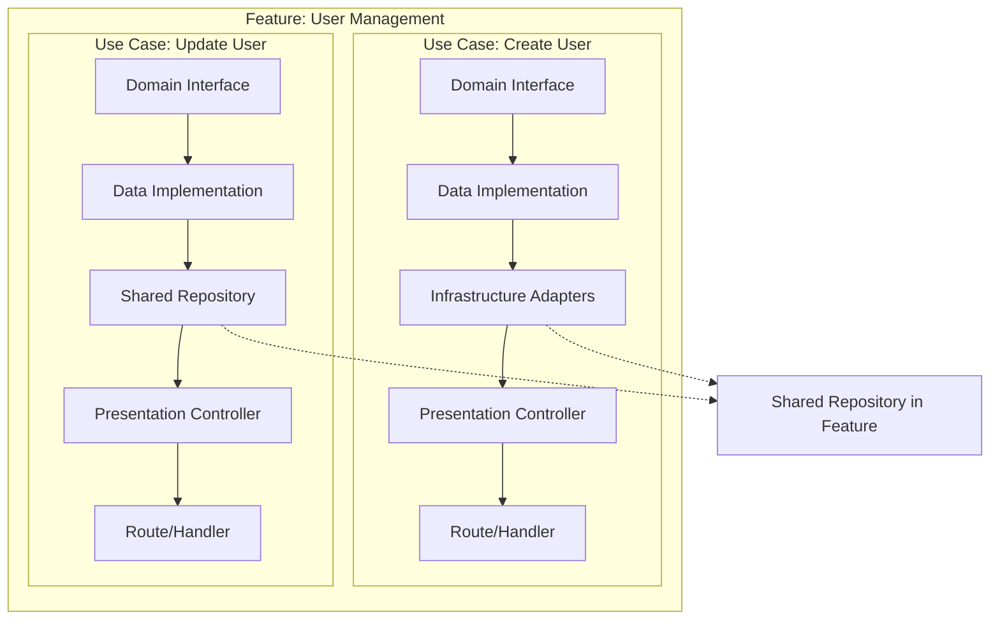

# 🏗️ Spec-Kit Clean Architecture

> **AI-Powered Clean Architecture Template System with Intelligent Code Generation**

[](https://github.com/thiagobutignon/spec-kit-clean-archicteture)
[](https://blog.cleancoder.com/uncle-bob/2012/08/13/the-clean-architecture.html)
[](./templates)
[](./templates)

## 📋 Overview

Spec-Kit Clean Architecture is a comprehensive template system that generates production-ready code following Clean Architecture, DDD, TDD, and SOLID principles. With intelligent AI-NOTEs guidance and RLHF scoring, it ensures consistent, high-quality code generation for backend, frontend, and fullstack applications.

## 🚀 What's New - v4.0 - COMPLETE SYSTEM

### 🎯 100% Complete Template System
- **✅ Backend Templates**: All 5 layers (Domain, Data, Infrastructure, Presentation, Main)
- **✅ Frontend Templates**: Next.js 15 with all 5 layers fully implemented
- **✅ Fullstack Templates**: Unified architecture combining backend and frontend
- **✅ Shared Templates**: Validation layer working across all project types
- **✅ 16 Total Templates**: Complete coverage for every architecture scenario

### 🤖 AI-NOTEs Intelligence System
- **Strategic Guidance**: AI-NOTEs at critical decision points
- **FIND/REPLACE Patterns**: 100% coverage with specific guidance
- **Architecture Validation**: Automatic detection of violations
- **RLHF Scoring**: -2 to +2 quality assessment

### 🔄 Brownfield & Greenfield Support
- **Greenfield**: Generate complete features from scratch
- **Brownfield**: Intelligent refactoring with `<<<FIND>>>/<<<REPLACE>>>` patterns
- **Migration Paths**: Gradual adoption in existing codebases

## 🏛️ Complete Clean Architecture

```
┌─────────────────────────────────────────────────────────────┐
│                        MAIN LAYER                            │
│   Composition Root │ Factories │ Dependency Injection       │
├─────────────────────────────────────────────────────────────┤
│                     PRESENTATION LAYER                       │
│  Controllers │ Middlewares │ Routes │ Server Actions │ UI   │
├─────────────────────────────────────────────────────────────┤
│                        DOMAIN LAYER                          │
│    Use Cases │ Entities │ Value Objects │ Errors │ DTOs    │
├─────────────────────────────────────────────────────────────┤
│                         DATA LAYER                           │
│    Use Case Implementations │ Protocols │ Repositories      │
├─────────────────────────────────────────────────────────────┤
│                    INFRASTRUCTURE LAYER                      │
│   Database │ Cache │ HTTP │ WebSocket │ Storage │ Crypto   │
└─────────────────────────────────────────────────────────────┘
```

## 🎯 Feature-Based Architecture with Use Case Slices

### Hybrid Approach: Feature Modules + Use Case Slices

Our architecture combines the best of both worlds:

```
src/
├── features/                         # Feature-based modules
│   ├── user-management/              # Feature module
│   │   ├── create-user/              # Use case slice
│   │   │   ├── domain/               # Domain layer
│   │   │   ├── data/                 # Data layer
│   │   │   ├── infra/                # Infrastructure (if needed)
│   │   │   └── presentation/         # Presentation layer
│   │   ├── update-user/              # Another use case slice
│   │   ├── delete-user/              # Another use case slice
│   │   ├── shared/                   # Shared within feature
│   │   │   ├── domain/               # Shared entities, VOs
│   │   │   ├── infra/                # Feature-specific repositories
│   │   │   └── utils/                # Feature utilities
│   │   └── main/                     # Feature composition
│   │       ├── factories/            # Use case factories
│   │       └── routes/               # Feature routes
│   ├── authentication/               # Another feature
│   └── billing/                      # Another feature
└── shared/                           # Global shared resources
    ├── domain/                       # Global domain types
    ├── infra/                        # Global infrastructure
    └── utils/                        # Global utilities
```

### Why Feature Modules with Use Case Slices?

**Feature Modules** provide:
- 🎯 **Domain Cohesion**: Related use cases stay together
- 📦 **Encapsulation**: Features are self-contained
- 🔄 **Reusability**: Shared resources within feature boundary
- 🚀 **Team Scalability**: Teams own entire features

**Use Case Slices** provide:
- ⚡ **Atomic Delivery**: Each use case is independently deployable
- 🧪 **Isolated Testing**: Test one use case without affecting others
- 🔒 **Reduced Coupling**: Use cases don't depend on each other
- 📝 **Clear Commits**: Each slice = one atomic git commit

### Vertical Slice Architecture

Each use case is implemented vertically through all layers:



### Implementation Flow

```yaml
# 1. Create feature module
feat/user-management/

# 2. Add first use case slice
feat/user-management/create-user/
  ├── domain/usecases/create-user.ts
  ├── data/usecases/db-create-user.ts
  └── presentation/controllers/create-user-controller.ts

# 3. Add shared resources when needed
feat/user-management/shared/
  ├── domain/entities/user.ts
  └── infra/db/user-repository.ts

# 4. Add more use cases
feat/user-management/update-user/
feat/user-management/delete-user/

# 5. Compose in main
feat/user-management/main/
  ├── factories/create-user-factory.ts
  └── routes/user-routes.ts
```

## 📁 Complete Template System Structure

```
templates/
├── parts/
│   ├── backend/
│   │   ├── 01-structure.part.regent      # Project structure
│   │   ├── 02-architecture.part.regent   # Architecture rules
│   │   ├── 03-rules.part.regent         # Clean Architecture rules
│   │   └── steps/
│   │       ├── 01-domain.part.regent    # Domain layer (contracts)
│   │       ├── 02-data.part.regent      # Data layer (implementations)
│   │       ├── 03-infra.part.regent     # Infrastructure (adapters)
│   │       ├── 04-presentation.part.regent # Presentation (controllers)
│   │       └── 05-main.part.regent      # Main (composition root)
│   ├── frontend/
│   │   ├── 01-structure.part.regent      # Next.js 15 structure
│   │   ├── 02-architecture.part.regent   # Frontend patterns
│   │   ├── 03-rules.part.regent         # React/Next.js rules
│   │   └── steps/
│   │       ├── 01-domain.part.regent    # Business contracts
│   │       ├── 02-data.part.regent      # HTTP/Storage protocols
│   │       ├── 03-infra.part.regent     # Fetch/IndexedDB adapters
│   │       ├── 04-presentation.part.regent # React components/hooks
│   │       └── 05-main.part.regent      # App Router composition
│   ├── fullstack/
│   │   ├── 01-structure.part.regent      # Unified structure
│   │   ├── 02-architecture.part.regent   # Fullstack patterns
│   │   ├── 03-rules.part.regent         # Combined rules
│   │   └── steps/
│   │       ├── 01-domain.part.regent    # Shared domain models
│   │       ├── 02-data.part.regent      # Unified data layer
│   │       ├── 03-infra.part.regent     # Dual-stack adapters
│   │       ├── 04-presentation.part.regent # API + UI components
│   │       └── 05-main.part.regent      # Complete composition
│   └── shared/
│       ├── 00-header.part.regent         # Shared metadata
│       └── steps/
│           └── validation.part.regent    # Validation composites
├── backend-template.regent              # Complete backend template
├── frontend-template.regent             # Complete frontend template
└── fullstack-template.regent           # Complete fullstack template
```

## 🤖 AI-NOTEs System

### Strategic Placement
AI-NOTEs are placed at critical decision points to guide AI code generation:

```yaml
# AI-NOTE: Vertical slicing ensures atomic feature delivery
# Complete one use case through ALL layers before starting another
execution_order:
  approach: 'Vertical Slice Architecture'

# AI-NOTE: Dependency direction is INWARD toward domain
# Any outward dependency is a CRITICAL violation
dependency_rules:
  domain:
    can_import_from: []  # Domain imports nothing
```

### FIND/REPLACE Patterns
Every refactoring pattern includes comprehensive AI guidance:

```yaml
<<<FIND>>>
# AI-NOTE: Identify axios imports and usage
# Look for: import axios from 'axios'
# Replace ALL axios calls with FetchHttpClient
[ORIGINAL_CODE]
<<<REPLACE>>>
# AI-NOTE: Ensure replacement:
# - Uses FetchHttpClient from infra layer
# - Implements proper error handling
# - Uses dependency injection
[REFACTORED_CODE]
```

## 🎯 Key Features

### Backend Features (All 5 Layers)
- **Domain Layer**: Use cases, entities, value objects, domain errors
- **Data Layer**: Use case implementations, protocols, DTOs
- **Infrastructure**: Prisma ORM, Redis cache, crypto adapters
- **Presentation**: Express/Fastify controllers, middleware pipeline
- **Main Layer**: Composition root, factories, dependency injection
- **TDD Approach**: RED-GREEN-REFACTOR with Vitest

### Frontend Features (All 5 Layers)
- **Domain Layer**: Business interfaces, entities, types
- **Data Layer**: HTTP clients, storage protocols
- **Infrastructure**: Fetch adapters, IndexedDB, WebSocket
- **Presentation**: React components, hooks, Server Actions
- **Main Layer**: Next.js 15 App Router composition, providers
- **Modern Stack**: Shadcn UI, Tailwind CSS, Zod validation

### Fullstack Features (Complete Integration)
- **Unified Domain**: Shared business models across stack
- **Dual Infrastructure**: Backend (Prisma/Redis) + Frontend (Fetch/IndexedDB)
- **API Routes**: Next.js API handlers with validation
- **Server Actions**: Direct database mutations
- **Main Composition**: Unified factories and dependency injection
- **E2E Type Safety**: Complete TypeScript coverage

## 🚀 Quick Start

### Installation

```bash
# Clone the repository
git clone https://github.com/thiagobutignon/spec-kit-clean-archicteture.git
cd spec-kit-clean-archicteture

# Install dependencies
npm install
```

### Generate a Feature

#### Backend Feature
```bash
# Generate user authentication backend feature
npx tsx execute-steps.ts templates/backend-template.regent \
  --feature "user-authentication" \
  --use-case "login"
```

#### Frontend Feature
```bash
# Generate dashboard frontend feature
npx tsx execute-steps.ts templates/frontend-template.regent \
  --feature "dashboard" \
  --use-case "display-metrics"
```

#### Fullstack Feature
```bash
# Generate complete e-commerce feature
npx tsx execute-steps.ts templates/fullstack-template.regent \
  --feature "e-commerce" \
  --use-case "checkout"
```

### Benefits of This Approach

#### For Development
- **Parallel Development**: Multiple devs can work on different use cases
- **No Merge Conflicts**: Each use case is isolated
- **Progressive Enhancement**: Add use cases incrementally
- **Easy Refactoring**: Change one use case without affecting others

#### For Testing
- **Unit Testing**: Test each layer independently
- **Integration Testing**: Test vertical slices
- **Feature Testing**: Test entire features
- **E2E Testing**: Test user journeys across features

#### For Architecture
- **Clean Boundaries**: Clear separation of concerns
- **No Circular Dependencies**: Unidirectional flow
- **Scalable Structure**: Grows naturally with features
- **Domain Focus**: Business logic stays pure

## 📊 RLHF Scoring System

The intelligent scoring system evaluates code quality:

| Score  | Level             | Description                                    |
| ------ | ----------------- | ---------------------------------------------- |
| **+2** | 🏆 PERFECT        | Clean Architecture + DDD + All Best Practices |
| **+1** | ✅ GOOD           | Valid implementation following patterns        |
| **0**  | ⚠️ LOW CONFIDENCE | Missing references or unclear implementation  |
| **-1** | ❌ RUNTIME ERROR  | Lint failures, test failures, build errors    |
| **-2** | 💥 CATASTROPHIC   | Architecture violations, dependency issues    |

## 🔄 Brownfield Refactoring

The system includes intelligent refactoring capabilities for existing codebases:

### Automatic Detection
```yaml
# The AI identifies violations:
- Business logic in controllers → Extract to use cases
- Direct database access → Implement repository pattern
- axios usage → Replace with FetchHttpClient
- localStorage in components → Use storage adapters
```

### Safe Refactoring
```yaml
steps:
  - Create rollback point
  - Identify violations
  - Apply transformations
  - Validate changes
  - Run tests
  - Commit if successful
```

## 🛠️ Template Customization

### Configure for Your Project

1. **Update Placeholders**:
```yaml
__PROJECT_NAME__: "my-awesome-app"
__FEATURE_NAME_PASCAL_CASE__: "UserAuthentication"
__USE_CASE_NAME_KEBAB_CASE__: "login-user"
```

2. **Customize Infrastructure**:
```yaml
infrastructure:
  backend:
    database: "prisma-postgresql"  # or "drizzle"
    cache: "redis"                  # or "in-memory"
  frontend:
    http: "fetch"                   # enforced, no axios
    storage: "indexedDB"            # or "localStorage"
```

3. **Add Custom Rules**:
```yaml
architecture_rules:
  custom:
    - "No console.log in production"
    - "All async functions must have error handling"
    - "Components must be under 200 lines"
```

## 📈 Architecture Compliance

### Dependency Rules Enforcement

```typescript
// ✅ VALID: Domain imports nothing
// domain/usecases/login.ts
export interface Login {
  execute(input: LoginInput): Promise<LoginOutput>
}

// ✅ VALID: Data imports from domain
// data/usecases/remote-login.ts
import { Login } from '@/domain/usecases/login'

// ❌ INVALID: Domain importing from data (RLHF: -2)
// domain/usecases/login.ts
import { HttpClient } from '@/data/protocols/http' // VIOLATION!
```

### Vertical Slicing

Each feature is implemented completely through all layers:

```
feature/user-authentication/
├── domain/
│   ├── usecases/
│   ├── entities/
│   └── errors/
├── data/
│   ├── usecases/
│   └── protocols/
├── infra/
│   ├── cache/
│   └── external/
└── presentation/
    ├── controllers/
    └── middlewares/
```

## 🧪 Testing Strategy

### Layer-Specific Testing

| Layer | Strategy | Coverage Target | Tools |
|-------|----------|----------------|--------|
| **Domain** | Unit Tests | 100% | Vitest |
| **Data** | Unit + Mocks | 95% | Vitest + Spies |
| **Infrastructure** | Integration | 80% | Vitest + Test DB |
| **Presentation** | Unit + E2E | 90% | Vitest + Playwright |

### Test Patterns

```typescript
// AI-NOTE: NEVER use faker or random data in tests
// Always use deterministic, fixed test data

// ✅ GOOD: Fixed test data
const mockUser = {
  id: 'test-id-123',
  name: 'Test User',
  email: 'test@example.com'
}

// ❌ BAD: Random data (RLHF: -1)
const mockUser = {
  id: faker.datatype.uuid(),  // VIOLATION!
  name: faker.name.findName(), // VIOLATION!
}
```

## 📚 Complete Template Coverage

### Template System Statistics
- **Total Templates**: 16 production-ready templates
- **Total Lines**: 15,000+ lines of template code
- **AI-NOTEs**: 500+ strategic guidance notes
- **RLHF Scoring**: Complete -2 to +2 coverage
- **JSON Schemas**: Full VS Code IntelliSense support

### Backend Templates (5 Complete Layers)
- **01-domain.part.regent**: Use cases, entities, errors, value objects
- **02-data.part.regent**: Use case implementations, protocols, DTOs
- **03-infra.part.regent**: Prisma repositories, Redis cache, crypto adapters
- **04-presentation.part.regent**: Express/Fastify controllers, middlewares, routes
- **05-main.part.regent**: Factories, composition root, dependency injection

### Frontend Templates (5 Complete Layers)
- **01-domain.part.regent**: Business interfaces, entities, types
- **02-data.part.regent**: HTTP clients, storage protocols
- **03-infra.part.regent**: Fetch adapters, IndexedDB, WebSocket
- **04-presentation.part.regent**: React components, hooks, Server Actions
- **05-main.part.regent**: Next.js 15 App Router, providers, middleware

### Fullstack Templates (5 Complete Layers)
- **01-domain.part.regent**: Unified domain models
- **02-data.part.regent**: Shared data layer protocols
- **03-infra.part.regent**: Dual-stack infrastructure
- **04-presentation.part.regent**: API routes + UI components
- **05-main.part.regent**: Complete composition root

### Shared Templates
- **validation.part.regent**: ValidationComposite pattern for all project types

## 🔍 VS Code Integration

The project includes VS Code settings for optimal development:

```json
{
  "files.associations": {
    "*.regent": "yaml"
  },
  "yaml.schemas": {
    "./templates/parts/backend/steps/01-domain.part.schema.json": [
      "templates/parts/backend/steps/01-domain.part.regent"
    ]
    // ... all schemas mapped
  }
}
```

Benefits:
- **IntelliSense**: Auto-completion for template fields
- **Validation**: Real-time schema validation
- **Documentation**: Inline documentation
- **Error Detection**: Immediate feedback on template errors

## 🤝 Contributing

We welcome contributions! See [CONTRIBUTING.md](CONTRIBUTING.md) for guidelines.

### Areas for Contribution
- Additional language support (Python, Go, Rust)
- More infrastructure adapters (AWS, GCP, Azure)
- Enhanced testing patterns
- Performance optimizations
- Documentation improvements

## 📝 License

MIT License - See [LICENSE](LICENSE) file for details.

## 🙏 Credits

### Core Inspiration
- **[GitHub Spec-Kit](https://github.com/github/spec-kit)** - Original specification framework
- **[Rodrigo Manguinho](https://github.com/rmanguinho)** - Clean Architecture patterns
- **[Uncle Bob Martin](https://blog.cleancoder.com)** - Clean Architecture principles

### Technologies
- **TypeScript** - Type-safe development
- **YAML/JSON** - Configuration and schemas
- **Claude AI** - Intelligent code generation
- **Vitest** - Testing framework
- **Prisma** - Database ORM
- **Next.js** - React framework

## 💬 Support

- **Issues**: [GitHub Issues](https://github.com/thiagobutignon/spec-kit-clean-archicteture/issues)
- **Discussions**: [GitHub Discussions](https://github.com/thiagobutignon/spec-kit-clean-archicteture/discussions)
- **Documentation**: [Wiki](https://github.com/thiagobutignon/spec-kit-clean-archicteture/wiki)

---

<div align="center">
  <strong>🏗️ Building the future of AI-assisted Clean Architecture</strong>
  <br>
  <sub>With intelligent templates, comprehensive AI-NOTEs, and RLHF validation</sub>
</div>