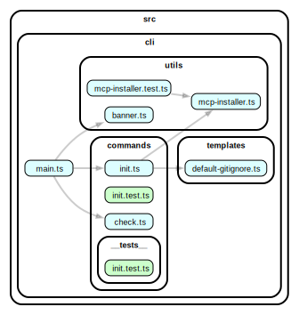

# 👑 The Regent

> **Multi-Target Clean Architecture Platform with AI-Powered Generation and Guaranteed Quality**

[](https://www.npmjs.com/package/the-regent-cli)
[](https://www.npmjs.com/package/the-regent-cli)
[](https://github.com/thiagobutignon/the-regent)
[](https://blog.cleancoder.com/uncle-bob/2012/08/13/the-clean-architecture.html)
[](./templates)
[](./templates)
[](./.claude/agents)
[](https://www.npmjs.com/package/the-regent-cli)

## 📋 Overview

The Regent addresses common problems in AI code generation: monolithic files (>200 lines) and absence of architectural structure. The system combines modular scaffolding with template-based generation, following Clean Architecture, DDD, TDD, and SOLID principles to produce maintainable code.

## 🎉 NEW: Deterministic AI Development Methodology

> **Breaking News**: The Regent successfully refactored itself using its own deterministic methodology - proving the system works at scale!

### The Dogfooding Achievement

The Regent achieved true **dogfooding** by refactoring its own 2000-line monolithic `execute-steps.ts` into proper Clean Architecture:

- **50 automated steps** across 6 layers (domain, data, infra, presentation, validation, main)
- **18 commits** with automated quality checks (lint, tests, TypeScript compilation)
- **RLHF score: 2/2** - perfect execution
- **Zero manual interventions** needed

**This proves**: The deterministic methodology works for real-world, complex refactoring tasks.

### Paradigm Shift: AI for Creativity, Systems for Execution

Traditional LLM coding ("vibe coding"):
- ❌ AI guesses file paths and code structure
- ❌ Probabilistic execution with inconsistent results
- ❌ Manual verification of every step
- ❌ Context window limitations
- ❌ Hard to reproduce or scale

**The Regent's deterministic approach**:
- ✅ **AI handles only creative decisions** (design, architecture, patterns)
- ✅ **Systems handle execution** (file operations, git, quality checks)
- ✅ **Serena MCP**: 15-20x faster code discovery vs manual reading
- ✅ **RLHF feedback loops**: Automated quality validation
- ✅ **Pattern extraction**: Learn from reference implementations
- ✅ **100% reproducible** deterministic execution

### Key Components

| Component | Role | Benefit |
|-----------|------|---------|
| **AI (Claude)** | Creative decisions, design, patterns | Human-like reasoning |
| **Regent System** | Deterministic execution, quality checks | Reliable, reproducible |
| **Serena MCP** | Semantic code analysis, discovery | 15-20x faster |
| **RLHF** | Automated feedback, scoring | Self-improving |
| **Pattern Extraction** | Learning from references | Best practices |

### Documentation

📖 **[Read the full analysis](./docs/ai-deterministic-development.md)** (1,416 lines)
- Complete methodology explanation
- Vibe coding vs deterministic comparison
- Role of MCPs (Serena, Context7)
- 5-phase workflow diagrams
- Real case study: execute-steps.ts refactoring

### Future Roadmap

The dogfooding success revealed clear next steps:

- **#171**: Integrate [Auditor library](https://github.com/TheAuditorTool/Auditor) for enhanced quality
- **#172**: SWE-bench TypeScript benchmark (prove superiority quantitatively)
- **#173**: Improve logger output for better visibility
- **#174**: Non-interactive mode for AI orchestration
- **#175**: Extract test directory patterns
- **#176**: Vertical Slice / Feature-based architecture

### Impact

> "This is the difference between asking AI to paint a masterpiece vs teaching it to use a camera with perfect settings. The output is deterministic, reproducible, and scalable."

**What this means for you:**
- Generate complex architectures reliably
- Refactor legacy code systematically
- Scale AI-assisted development to production
- Reproduce results across teams

---

## 🔬 The Multi-Target Architecture Discovery

### From Bug Fix to Architectural Revelation

What started as a simple template path correction (`[LAYER]_TEMPLATE.yaml` → `[TARGET]-[LAYER]-template.regent`) revealed The Regent's hidden power: **Multi-Target Clean Architecture**.

### The Architecture Matrix

The Regent isn't just a Clean Architecture generator - it's a **deterministic multi-context generation platform** with a powerful matrix of possibilities:

```
Targets × Layers = Optimized Templates
5 targets × 5 layers = 25+ specialized combinations
```

| Target | Optimized For | Template Examples |
|--------|--------------|-------------------|
| **backend** | Node.js, Express, Prisma | `backend-domain-template.regent` |
| **frontend** | React, Next.js, Components | `frontend-presentation-template.regent` |
| **fullstack** | Shared types, API contracts | `fullstack-data-template.regent` |
| **mobile** | React Native, Expo | `mobile-infrastructure-template.regent` |
| **api** | OpenAPI, GraphQL | `api-domain-template.regent` |

### Template Resolution Intelligence

Each template combination carries specific semantic meaning and contextual optimizations:


### The RLHF Feedback Loop

The Regent's scoring system creates a quantifiable improvement cycle:

- **+2 PERFECT**: Exact template match with DDD patterns
- **+1 GOOD**: Generic fallback maintains functionality
- **0 LOW**: System uncertainty prevents hallucinations
- **-1 ERROR**: Runtime failures are learning opportunities
- **-2 FATAL**: Architecture violations trigger corrections

### Why This Matters

This architecture transforms The Regent from a **prescriptive tool** into an **adaptive platform**:

1. **Deterministic Context**: Each target-layer pair has predictable, optimized behavior
2. **Graceful Degradation**: System maintains functionality even without exact templates
3. **Guided Evolution**: RLHF scores quantify and guide improvements
4. **Natural Extensibility**: New targets follow established patterns

### The Real Power

The true "secret sauce" isn't just generating code - it's generating **contextually optimized code** for your specific architecture needs while maintaining Clean Architecture principles as invariants.

## 🔍 Pattern Extraction & Code Analysis

The Regent includes automated pattern extraction to learn from existing codebases and generate validation rules.

### Extract Patterns from Codebase

```bash
# Extract patterns from source code
npx tsx .regent/scripts/extract-patterns.ts ./src .regent/patterns/auto-generated.yaml

# Or use the slash command in Claude Code
/extract-patterns-from-codebase clean-ts-api
```

### Pattern Categories

The extraction tool analyzes **11 categories** of code quality:

**Clean Architecture Layers:**
- Domain, Data, Infrastructure, Presentation, Main

**Quality Patterns:**
- TDD (Test-Driven Development)
- SOLID Principles
- DRY Violations
- Design Patterns (Factory, Strategy, Repository, etc.)
- KISS/YAGNI
- Cross-Cutting Concerns (logging, error handling, security)

### Example Output

```yaml
metadata:
  generated: "2025-01-02T10:30:00Z"
  source: "./src"
  tool: "The Regent Pattern Extractor"

patterns:
  domain:
    - id: "DOM001"
      name: "entity-without-validation"
      regex: "class\\s+(\\w+Entity)\\s+{[^}]*constructor"
      severity: "high"
      description: "Domain entities should validate their state"
      examples:
        - violation: "class User { constructor(name) { this.name = name; } }"
          fix: "class User { constructor(name) { this.validate(name); } }"
```

### Security Features

- ✅ Path traversal protection
- ✅ File size limits (1MB)
- ✅ Prompt size validation (50KB)
- ✅ Input sanitization for malicious content
- ✅ Schema validation with Zod

### Environment Variables

- `DEBUG=1` - Enable detailed logging for troubleshooting

## 🚀 Quick Start

### Installation

#### Option 1: NPM (Recommended)

```bash
# Install globally from NPM
npm install -g the-regent-cli

# Verify installation
regent --version
regent --help
```

#### Option 2: From Source

```bash
# Clone the repository
git clone https://github.com/thiagobutignon/the-regent.git
cd the-regent

# Install dependencies
npm install

# Make CLI available globally
npm link
```

### Create Your First Project

```bash
# Initialize a new Clean Architecture project (interactive mode)
regent init

# Or with parameters
regent init my-project --ai claude

# Or initialize in current directory
regent init --here --ai claude

# Check system requirements
regent check
```

### Start Development Workflow

```bash
cd my-project

# 1. Plan layer features
/01-plan-layer-features

# 2. Validate the plan
/02-validate-layer-plan

# 3. Generate code from plan
/03-generate-layer-code

# 4. Reflect and learn from implementation
/04-reflect-layer-lessons

# 5. Evaluate architecture compliance
/05-evaluate-layer-results
```

## 🎯 CLI Tool

The **`regent`** CLI provides a complete toolkit for spec-driven Clean Architecture development:

### Commands

| Command | Description | Example |
|---------|-------------|---------|
| `regent init [project]` | Initialize new Clean Architecture project | `regent init my-app --ai claude` |
| `regent check` | Validate system requirements | `regent check` |
| `regent --help` | Show usage information | `regent --help` |

### Getting Help

Get detailed information about any command using the `--help` flag:

```bash
# Show all commands
regent --help

# Show options for specific command
regent init --help

# Output shows all available options:
#   --ai <assistant>    AI assistant to use (claude, gemini, copilot, cursor)
#   --here              Initialize in current directory
#   --force             Force overwrite existing files
#   --no-git            Skip git repository initialization
#   --skip-mcp          Skip MCP server installation
#   --debug             Show debug information
```

### Layer-Driven Workflow Commands

The Regent system uses **9 numbered commands** (`/01` through `/09`) that follow the complete Clean Architecture development lifecycle. Each command is validated and proven to work with `.regent/` templates.

| Command | Purpose | Integration |
|---------|---------|-------------|
| `/01-plan-layer-features` | Detailed layer planning | Template generation |
| `/02-validate-layer-plan` | Validate layer plans | RLHF scoring |
| `/03-generate-layer-code` | Generate code from plans | .regent templates |
| `/04-reflect-layer-lessons` | Learn from implementation | Continuous improvement |
| `/05-evaluate-layer-results` | Architecture validation | Quality gates |
| `/06-execute-layer-steps` | Execute validated plans | Code generation |
| `/07-fix-layer-errors` | Fix architectural violations | Error correction |
| `/08-apply-layer-improvements` | Apply learning feedback | Template evolution |
| `/09-e2e-performance-testing` | End-to-end validation | Quality assurance |

> **Migration Note**: If you were using legacy commands (`/constitution`, `/specify`, `/plan`, `/tasks`, `/implement`, `/clarify`, `/analyze`), they have been removed as of v2.2.0. Use the numbered workflow above instead - start with `/01-plan-layer-features` to begin your implementation.

### Execution Modes

The Regent supports different execution modes for automation and CI/CD integration:

#### CLI Flags

| Flag | Description | Use Case |
|------|-------------|----------|
| `--non-interactive` | Disable all prompts, proceed with defaults | CI/CD pipelines, automated workflows |
| `--yes` | Auto-confirm all prompts | Trusted automated environments |
| `--strict` | Fail immediately on warnings/uncommitted changes | Quality gates, pre-commit checks |

#### Environment Variables

| Variable | Value | Effect |
|----------|-------|--------|
| `REGENT_NON_INTERACTIVE` | `1` or `true` | Enable non-interactive mode |
| `REGENT_AUTO_CONFIRM` | `1` or `true` | Auto-confirm all prompts |
| `REGENT_STRICT` | `1` or `true` | Enable strict mode |
| `CI` | `true` | Auto-detected, enables non-interactive mode |
| `CLAUDE_CODE` | Any value | Auto-detected, enables non-interactive mode |
| `AI_ORCHESTRATOR` | Any value | Auto-detected, enables non-interactive mode |

#### Priority Order

Settings are applied in this order (highest to lowest priority):
1. CLI flags
2. Environment variables
3. Config file (`interactive_safety` in `.regent/config/execute.yml`)

#### Examples

```bash
# Non-interactive mode for CI/CD
npx tsx src/execute-steps.ts template.regent --non-interactive

# Auto-confirm all prompts (use with caution)
npx tsx src/execute-steps.ts template.regent --yes

# Strict mode for quality gates
npx tsx src/execute-steps.ts template.regent --strict

# Combine flags
npx tsx src/execute-steps.ts --all --non-interactive --strict

# Environment variable
REGENT_NON_INTERACTIVE=1 npx tsx src/execute-steps.ts template.regent

# CI environment (auto-detected)
CI=true npx tsx src/execute-steps.ts template.regent
```

#### ⚠️ Security Warning

**The `--yes` flag bypasses all safety prompts and should only be used in trusted CI/CD environments.**

- ✅ Safe: `CI=true regent execute template.regent --yes` (in trusted CI pipeline)
- ❌ Unsafe: Using `--yes` for destructive operations in local development
- ⚠️ Note: `--strict` mode overrides `--yes` to prevent unintended auto-confirmations

Always verify:
- Scripts are from trusted sources
- Operations are non-destructive
- The environment is secure and isolated

#### 📋 Audit Logging

The Regent includes an audit trail for security-relevant events, especially useful when using `--yes` flag in CI/CD environments.

**Enable Audit Logging:**
```bash
# View audit events in real-time
AUDIT_LOG=true npx tsx src/execute-steps.ts template.regent --yes

# Combine with other flags
AUDIT_LOG=true CI=true npx tsx src/execute-steps.ts --all --yes
```

**Audit Events Logged:**
- `auto_confirm_git_dirty` - When --yes bypasses uncommitted changes warning
- `auto_confirm_validation_errors` - When --yes bypasses validation errors
- `script_validation` - Script security validation results
- `git_operation` - Git commands executed
- `rollback_started/success/failed` - Rollback operations

**Features:**
- Last 100 events stored in memory
- Real-time console output with `AUDIT_LOG=true`
- Includes timestamps and detailed context
- Helps track automated decisions in CI/CD pipelines

### Architecture Validation Scripts

The Regent includes powerful NPM scripts to validate and visualize your Clean Architecture:

| Script | Purpose | Output |
|--------|---------|--------|
| `npm run arch:validate` | Validate dependency rules with Dependency Cruiser | Console report with violations |
| `npm run arch:graph` | Generate visual dependency graph | `docs/architecture-graph.svg` |
| `npm run arch:report` | Generate detailed HTML report | `docs/architecture-report.html` |
| `npm run arch:check` | Run validation + generate graph | Both validation and SVG |

**Requirements:**
- **Graphviz**: Required for `arch:graph` and `arch:check`
  ```bash
  # macOS
  brew install graphviz

  # Ubuntu/Debian
  sudo apt-get install graphviz

  # Windows (using Chocolatey)
  choco install graphviz
  ```

**Usage Examples:**

```bash
# Validate architecture (fails on violations)
npm run arch:validate

# Generate visual dependency graph
npm run arch:graph
# → Creates docs/architecture-graph.svg

# Generate detailed HTML report
npm run arch:report
# → Creates docs/architecture-report.html

# Run both validation and graph generation
npm run arch:check
```

**Architecture Graph:**

The generated graph (`docs/architecture-graph.svg`) provides a visual representation of your codebase dependencies, making it easy to:
- ✅ Verify layer separation
- ✅ Identify circular dependencies
- ✅ Onboard new team members
- ✅ Review PRs with architectural context



### Command Consistency & Quality Assurance

The Regent includes automated tools to ensure command consistency and prevent architectural drift:

| Tool | Purpose | When It Runs |
|------|---------|--------------|
| `npm run validate:commands` | Validate cross-command consistency | Manual, pre-commit, CI/CD |
| **Pre-commit Hook** | Automatic validation before commit | Every `git commit` |
| **GitHub Actions** | CI/CD validation on PRs | Pull requests to main |

**Command Validation:**

```bash
# Manual validation
npm run validate:commands

# Bypass pre-commit hook (emergency only)
git commit --no-verify
```

**Pre-commit Hook Features:**
- ✅ Runs automatically before every commit
- ✅ Only validates when `.claude/commands/` files change
- ✅ Fast execution (< 1 second)
- ✅ Easy bypass with `--no-verify` for emergencies
- ✅ Clear error messages with actionable fixes

**CI/CD Integration:**
- ✅ Automated validation on pull requests
- ✅ Posts comments on PR when validation fails
- ✅ Prevents inconsistent commands from being merged
- ✅ Fast feedback loop (< 30 seconds)

**Consistency Rules:**

The validator checks 5 key concepts across all AI commands:
- `sharedComponents` - Modular YAML structure (Issues #117, #144)
- `useCases` - Modular YAML structure
- `Edge Case` - Edge case guidance (Issue #145)
- `RLHF` - RLHF scoring system
- `Clean Architecture` - Core architectural principle

**Documentation:**
- [Architectural Change Checklist](docs/processes/architectural-change-checklist.md) - Process for maintaining consistency
- [Command Consistency Tool](scripts/validate-command-consistency.ts) - Implementation details

## 🏗️ Layer-Driven Clean Architecture

### The Innovation

Spec-Kit Clean Architecture uses **Clean Architecture layer templates** with **RLHF validation** to create a deterministic AI development process:


### Workflow Phases

| Phase | Command | Output |
|-------|---------|--------|
| **Planning** | `/01-plan-layer-features` | Layer-mapped implementation plan |
| **Validation** | `/02-validate-layer-plan` | Validated, layer-specific plan |
| **Implementation** | `/03-generate-layer-code` | .regent template execution |
| **Reflection** | `/04-reflect-layer-lessons` | Learning feedback |
| **Evaluation** | `/05-evaluate-layer-results` | Architecture compliance validation |
| **Execution** | `/06-execute-layer-steps` | Automated code generation |
| **Error Fixing** | `/07-fix-layer-errors` | Error correction |
| **Improvement** | `/08-apply-layer-improvements` | Template evolution |
| **Testing** | `/09-e2e-performance-testing` | Quality assurance |

### Always Greenfield Architecture

Every feature becomes a **self-contained vertical slice**:

```
features/[domain]/[use-case]/
├── domain/           # 🎯 Pure business logic (zero dependencies)
├── data/            # 💾 Repository implementations
├── infra/           # 🔌 External integrations
├── presentation/    # 🌐 Controllers/Components
└── main/           # 🚀 Dependency injection
```

**Benefits:**
- ✅ **Legacy becomes greenfield** - Each feature is clean and modern
- ✅ **Parallel development** - Teams work on independent slices
- ✅ **Zero architectural debt** - Clean Architecture enforced always
- ✅ **Incremental adoption** - Add features without affecting existing code

## 🔧 Technical Approach

### Problem Statement

Current AI code generation typically produces:

- **Monolithic files**: 200+ line files with mixed responsibilities
- **Architectural inconsistency**: No structural enforcement or patterns
- **Variable quality**: Same input may generate different output quality

### Solution: Scaffolding + AI Generation Hybrid

#### 1. **Scaffolding as Starting Point**

- Initialize projects with modular scaffolding for CRUDs and recurring functionalities
- AI adapts templates creatively, inserting only necessary code
- `.regent` templates provide base architectural structure

#### 2. **Architecture Compliance**

- **Feature Slice Architecture**: Separation of responsibilities and scalability
- **Clean Architecture**: Application of SOLID principles and design patterns
- **Modular structure**: Prevents monolithic files

```yaml
# Feature slice structure
features/user/
├── create-user/          # Atomic use case
│   ├── domain/          # Interfaces and business rules
│   ├── data/            # Implementations
│   ├── presentation/    # Controllers/Components
│   └── main/            # Dependency injection
```

#### 3. **Supporting Tools**

- **Serena MCP**: Codebase search and indexing
- **Context7 MCP**: Updates with current programming practices
- **Chrome DevTools MCP**: Real-time bug inspection and corrections

#### 4. **Structured Development Cycle**

```bash
# TDD workflow
git checkout -b feat/user/create-user
# 1. RED: Initial failing unit test
npm test -- create-user.spec.ts  # Expected failure
git commit -m "test(domain): add failing tests for CreateUser"
# 2. GREEN: Minimal implementation
npm test -- create-user.spec.ts  # Passes
git commit -m "feat(domain): implement CreateUser"
# 3. REFACTOR: Improvements and optimization
git commit -m "refactor(domain): optimize CreateUser validation"
# 4. PR and automated review
claude /review  # Review via Claude Code
```

#### 5. **Continuous Learning**

- **Feedback cycle**: Based on failure logs and automated RLHF
- **Template versioning**: Iterative improvements reduce error repetition
- **Adaptive patterns**: System learns from successful and failed executions

### Outcome

This process enables consistent deliveries in both **Greenfield** and **Brownfield** projects, maintaining quality and clean architecture.

- **Serena MCP**: Semantic codebase analysis and intelligent search
- **Context7 MCP**: Current programming knowledge and best practices
- **Chrome DevTools MCP**: Runtime debugging and performance insights
- **Verified Information**: Reduces errors through factual context

### 🎯 Architecture Benefits

#### **Feature Slice Architecture**

Every use case is self-contained, enabling "always greenfield" development even in legacy systems:

```
features/user/
├── create-user/     # Atomic use case slice
│   ├── domain/      # Pure business interface
│   ├── data/        # Implementation
│   ├── presentation/ # HTTP controller
│   └── main/        # Wiring
└── update-user/     # Independent slice
    ├── domain/
    ├── data/
    ├── presentation/
    └── main/
```

#### **Quality Outcomes**

- **Input Consistency**: Templates provide consistent structure
- **Architectural Compliance**: Built-in validation prevents violations
- **Development Patterns**: TDD, atomic commits, PR workflow integrated
- **Scalable Approach**: Suitable for various project sizes

### 🚀 Technical Differentiation

| Aspect           | Traditional Scaffolding    | Pure AI Generation    | Spec-Kit Clean Architecture     |
| ---------------- | -------------------------- | --------------------- | ------------------------------- |
| **Structure**    | Rigid, requires adaptation | None, variable output | Flexible within constraints     |
| **Quality**      | Consistent but basic       | Variable              | Consistent with validation      |
| **Architecture** | Basic patterns             | No enforcement        | Clean Architecture enforced     |
| **Learning**     | Static                     | None                  | Continuous improvement via RLHF |
| **Context**      | Limited                    | AI knowledge only     | Multiple context sources        |
| **Workflow**     | Manual adaptation          | Ad-hoc                | Structured development process  |

#### 2. **Architecture Compliance**

- **Feature Slice Architecture**: Separation of responsibilities and scalability
- **Clean Architecture**: Application of SOLID principles and design patterns
- **Modular structure**: Prevents monolithic files

```yaml
# Feature slice structure
features/user/
├── create-user/          # Atomic use case
│   ├── domain/          # Interfaces and business rules
│   ├── data/            # Implementations
│   ├── presentation/    # Controllers/Components
│   └── main/            # Dependency injection
```

#### 3. **Supporting Tools**

- **Serena MCP**: Codebase search and indexing
- **Context7 MCP**: Updates with current programming practices
- **Chrome DevTools MCP**: Real-time bug inspection and corrections

#### 4. **Structured Development Cycle**

```bash
# TDD workflow
git checkout -b feat/user/create-user
# 1. RED: Initial failing unit test
npm test -- create-user.spec.ts  # Expected failure
git commit -m "test(domain): add failing tests for CreateUser"
# 2. GREEN: Minimal implementation
npm test -- create-user.spec.ts  # Passes
git commit -m "feat(domain): implement CreateUser"
# 3. REFACTOR: Improvements and optimization
git commit -m "refactor(domain): optimize CreateUser validation"
# 4. PR and automated review
claude /review  # Review via Claude Code
```

#### 5. **Continuous Learning**

- **Feedback cycle**: Based on failure logs and automated RLHF
- **Template versioning**: Iterative improvements reduce error repetition
- **Adaptive patterns**: System learns from successful and failed executions

### Outcome

This process enables consistent deliveries in both **Greenfield** and **Brownfield** projects, maintaining quality and clean architecture.

- **Serena MCP**: Semantic codebase analysis and intelligent search
- **Context7 MCP**: Current programming knowledge and best practices
- **Chrome DevTools MCP**: Runtime debugging and performance insights
- **Verified Information**: Reduces errors through factual context

### 🎯 Architecture Benefits

#### **Feature Slice Architecture**

Every use case is self-contained, enabling "always greenfield" development even in legacy systems:

```
features/user/
├── create-user/     # Atomic use case slice
│   ├── domain/      # Pure business interface
│   ├── data/        # Implementation
│   ├── presentation/ # HTTP controller
│   └── main/        # Wiring
└── update-user/     # Independent slice
    ├── domain/
    ├── data/
    ├── presentation/
    └── main/
```

#### **Quality Outcomes**

- **Input Consistency**: Templates provide consistent structure
- **Architectural Compliance**: Built-in validation prevents violations
- **Development Patterns**: TDD, atomic commits, PR workflow integrated
- **Scalable Approach**: Suitable for various project sizes

### 🚀 Technical Differentiation

| Aspect           | Traditional Scaffolding    | Pure AI Generation    | Spec-Kit Clean Architecture     |
| ---------------- | -------------------------- | --------------------- | ------------------------------- |
| **Structure**    | Rigid, requires adaptation | None, variable output | Flexible within constraints     |
| **Quality**      | Consistent but basic       | Variable              | Consistent with validation      |
| **Architecture** | Basic patterns             | No enforcement        | Clean Architecture enforced     |
| **Learning**     | Static                     | None                  | Continuous improvement via RLHF |
| **Context**      | Limited                    | AI knowledge only     | Multiple context sources        |
| **Workflow**     | Manual adaptation          | Ad-hoc                | Structured development process  |

## 🚀 What's New - v2.1.9

### 🔧 **MCP Server Auto-Installation**

The Regent offers seamless MCP (Model Context Protocol) server integration during project initialization:

```bash
# Initialize with interactive MCP installation
regent init my-project

# Or skip MCP installation
regent init my-project --skip-mcp
```

**Features**:
- ✅ **Interactive Prompts**: Choose which MCP servers to install
- ✅ **4 Supported Servers**: Serena, Context7, Chrome DevTools, Playwright
- ✅ **Graceful Failures**: Project initialization continues even if MCP installation fails
- ✅ **Path Safety**: Handles project paths with spaces and special characters
- ✅ **Better Error Messages**: Detailed stderr capture for troubleshooting

### 🔍 **MCP Detection in System Check**

```bash
# Check installed MCP servers
regent check

# Output shows:
MCP Tools:
  serena          ✅ available    Symbolic code analysis
  context7        ⚠️  not found    Documentation retrieval
  chrome-devtools ✅ available    Browser automation
  playwright      ✅ available    E2E testing framework
```

### 🎯 **Core Features**

- **Global CLI Tool**: `regent` command available globally
- **Hybrid Workflow**: Seamless integration between spec-driven and layer-driven development
- **Multi-AI Support**: Compatible with Claude, Gemini, Copilot, and Cursor
- **15 Templates**: Backend, Frontend, and Fullstack .regent templates
- **6 Specialized AI Agents**: Domain, Backend, Frontend, Fullstack, Validator, Generator
- **9-Phase Workflow**: Complete feature generation with RLHF validation
- **E2E Testing**: Chrome DevTools MCP integration for performance testing
- **MCP Auto-Install**: Optional automatic MCP server installation during init

### 📦 **Installation**

```bash
# Install globally from NPM
npm install -g the-regent-cli

# Verify installation
regent --version  # Should show 2.1.9
regent check      # Validate system requirements
```

**🌍 Official NPM Package**: https://www.npmjs.com/package/the-regent-cli

### 📦 **Prerequisites**

- **Node.js**: >= 18.0.0 (required for NPM install)
- **Claude Code CLI**: Latest version (recommended for MCP and best experience)
- **Git**: Configured with GitHub credentials (for project initialization)
- **NPM**: For global installation and updates

## 🤖 AI Agent System

### Specialized Agents

Our system includes 6 specialized AI agents that work together to generate Clean Architecture compliant code:

| Agent                            | Model | Expertise                               | Integration                                                 |
| -------------------------------- | ----- | --------------------------------------- | ----------------------------------------------------------- |
| **clean-architecture-generator** | Opus  | Orchestrates complete 8-phase workflow  | execute-steps.ts, validate-template.ts, core/rlhf-system.ts |
| **layer-validator**              | Opus  | Validates Clean Architecture compliance | Detects violations, predicts RLHF scores                    |
| **backend-specialist**           | Opus  | Backend patterns, Node.js, databases    | All 5 backend layers                                        |
| **frontend-specialist**          | Opus  | React, Vue, Angular, state management   | All 5 frontend layers                                       |
| **fullstack-architect**          | Opus  | API contracts, shared types, monorepo   | End-to-end integration                                      |
| **domain-feature-planner**       | Opus  | DDD, bounded contexts, domain modeling  | Business to technical specs                                 |

### 9-Phase Workflow Commands

The agents use these commands sequentially to generate and validate code:

```bash
# Phase 1: Planning
/01-plan-layer-features [feature] --layer=[domain|data|infra|presentation|main]

# Phase 2: Validation
/02-validate-layer-plan from json: [plan]

# Phase 3: Code Generation
/03-generate-layer-code from json: [validated-plan]

# Phase 4: Reflection (Optimize for RLHF +2)
/04-reflect-layer-lessons from yaml: [code]

# Phase 5: Evaluation (Architecture Review)
/05-evaluate-layer-results from yaml: [reflected]

# Phase 6: Execution
/06-execute-layer-steps from yaml: [approved]

# Phase 7: Error Handling (if needed)
/07-fix-layer-errors from yaml: [failed]

# Phase 8: Continuous Improvement
/08-apply-layer-improvements

# Phase 9: E2E Performance Testing (NEW!)
/09-e2e-performance-testing --feature_path=[path] --test_type=[full|performance|visual|api]
```

### Using AI Agents

#### Complete Feature Generation Example

```bash
# Example: Generate complete user authentication feature
claude "Use the clean-architecture-generator agent to create user authentication with email and password"

# This will automatically:
# 1. Plan all 5 layers (domain, data, infra, presentation, main)
# 2. Generate 20+ files with proper structure
# 3. Validate Clean Architecture compliance
# 4. Achieve RLHF score +2 (EXCELLENT)
# 5. Generate tests for each layer
```

#### Expected Output Structure

```
features/authentication/
├── login-user/
│   ├── domain/          # Interfaces and entities
│   ├── data/            # Use case implementations
│   ├── infra/           # External adapters
│   ├── presentation/    # Controllers/Components
│   └── main/            # Dependency injection
├── register-user/       # Another use case
└── shared/              # Shared auth resources
```

#### Specialist Agent Examples

```bash
# Backend API Design
claude "Use the backend-specialist agent to design RESTful API for order management"
# Output: Complete API with controllers, DTOs, validation, and OpenAPI docs

# Frontend Component Architecture
claude "Use the frontend-specialist agent to create product catalog with filtering"
# Output: React components with state management, hooks, and Clean Architecture

# Architecture Validation
claude "Use the layer-validator agent to check for dependency violations in src/"
# Output: Detailed report with violations, RLHF score, and fixes
```

## 🏛️ Complete Clean Architecture

```
┌─────────────────────────────────────────────────────────────┐
│                        MAIN LAYER                            │
│   Composition Root │ Factories │ Dependency Injection       │
├─────────────────────────────────────────────────────────────┤
│                     PRESENTATION LAYER                       │
│  Controllers │ Middlewares │ Routes │ Server Actions │ UI   │
├─────────────────────────────────────────────────────────────┤
│                        DOMAIN LAYER                          │
│    Use Cases │ Entities │ Value Objects │ Errors │ DTOs    │
├─────────────────────────────────────────────────────────────┤
│                         DATA LAYER                           │
│    Use Case Implementations │ Protocols │ Repositories      │
├─────────────────────────────────────────────────────────────┤
│                    INFRASTRUCTURE LAYER                      │
│   Database │ Cache │ HTTP │ WebSocket │ Storage │ Crypto   │
└─────────────────────────────────────────────────────────────┘
```

## 🎯 Feature-Based Architecture with Use Case Slices

### Hybrid Approach: Feature Modules + Use Case Slices

Our architecture combines the best of both worlds:

```
src/
├── features/                         # Feature-based modules
│   ├── user-management/              # Feature module
│   │   ├── create-user/              # Use case slice
│   │   │   ├── domain/               # Domain layer
│   │   │   ├── data/                 # Data layer
│   │   │   ├── infra/                # Infrastructure (if needed)
│   │   │   └── presentation/         # Presentation layer
│   │   ├── update-user/              # Another use case slice
│   │   ├── delete-user/              # Another use case slice
│   │   ├── shared/                   # Shared within feature
│   │   │   ├── domain/               # Shared entities, VOs
│   │   │   ├── infra/                # Feature-specific repositories
│   │   │   └── utils/                # Feature utilities
│   │   └── main/                     # Feature composition
│   │       ├── factories/            # Use case factories
│   │       └── routes/               # Feature routes
│   ├── authentication/               # Another feature
│   └── billing/                      # Another feature
└── shared/                           # Global shared resources
    ├── domain/                       # Global domain types
    ├── infra/                        # Global infrastructure
    └── utils/                        # Global utilities
```

### Why Feature Modules with Use Case Slices?

**Feature Modules** provide:

- 🎯 **Domain Cohesion**: Related use cases stay together
- 📦 **Encapsulation**: Features are self-contained
- 🔄 **Reusability**: Shared resources within feature boundary
- 🚀 **Team Scalability**: Teams own entire features

**Use Case Slices** provide:

- ⚡ **Atomic Delivery**: Each use case is independently deployable
- 🧪 **Isolated Testing**: Test one use case without affecting others
- 🔒 **Reduced Coupling**: Use cases don't depend on each other
- 📝 **Clear Commits**: Each slice = one atomic git commit

### Vertical Slice Architecture

Each use case is implemented vertically through all layers:


### Implementation Flow

```yaml
# 1. Create feature module
feat/user-management/

# 2. Add first use case slice
feat/user-management/create-user/
  ├── domain/usecases/create-user.ts
  ├── data/usecases/db-create-user.ts
  └── presentation/controllers/create-user-controller.ts

# 3. Add shared resources when needed
feat/user-management/shared/
  ├── domain/entities/user.ts
  └── infra/db/user-repository.ts

# 4. Add more use cases
feat/user-management/update-user/
feat/user-management/delete-user/

# 5. Compose in main
feat/user-management/main/
  ├── factories/create-user-factory.ts
  └── routes/user-routes.ts
```

## 📁 Complete Project Structure

```
spec-kit-clean-archicteture/
├── .claude/
│   ├── agents/                          # AI Agent Definitions (NEW!)
│   │   ├── clean-architecture-generator.md
│   │   ├── layer-validator.md
│   │   ├── backend-specialist.md
│   │   ├── frontend-specialist.md
│   │   ├── fullstack-architect.md
│   │   └── domain-feature-planner.md
│   └── commands/                        # Workflow Commands (NEW!)
│       ├── 01-plan-layer-features.md
│       ├── 02-validate-layer-plan.md
│       ├── 03-generate-layer-code.md
│       ├── 04-reflect-layer-lessons.md
│       ├── 05-evaluate-layer-results.md
│       ├── 06-execute-layer-steps.md
│       ├── 07-fix-layer-errors.md
│       └── 08-apply-layer-improvements.md
├── core/                                # Core System (REORGANIZED!)
│   ├── rlhf-system.ts                  # Enhanced RLHF with layer awareness
│   ├── logger.ts                       # Centralized logging
│   └── utils.ts                        # Shared utilities
├── scripts/                             # Automation Scripts (REORGANIZED!)
│   ├── rlhf-autofix.ts                 # Automatic fix generation
│   ├── rlhf-dashboard.ts               # Score dashboard
│   └── rollback-manager.ts             # Safe rollback system
├── templates/
│   └── parts/                           # Modular template components
│   ├── backend/
│   │   ├── 01-structure.part.regent      # Project structure
│   │   ├── 02-architecture.part.regent   # Architecture rules
│   │   ├── 03-rules.part.regent         # Clean Architecture rules
│   │   └── steps/
│   │       ├── 01-domain.part.regent    # Domain layer (contracts)
│   │       ├── 01-domain.part.schema.json # Domain validation schema
│   │       ├── 02-data.part.regent      # Data layer (implementations)
│   │       ├── 02-data.part.schema.json # Data validation schema
│   │       ├── 03-infra.part.regent     # Infrastructure (adapters)
│   │       ├── 03-infra.part.schema.json # Infra validation schema
│   │       ├── 04-presentation.part.regent # Presentation (controllers)
│   │       ├── 04-presentation.part.schema.json # Presentation schema
│   │       ├── 05-main.part.regent      # Main (composition root)
│   │       └── 05-main.part.schema.json # Main validation schema
│   ├── frontend/                         # (similar structure with schemas)
│   ├── fullstack/                        # (similar structure with schemas)
│   └── shared/
│       ├── 00-header.part.regent         # Shared metadata
│       ├── 01-footer.part.regent         # RLHF patterns & troubleshooting
│       └── steps/
│           └── validation.part.regent    # Validation composites
├── build-template.sh                     # Generates 15 layer-specific templates
├── .gitignore                            # Ignores generated templates
└── [Generated on-demand]:
    ├── backend-domain-template.regent    # Generated: backend + domain
    ├── backend-data-template.regent      # Generated: backend + data
    ├── backend-infra-template.regent     # Generated: backend + infra
    ├── frontend-presentation-template.regent # Generated: frontend + presentation
    └── ... (15 total combinations)
```

## 🤖 AI-NOTEs System

### Strategic Placement

AI-NOTEs are placed at critical decision points to guide AI code generation:

```yaml
# AI-NOTE: Vertical slicing ensures atomic feature delivery
# Complete one use case through ALL layers before starting another
execution_order:
  approach: "Vertical Slice Architecture"

# AI-NOTE: Dependency direction is INWARD toward domain
# Any outward dependency is a CRITICAL violation
dependency_rules:
  domain:
    can_import_from: [] # Domain imports nothing
```

### FIND/REPLACE Patterns

Every refactoring pattern includes comprehensive AI guidance:

```yaml
<<<FIND>>>
# AI-NOTE: Identify axios imports and usage
# Look for: import axios from 'axios'
# Replace ALL axios calls with FetchHttpClient
[ORIGINAL_CODE]
<<<REPLACE>>>
# AI-NOTE: Ensure replacement:
# - Uses FetchHttpClient from infra layer
# - Implements proper error handling
# - Uses dependency injection
[REFACTORED_CODE]
```

## 🎯 Key Features

### Automated Commit Convention

The Regent uses a special **`regent`** commit type for all automated commits, making it easy to distinguish between human and AI-generated code:

```bash
# Regent automated commits use 'regent' type
regent(domain): step-1-create-user-model
regent(data): step-2-create-repository
regent(infra): step-3-create-adapter

# Human commits use standard types
feat(api): add user authentication
fix(ui): resolve login button styling
docs: update API documentation
```

**Benefits:**
- **Easy Filtering**: `git log --grep="^regent"` shows only automated commits
- **Clear History**: Instantly see which code was AI-generated vs hand-written
- **Bulk Operations**: Revert or analyze all Regent commits at once
- **CI/CD Integration**: Skip automated commits in workflows

**Configuration:**
The project includes `.commitlintrc.json` to validate both `regent` and standard conventional commit types.

### Backend Features (All 5 Layers)

- **Domain Layer**: Use cases, entities, value objects, domain errors
- **Data Layer**: Use case implementations, protocols, DTOs
- **Infrastructure**: Prisma ORM, Redis cache, crypto adapters
- **Presentation**: Express/Fastify controllers, middleware pipeline
- **Main Layer**: Composition root, factories, dependency injection
- **TDD Approach**: RED-GREEN-REFACTOR with Vitest

### Frontend Features (All 5 Layers)

- **Domain Layer**: Business interfaces, entities, types
- **Data Layer**: HTTP clients, storage protocols
- **Infrastructure**: Fetch adapters, IndexedDB, WebSocket
- **Presentation**: React components, hooks, Server Actions
- **Main Layer**: Next.js 15 App Router composition, providers
- **Modern Stack**: Shadcn UI, Tailwind CSS, Zod validation

### Fullstack Features (Complete Integration)

- **Unified Domain**: Shared business models across stack
- **Dual Infrastructure**: Backend (Prisma/Redis) + Frontend (Fetch/IndexedDB)
- **API Routes**: Next.js API handlers with validation
- **Server Actions**: Direct database mutations
- **Main Composition**: Unified factories and dependency injection
- **E2E Type Safety**: Complete TypeScript coverage

## 🚀 Quick Start

### Installation

```bash
# Clone the repository
git clone https://github.com/thiagobutignon/spec-kit-clean-archicteture.git
cd spec-kit-clean-archicteture

# Install dependencies
npm install
```

### Generate Layer-Specific Templates

```bash
# IMPORTANT: Run from project root, not from templates directory
./templates/build-template.sh

# This generates 15 templates:
# - backend: domain, data, infra, presentation, main
# - frontend: domain, data, infra, presentation, main
# - fullstack: domain, data, infra, presentation, main
```

Generated templates follow the pattern: `[target]-[layer]-template.regent`

### Validate Templates with Schemas

```bash
# Validate a specific template against its JSON schema
npx tsx validate-template.ts templates/backend-domain-template.regent

# Validate all generated templates
npx tsx validate-template.ts --all

# The validator automatically:
# - Detects the layer from filename
# - Loads the appropriate JSON schema
# - Performs layer-specific validations
# - Checks for architectural violations
```

### Execute Templates with Layer-Aware System

```bash
# Execute with layer-aware RLHF scoring
npx tsx execute-steps.ts templates/backend-domain-template.regent

# The executor provides:
# - Pre-execution validation
# - Layer-specific architectural checks
# - Centralized RLHF scoring
# - Contextual error messages

# Batch execution options:
npx tsx execute-steps.ts --all              # All templates
npx tsx execute-steps.ts --layer=domain     # All domain templates
npx tsx execute-steps.ts --target=backend   # All backend templates
```

### RLHF Analysis with Layer Context

```bash
# Analyze execution with layer awareness
npx tsx rlhf-system.ts analyze implementation.yaml domain backend

# Generate layer-specific report
npx tsx rlhf-system.ts report domain backend

# View loaded patterns for a layer
npx tsx rlhf-system.ts patterns domain
```

### Benefits of This Approach

#### For Development

- **Parallel Development**: Multiple devs can work on different use cases
- **No Merge Conflicts**: Each use case is isolated
- **Progressive Enhancement**: Add use cases incrementally
- **Easy Refactoring**: Change one use case without affecting others

#### For Testing

- **Unit Testing**: Test each layer independently
- **Integration Testing**: Test vertical slices
- **Feature Testing**: Test entire features
- **E2E Testing**: Test user journeys across features

#### For Architecture

- **Clean Boundaries**: Clear separation of concerns
- **No Circular Dependencies**: Unidirectional flow
- **Scalable Structure**: Grows naturally with features
- **Domain Focus**: Business logic stays pure

## 📊 Enhanced RLHF Scoring System

### Layer-Aware Intelligent Scoring

The system now provides context-specific scoring based on architectural layer:

| Score  | Level             | Description                                     |
| ------ | ----------------- | ----------------------------------------------- |
| **+2** | 🏆 EXCELLENT      | Clean Architecture + DDD + Layer Best Practices |
| **+1** | ✅ GOOD           | Valid implementation following patterns         |
| **0**  | ⚠️ LOW CONFIDENCE | Missing references or unclear implementation    |
| **-1** | ❌ RUNTIME ERROR  | Lint failures, test failures, build errors      |
| **-2** | 💥 CATASTROPHIC   | Architecture violations, dependency issues      |

### Layer-Specific Scoring Rules

#### Domain Layer

```yaml
penalties:
  -2: External dependencies (axios, fetch, prisma)
  -1: Missing value objects or entities
bonuses:
  +1: Proper value objects, aggregate roots
  +2: Complete ubiquitous language implementation
```

#### Data Layer

```yaml
penalties:
  -2: Direct DB access without repository pattern
  -1: Missing interface implementation
bonuses:
  +1: Proper protocol implementation
  +2: Complete DTO mapping
```

#### Infrastructure Layer

```yaml
penalties:
  -1: Missing error handling
  -1: No retry logic for external services
bonuses:
  +1: Proper adapter pattern
  +2: Circuit breakers and resilience patterns
```

#### Presentation Layer

```yaml
penalties:
  -2: Business logic in controllers/components
  -1: Missing validation
bonuses:
  +1: Clean separation of concerns
  +2: Proper MVC/MVP implementation
```

#### Main Layer

```yaml
penalties:
  -1: Direct instantiation instead of factories
  -1: Missing dependency injection
bonuses:
  +1: Factory pattern usage
  +2: Complete composition root
```

## 🔄 Brownfield Refactoring

The system includes intelligent refactoring capabilities for existing codebases:

### Automatic Detection

```yaml
# The AI identifies violations:
- Business logic in controllers → Extract to use cases
- Direct database access → Implement repository pattern
- axios usage → Replace with FetchHttpClient
- localStorage in components → Use storage adapters
```

### Safe Refactoring

```yaml
steps:
  - Create rollback point
  - Identify violations
  - Apply transformations
  - Validate changes
  - Run tests
  - Commit if successful
```

## 🛠️ Template Customization

### Configure for Your Project

1. **Update Placeholders**:

```yaml
__PROJECT_NAME__: "my-awesome-app"
__FEATURE_NAME_PASCAL_CASE__: "UserAuthentication"
__USE_CASE_NAME_KEBAB_CASE__: "login-user"
```

2. **Customize Infrastructure**:

```yaml
infrastructure:
  backend:
    database: "prisma-postgresql" # or "drizzle"
    cache: "redis" # or "in-memory"
  frontend:
    http: "fetch" # enforced, no axios
    storage: "indexedDB" # or "localStorage"
```

3. **Add Custom Rules**:

```yaml
architecture_rules:
  custom:
    - "No console.log in production"
    - "All async functions must have error handling"
    - "Components must be under 200 lines"
```

## 📈 Architecture Compliance

### Dependency Rules Enforcement

```typescript
// ✅ VALID: Domain imports nothing
// domain/usecases/login.ts
export interface Login {
  execute(input: LoginInput): Promise<LoginOutput>;
}

// ✅ VALID: Data imports from domain
// data/usecases/remote-login.ts
import { Login } from "@/domain/usecases/login";

// ❌ INVALID: Domain importing from data (RLHF: -2)
// domain/usecases/login.ts
import { HttpClient } from "@/data/protocols/http"; // VIOLATION!
```

### Vertical Slicing

Each feature is implemented completely through all layers:

```
feature/user-authentication/
├── domain/
│   ├── usecases/
│   ├── entities/
│   └── errors/
├── data/
│   ├── usecases/
│   └── protocols/
├── infra/
│   ├── cache/
│   └── external/
└── presentation/
    ├── controllers/
    └── middlewares/
```

## 🧪 Testing Strategy

### Layer-Specific Testing

| Layer              | Strategy     | Coverage Target | Tools               |
| ------------------ | ------------ | --------------- | ------------------- |
| **Domain**         | Unit Tests   | High            | Vitest              |
| **Data**           | Unit + Mocks | High            | Vitest + Spies      |
| **Infrastructure** | Integration  | 80%             | Vitest + Test DB    |
| **Presentation**   | Unit + E2E   | High            | Vitest + Playwright |

### Test Patterns

```typescript
// AI-NOTE: Avoid random data in tests
// Use deterministic, fixed test data

// ✅ GOOD: Fixed test data
const mockUser = {
  id: "test-id-123",
  name: "Test User",
  email: "test@example.com",
};

// ❌ BAD: Random data (RLHF: -1)
const mockUser = {
  id: faker.datatype.uuid(), // VIOLATION!
  name: faker.name.findName(), // VIOLATION!
};
```

## 📚 Complete Template Coverage

### Template System Statistics

- **Total Templates**: 15 layer-specific templates (generated on-demand)
- **Template Parts**: 46 modular components
- **JSON Schemas**: 16 schemas for layer-specific validation
- **AI-NOTEs**: Strategic guidance notes throughout templates
- **RLHF Integration**: Centralized layer-aware scoring
- **Pattern Loading**: Automatic extraction from templates
- **Template Coverage**: Comprehensive layer implementation

### Backend Templates (5 Complete Layers)

- **01-domain.part.regent**: Use cases, entities, errors, value objects
- **02-data.part.regent**: Use case implementations, protocols, DTOs
- **03-infra.part.regent**: Prisma repositories, Redis cache, crypto adapters
- **04-presentation.part.regent**: Express/Fastify controllers, middlewares, routes
- **05-main.part.regent**: Factories, composition root, dependency injection

### Frontend Templates (5 Complete Layers)

- **01-domain.part.regent**: Business interfaces, entities, types
- **02-data.part.regent**: HTTP clients, storage protocols
- **03-infra.part.regent**: Fetch adapters, IndexedDB, WebSocket
- **04-presentation.part.regent**: React components, hooks, Server Actions
- **05-main.part.regent**: Next.js 15 App Router, providers, middleware

### Fullstack Templates (5 Complete Layers)

- **01-domain.part.regent**: Unified domain models
- **02-data.part.regent**: Shared data layer protocols
- **03-infra.part.regent**: Dual-stack infrastructure
- **04-presentation.part.regent**: API routes + UI components
- **05-main.part.regent**: Complete composition root

### Shared Templates

- **validation.part.regent**: ValidationComposite pattern for all project types

## 🔍 VS Code Integration

The project includes comprehensive VS Code settings for optimal development:

```json
{
  "files.associations": {
    "*.regent": "yaml"
  },
  "yaml.schemas": {
    // 16 JSON schemas for all layer/target combinations
    "./templates/parts/backend/steps/01-domain.part.schema.json": ["..."],
    "./templates/parts/frontend/steps/02-data.part.schema.json": ["..."],
    "./templates/parts/fullstack/steps/03-infra.part.schema.json": ["..."]
    // ... all schemas mapped
  }
}
```

Benefits:

- **IntelliSense**: Auto-completion for template fields
- **Real-time Validation**: Schema validation as you type
- **Layer-Specific**: Each layer has its own schema
- **Error Detection**: Immediate feedback on template errors
- **Documentation**: Inline documentation from schemas

## 🛠️ Key Tools & Scripts

### Core Executors

- **`execute-steps.ts`**: Layer-aware template executor with pre-validation
- **`validate-template.ts`**: Unified validator using JSON schemas
- **`rlhf-system.ts`**: Centralized RLHF scoring with layer context
- **`build-template.sh`**: Generates 15 layer-specific templates

### System Architecture

```
┌─────────────────────────────┐
│      Execute Steps          │
│  - Detects layer from file  │
│  - Pre-validates template   │
└────────────┬────────────────┘
             │
             ▼
┌─────────────────────────────┐
│       RLHF System           │
│  - Centralized scoring      │
│  - Pattern loading          │
│  - Layer-aware validation   │
└────────────┬────────────────┘
             │
             ▼
┌─────────────────────────────┐
│     Template Patterns       │
│  - Loaded from parts        │
│  - Score impacts defined    │
│  - Layer-specific rules     │
└─────────────────────────────┘
```

## 🤝 Contributing

We welcome contributions! See [CONTRIBUTING.md](CONTRIBUTING.md) for guidelines.

### Areas for Contribution

- Additional language support (Python, Go, Rust)
- More infrastructure adapters (AWS, GCP, Azure)
- Enhanced testing patterns
- Performance optimizations
- Documentation improvements
- Layer-specific pattern definitions

## 📝 License

MIT License - See [LICENSE](LICENSE) file for details.

## 🙏 Credits

### Core Inspiration

- **[GitHub Spec-Kit](https://github.com/github/spec-kit)** - Original specification framework
- **[Rodrigo Manguinho](https://github.com/rmanguinho)** - Clean Architecture patterns
- **[Uncle Bob Martin](https://blog.cleancoder.com)** - Clean Architecture principles

### Technologies

- **TypeScript** - Type-safe development
- **YAML/JSON** - Configuration and schemas
- **Claude AI** - Intelligent code generation
- **Vitest** - Testing framework
- **Prisma** - Database ORM
- **Next.js** - React framework

## 🔧 Troubleshooting

### Common Issues and Solutions

#### Agent-Related Issues

- **"Agent not found" error**:
  - Ensure `.claude/agents/` directory exists
  - Check agent name spelling matches exactly
  - Run `ls .claude/agents/` to see available agents

#### Template Generation Issues

- **"Template not found" error**:
  - Run `./templates/build-template.sh` first
  - Check for 15 generated templates: `ls templates/*-template.regent`
  - Ensure you have execute permissions: `chmod +x templates/build-template.sh`

#### RLHF Scoring Issues

- **Consistently getting negative scores**:
  - Check for external dependencies in domain layer
  - Verify REPLACE/WITH syntax in refactoring steps
  - Use `npx tsx validate-template.ts` before execution

#### MCP Connection Issues

- **"MCP server connection failed"**:
  - Check status: `claude mcp list`
  - Restart server: `claude mcp remove serena && claude mcp add serena ...`
  - Verify API keys for Context7

#### TypeScript Errors

- **"Cannot find module" errors**:
  - Run `npm install` to ensure all dependencies
  - Check TypeScript version: `npx tsc --version` (should be >= 5.0.0)
  - Clear TypeScript cache: `npx tsc --build --clean`

## 🔌 MCP Server Integration (Advanced Setup)

### Essential MCP Servers for Development

Enhance your Claude Code experience with these powerful MCP servers:

#### 🔍 Chrome DevTools MCP - E2E Testing & Performance (HIGHLY RECOMMENDED)

```bash
# Install Chrome DevTools for automated testing and debugging
claude mcp add chrome-devtools -- npx chrome-devtools-mcp@latest

# Optional flags:
# --channel=canary    # Use Chrome Canary
# --headless=true     # Run in headless mode
# --isolated=true     # Use isolated user data directory

# Features:
# - Performance tracing and Core Web Vitals analysis
# - E2E automation (form filling, clicks, navigation)
# - Network monitoring and API validation
# - Visual testing with screenshots
# - Console debugging and script evaluation
# - CPU/Network emulation for real-world testing
```

**Purpose**: Validates Clean Architecture implementation in runtime conditions and ensures proper layer boundaries.

#### 📝 Serena MCP - Semantic Code Understanding

```bash
# Install Serena for semantic code navigation
claude mcp add serena -- uvx --from git+https://github.com/oraios/serena serena-mcp-server

# Features:
# - Semantic symbol search
# - Code pattern detection
# - Architecture validation
# - Memory persistence
```

#### Context7 MCP - Up-to-date Documentation

```bash
# Install Context7 for latest library docs
claude mcp add context7 -- npx -y @upstash/context7-mcp --api-key YOUR_API_KEY

# Features:
# - Real-time documentation
# - Library version support
# - Code examples
# - API references
```

#### Verify Installation

```bash
# List installed servers
claude mcp list

# Check specific server
claude mcp get serena
claude mcp get context7
```

## 🎯 Extending Multi-Target Architecture

The Regent's template system is designed for extensibility. Contributing new target-layer combinations follows a clear pattern:

### Adding New Targets

```bash
# Example: Adding IoT target support
.regent/templates/
├── iot-domain-template.regent      # IoT-specific domain patterns
├── iot-data-template.regent        # IoT data protocols
├── iot-infrastructure-template.regent  # Device integrations
├── iot-presentation-template.regent    # Device UI patterns
└── iot-main-template.regent        # IoT bootstrap
```

### Template Structure Pattern

Each template follows the established pattern:

```yaml
# iot-domain-template.regent
version: '3.0.0'
metadata:
  title: 'IoT Domain Layer Template'
  target: 'iot'
  layer: 'domain'
  specializations:
    - 'Device protocols'
    - 'Sensor data models'
    - 'Edge computing patterns'

# AI-NOTEs guide generation
# Template blocks define structure
# Placeholders ensure consistency
```

### RLHF Score Optimization

New templates inherit the scoring system:

- **+2 PERFECT**: Include DDD patterns, ubiquitous language, target optimizations
- **+1 GOOD**: Basic functionality without target-specific features
- **0 LOW**: Generic fallback when no specialized template exists

### Contributing Templates

1. **Identify Target**: What architecture context needs optimization?
2. **Define Patterns**: What patterns are unique to this target?
3. **Create Templates**: Follow the `[TARGET]-[LAYER]-template.regent` convention
4. **Add AI-NOTEs**: Guide AI generation with contextual comments
5. **Test RLHF**: Validate templates generate +2 scores

### Future Targets

The architecture supports any target that benefits from specialized patterns:

- **serverless**: Lambda, Vercel Functions, Edge Workers
- **blockchain**: Smart contracts, DeFi protocols
- **desktop**: Electron, Tauri, native apps
- **microservices**: Service mesh, API gateways
- **iot**: Device protocols, edge computing
- **ai-ml**: Model serving, data pipelines

Each new target multiplies The Regent's capabilities while maintaining architectural consistency.

## 💬 Support

- **Issues**: [GitHub Issues](https://github.com/thiagobutignon/spec-kit-clean-archicteture/issues)
- **Discussions**: [GitHub Discussions](https://github.com/thiagobutignon/spec-kit-clean-archicteture/discussions)
- **Documentation**: [Wiki](https://github.com/thiagobutignon/spec-kit-clean-archicteture/wiki)

---

<div align="center">
  <strong>🏗️ Multi-Target Clean Architecture Platform</strong>
  <br>
  <sub>25+ Template Combinations • AI-Guided Generation • RLHF Validation • Adaptive Architecture</sub>
</div>
