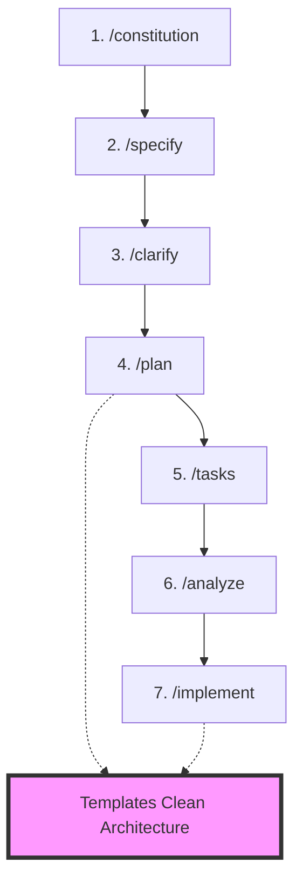

# Integração dos Templates Clean Architecture com Spec-Kit Workflow

## Visão Geral

Este documento descreve como os templates Clean Architecture (.regent) se integram com o workflow de 7 comandos do spec-kit, criando um fluxo unificado de desenvolvimento spec-driven com arquitetura limpa.

## Abordagem Híbrida: Scaffolding + Generativo

### Diferença Fundamental dos Projetos

| Aspecto | Spec-Kit Original | Spec-Kit Clean Architecture |
|---------|------------------|----------------------------|
| **Geração** | 100% generativa | Híbrida (scaffolding + generativo) |
| **Templates** | Não existe | .regent files com estrutura pré-definida |
| **Arquitetura** | AI decide | Enforced by templates |
| **Consistência** | Varia por geração | Garantida pelos templates |
| **AI Role** | Gera tudo | Preenche e adapta templates |

### Como Funciona o Modelo Híbrido

1. **Templates como Scaffolding**
   - Estrutura de camadas pré-definida
   - Interfaces e contratos estabelecidos
   - Padrões arquiteturais enforçados
   - Dependency rules implementadas

2. **AI como Motor Generativo**
   - Analisa especificações
   - Identifica entidades e casos de uso
   - Preenche templates com lógica específica
   - Adapta ao contexto do domínio

3. **Resultado Final**
   - Código consistente com Clean Architecture
   - Implementação específica para o domínio
   - Best practices garantidas
   - Redução de erros arquiteturais

## Workflow Spec-Kit + Clean Architecture



## Pontos de Integração

### 1. `/constitution` - Define Princípios
**Integração**: Adicionar princípios Clean Architecture ao constitution.md

```markdown
## Core Principles

### I. Clean Architecture Layers
- Domain layer: Pure business logic, no dependencies
- Data layer: Repositories and data sources
- Presentation layer: UI and controllers
- Infrastructure layer: Framework-specific implementations
- Main layer: Dependency injection and app initialization

### II. Dependency Rule
- Dependencies point inward only (Presentation → Domain ← Data)
- Domain layer has zero external dependencies
- Interfaces defined in domain, implemented in outer layers
```

### 2. `/specify` - Cria Especificação
**Integração**: Especificação deve identificar:
- Entidades do domínio
- Casos de uso principais
- Fontes de dados necessárias
- Interfaces de usuário requeridas

```markdown
## Key Entities
- User (domain entity)
- Order (domain entity)
- Product (domain entity)

## Use Cases
- CreateUserUseCase
- GetOrderDetailsUseCase
- UpdateProductUseCase
```

### 3. `/clarify` - Resolve Ambiguidades
**Sem mudanças** - Funciona normalmente para esclarecer requisitos

### 4. `/plan` - Cria Plano de Implementação ⚡ **PONTO CRÍTICO**

**Integração**: O plan-template.md deve:
1. Analisar a especificação
2. Determinar tipo de projeto (backend, frontend, fullstack)
3. **Definir estrutura baseada nos templates Clean Architecture**

```markdown
## Project Structure (Clean Architecture)

### Backend Structure
```
backend/
├── domain/           # [backend-domain-template.regent]
│   ├── entities/
│   ├── usecases/
│   └── repositories/
├── data/            # [backend-data-template.regent]
│   ├── datasources/
│   └── repositories/
├── presentation/    # [backend-presentation-template.regent]
│   ├── controllers/
│   └── routes/
├── infrastructure/  # [backend-infra-template.regent]
│   ├── database/
│   └── external/
└── main/           # [backend-main-template.regent]
    └── index.ts
```

### Frontend Structure
[Similar com frontend templates]
```

**Processo**:
1. `/plan` analisa requisitos
2. Identifica camadas necessárias
3. Mapeia para templates apropriados
4. Define dependências entre camadas

### 5. `/tasks` - Gera Lista de Tarefas ⚡ **PONTO CRÍTICO**

**Integração**: Tasks organizadas por camada seguindo Clean Architecture

```markdown
## Phase 3.1: Domain Layer (Zero Dependencies)
- [ ] T001 [P] Create User entity in domain/entities/user.ts
- [ ] T002 [P] Create Order entity in domain/entities/order.ts
- [ ] T003 [P] Create UserRepository interface in domain/repositories/
- [ ] T004 [P] Create CreateUserUseCase in domain/usecases/

## Phase 3.2: Data Layer (Implements Domain Interfaces)
- [ ] T005 [P] Implement UserRepository in data/repositories/
- [ ] T006 [P] Create UserDataSource in data/datasources/
- [ ] T007 [P] Create database models in data/models/

## Phase 3.3: Presentation Layer
- [ ] T008 Create UserController in presentation/controllers/
- [ ] T009 Define routes in presentation/routes/
- [ ] T010 Create DTOs in presentation/dto/

## Phase 3.4: Infrastructure Layer
- [ ] T011 Setup database connection in infrastructure/database/
- [ ] T012 Configure external services in infrastructure/external/

## Phase 3.5: Main Layer (Dependency Injection)
- [ ] T013 Configure DI container in main/container.ts
- [ ] T014 Wire all dependencies in main/index.ts
```

**Regras**:
- Domain tasks primeiro (zero dependencies)
- Data/Presentation em paralelo (dependem só do domain)
- Infrastructure pode ser paralelo
- Main por último (precisa de todas as camadas)

### 6. `/analyze` - Analisa Consistência
**Integração**: Adicionar verificações Clean Architecture

```markdown
## Clean Architecture Validation
- [ ] Domain layer has zero external imports
- [ ] No circular dependencies between layers
- [ ] All use cases have corresponding repository interfaces
- [ ] All controllers use only use cases (not repositories directly)
- [ ] Dependency injection properly configured
```

### 7. `/implement` - Executa Implementação ⚡ **PONTO MÁXIMO**

**Integração**: Aqui acontece a mágica híbrida - scaffolding + generation!

#### Modelo Híbrido em Ação

```typescript
// Processo híbrido de implementação
async function implementTask(task: Task) {
  // 1. SCAFFOLDING: Carrega template estrutural
  const layer = detectLayer(task); // domain, data, presentation, etc.
  const template = loadTemplate(layer); // backend-domain-template.regent

  // Template contém:
  // - Estrutura de pastas e arquivos
  // - Interfaces e contratos pré-definidos
  // - Padrões arquiteturais (Repository, UseCase, etc.)
  // - AI-NOTEs para guiar a geração

  // 2. GENERATIVO: AI preenche template com contexto específico
  const code = await generateFromTemplate(template, {
    entities: spec.entities,        // Ex: User, Order, Product
    useCases: spec.useCases,        // Ex: CreateUser, UpdateOrder
    repositories: spec.repositories, // Ex: UserRepository interface
    businessRules: spec.rules,      // Lógica específica do domínio
  });

  // 3. RESULTADO: Código estruturado + implementação específica
  // - Estrutura garantida pelo template
  // - Lógica de negócio gerada pela AI
  // - Best practices enforçadas automaticamente

  await writeFiles(code, task.targetPath);
}
```

**Fluxo de Execução**:
1. Para cada task, identifica a camada
2. Carrega o template .regent correspondente
3. Extrai informações da spec (entities, use cases, etc.)
4. Gera código usando o template
5. Escreve arquivos respeitando a estrutura

## Adaptações Necessárias nos Templates

### 1. Templates de Comando
Modificar para awareness de Clean Architecture:

```markdown
# templates/commands/plan.md
- Adicionar lógica para escolher templates por camada
- Definir estrutura baseada em Clean Architecture

# templates/commands/tasks.md
- Organizar tasks por camada
- Respeitar dependency rule

# templates/commands/implement.md
- Executar templates .regent apropriados
- Validar dependency rule durante geração
```

### 2. Templates Regent
Os templates já existentes são perfeitos! Só precisam ser:
1. Integrados ao comando `/implement`
2. Parametrizados com dados da spec
3. Executados na ordem correta (domain first)

## Exemplo Completo de Fluxo

```bash
# 1. Define princípios Clean Architecture
/constitution

# 2. Especifica feature
/specify "Create user management system with authentication"
# → Identifica: User entity, auth use cases, user repository

# 3. Esclarece dúvidas
/clarify
# → Define: JWT auth, PostgreSQL, REST API

# 4. Planeja implementação
/plan
# → Mapeia para estrutura Clean Architecture
# → Define quais templates usar (backend-*.regent)

# 5. Gera tarefas
/tasks
# → T001-T004: Domain layer (entities, use cases)
# → T005-T007: Data layer (repositories, datasources)
# → T008-T010: Presentation (controllers, routes)
# → T011-T012: Infrastructure (database, JWT)
# → T013-T014: Main (DI, bootstrap)

# 6. Analisa consistência
/analyze
# → Verifica dependency rule
# → Confirma cobertura de todas as camadas

# 7. Implementa
/implement
# → Executa backend-domain-template.regent para T001-T004
# → Executa backend-data-template.regent para T005-T007
# → Executa backend-presentation-template.regent para T008-T010
# → Executa backend-infra-template.regent para T011-T012
# → Executa backend-main-template.regent para T013-T014
```

## Benefícios da Integração Híbrida

### Vantagens sobre Abordagem 100% Generativa

1. **Consistência Garantida**
   - Templates enforçam estrutura correta
   - Impossível violar Clean Architecture
   - Padrões sempre aplicados corretamente

2. **Menor Taxa de Erro**
   - AI não precisa "inventar" estrutura
   - Templates previnem erros arquiteturais
   - Reduz hallucinations significativamente

3. **Velocidade de Desenvolvimento**
   - Scaffolding instantâneo da estrutura
   - AI foca apenas no domínio específico
   - Menos iterações para código correto

4. **Manutenibilidade Superior**
   - Estrutura previsível em todos os projetos
   - Fácil onboarding de novos desenvolvedores
   - Refatorações mais seguras

5. **Best Practices Built-in**
   - TDD enforçado pelos templates
   - SOLID principles na estrutura
   - DDD patterns pré-implementados

## Implementação Proposta

### Fase 1: Adaptar Comandos (1 semana)
- [ ] Modificar plan-template.md para considerar camadas
- [ ] Adaptar tasks-template.md para organizar por camada
- [ ] Atualizar implement.md para executar templates

### Fase 2: Integrar Templates (1 semana)
- [ ] Criar engine de execução de templates .regent
- [ ] Parametrizar templates com dados da spec
- [ ] Implementar validação de dependency rule

### Fase 3: Validação (1 semana)
- [ ] Criar projeto exemplo completo
- [ ] Testar fluxo end-to-end
- [ ] Documentar processo

## Conclusão

Os templates Clean Architecture se encaixam **perfeitamente** no workflow spec-kit:

1. **Durante `/plan`**: Define estrutura de camadas
2. **Durante `/tasks`**: Organiza tarefas por camada
3. **Durante `/implement`**: Executa templates para gerar código

Isso cria um sistema poderoso onde:
- Especificações dirigem a arquitetura
- Templates garantem consistência
- Clean Architecture mantém qualidade
- Automação acelera desenvolvimento

---

*Proposta criada: 2025-09-27*
*Projeto: spec-kit-clean-architecture*