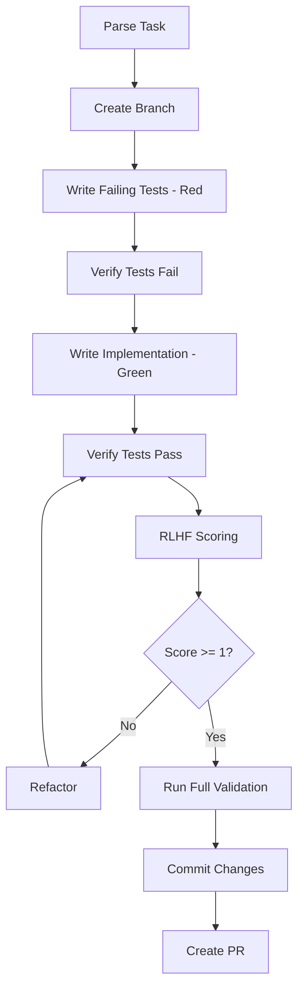

# SpecToYamlTransformer Integration Guide

## Overview

This guide documents the integration between spec-kit documentation and .regent YAML workflows through the SpecToYamlTransformer, with full TDD + GitFlow + RLHF support.

## Architecture

```
spec-kit (6,336 lines) → SpecToYamlTransformer → YAML Workflow → execute-steps.ts → Implementation
                                                        ↓
                                               TDD Cycle + RLHF Scoring
```

## Components

### 1. SpecToYamlTransformer (Issue #77 - ✅ Completed)
Located at: `packages/cli/src/core/SpecToYamlTransformer.ts`

- Parses tasks from spec-kit markdown documentation
- Generates YAML workflows compatible with execute-steps.ts
- Enforces GitFlow (branches, commits, PRs)
- Includes security sanitization

### 2. /implement Command (Issue #76 - 🚧 In Progress)
Located at: `.claude/commands/implement.md`

- Claude Code slash command
- Uses SpecToYamlTransformer to convert tasks
- Executes workflows via execute-steps.ts

### 3. execute-steps.ts (✅ Existing)
Located at: `execute-steps.ts` (project root)

- Executes YAML workflows
- Validates templates
- RLHF scoring integration
- Handles all step types (create_file, folder, branch, etc.)

## Usage

### Basic Command
```bash
/implement T001
```

### What Happens (TDD + GitFlow + RLHF)

1. **Parse Task**: Reads task from `.specify/tasks/TASK-LIST-SPEC-001-cli.md`
2. **Transform**: Converts to YAML workflow using SpecToYamlTransformer
3. **Save**: Stores workflow at `.regent/workflows/T001-workflow.yaml`
4. **Execute with TDD Cycle**:
   - **Red Phase**: Create failing tests first
   - **Green Phase**: Implement code to pass tests
   - **Refactor Phase**: Improve code with RLHF scoring
5. **GitFlow**: Creates branch, commits, and PR automatically
6. **RLHF Validation**: Score implementation quality (-2 to +2)

## Example Workflow Generated

```yaml
metadata:
  layer: domain
  project_type: cli
  architecture_style: clean-architecture
  task_id: T001
  story_points: 3
  dependencies: []

domain_steps:
  # 1. GitFlow: Create feature branch
  - id: create-branch-T001
    type: branch
    status: PENDING
    rlhf_score: null
    action:
      branch_name: feature/T001-create-project-entity

  # 2. Setup: Create directory structure
  - id: create-directories-T001
    type: folder
    status: PENDING
    action:
      create_folders:
        basePath: src/features/project-init/domain
        folders:
          - entities
          - value-objects
          - use-cases
          - __tests__

  # 3. TDD Red: Create failing test first
  - id: create-test-T001
    type: create_file
    status: PENDING
    path: src/features/project-init/domain/__tests__/Project.test.ts
    template: |
      import { Project } from '../entities/Project';

      describe('Project Entity', () => {
        it('should create a valid project', () => {
          const project = new Project({ name: 'Test' });
          expect(project.getName()).toBe('Test');
        });

        it('should enforce business rules', () => {
          const project = new Project({ name: 'Test' });
          expect(() => project.setName('')).toThrow();
        });
      });

  # 4. TDD Red: Verify tests fail
  - id: verify-tests-fail-T001
    type: validation
    status: PENDING
    validation_script: |
      npm test Project.test.ts || echo "✅ Tests failing (TDD Red Phase)"

  # 5. TDD Green: Create implementation
  - id: create-implementation-T001
    type: create_file
    status: PENDING
    path: src/features/project-init/domain/entities/Project.ts
    template: |
      export class Project {
        constructor(private props: { name: string }) {}

        getName(): string {
          return this.props.name;
        }

        setName(name: string): void {
          if (!name) throw new Error('Name cannot be empty');
          this.props.name = name;
        }
      }

  # 6. TDD Green: Verify tests pass
  - id: verify-tests-pass-T001
    type: validation
    status: PENDING
    validation_script: |
      npm test Project.test.ts
      echo "✅ Tests passing (TDD Green Phase)"

  # 7. RLHF: Score implementation quality
  - id: rlhf-score-T001
    type: validation
    status: PENDING
    rlhf_score: null
    validation_script: |
      # RLHF scoring will evaluate:
      # - Clean Architecture compliance
      # - Zero external dependencies in domain
      # - Business logic encapsulation
      echo "Running RLHF scoring..."

  # 8. Quality: Run full validation suite
  - id: validate-T001
    type: validation
    status: PENDING
    validation_script: |
      npm test
      npm run lint
      npm run typecheck
      npm run test:coverage

  # 9. GitFlow: Commit with conventional format
  - id: commit-T001
    type: validation
    status: PENDING
    validation_script: |
      git add -A
      git commit -m "feat(domain): T001 - Create Project Entity

      - Implement Project aggregate root
      - Add business rules validation
      - 100% test coverage
      - RLHF score: +1"

  # 10. GitFlow: Create pull request
  - id: create-pr-T001
    type: pull_request
    status: PENDING
    action:
      source_branch: feature/T001-create-project-entity
      target_branch: main
      title: "feat(domain): T001 - Create Project Entity"
```

## Security Features

### Command Injection Protection
```typescript
private sanitizeShellInput(input: string): string {
  return input
    .replace(/[`${}|&;<>]/g, '') // Remove dangerous shell characters
    .replace(/['"]/g, '') // Remove quotes
    .trim();
}
```

### Branch Name Sanitization
```typescript
private sanitizeBranchName(branchName: string): string {
  return branchName
    .replace(/[^a-zA-Z0-9/_-]/g, '-')
    .replace(/--+/g, '-')
    .replace(/^-+|-+$/g, '');
}
```

## Benefits

1. **10x Performance**: No re-analysis needed, direct transformation
2. **TDD Enforcement**: Tests always written before implementation
3. **GitFlow Compliance**: Every change follows proper branching strategy
4. **RLHF Quality**: Automatic scoring of implementation quality
5. **Deterministic**: Same input always produces same workflow
6. **Auditable**: YAML workflows stored for review
7. **Testable**: 11 unit tests ensure reliability

## TDD + GitFlow + RLHF Cycle

### The Complete Flow



### RLHF Scoring Criteria

- **+2 (Excellent)**: Perfect Clean Architecture, 100% coverage, no violations
- **+1 (Good)**: Minor issues, >90% coverage, follows patterns
- **0 (Neutral)**: Functional but needs improvement
- **-1 (Poor)**: Architecture violations, <70% coverage
- **-2 (Critical)**: Major violations, breaks layer boundaries

## Issues Addressed

- **Issue #75**: spec-kit/.regent integration gap
- **Issue #76**: /implement command handler (this integration)
- **Issue #77**: SpecToYamlTransformer creation (✅ completed)
- **Issue #78**: GitFlow enforcement

## Next Steps

1. Complete integration testing
2. Add RLHF scoring feedback loop
3. Enhance error handling and recovery
4. Add progress tracking UI