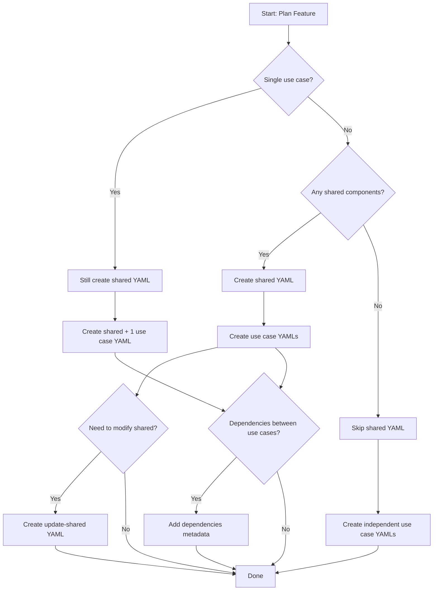

# Edge Cases for Modular YAML Generation

> **Context**: Issue #145 - Document edge case handling for modular YAML structure introduced in PR #136

## Overview

The modular YAML generation system (introduced in #117 and PR #136) uses a structure with `sharedComponents` and individual use case YAMLs. This document defines how to handle edge cases that may arise during feature implementation.

---

## Edge Case 1: Single Use Case Feature

### Scenario
Feature contains only **one use case** with no plans for additional use cases.

### Question
Should we still generate both `shared-implementation.yaml` and use case YAML?

### ✅ Recommended Solution

**YES** - Always follow the modular pattern for consistency.

```
spec/001-simple-feature/domain/
├── shared-implementation.yaml          # Shared entities, VOs, errors
└── single-use-case-implementation.yaml # The one use case
```

### Rationale

1. **Consistency**: Same pattern across all features
2. **Future-proof**: Easy to add more use cases later
3. **Clear separation**: Shared models vs use case logic
4. **Tool compatibility**: Works with all `/0X` commands

### Example: Login Feature

```yaml
# spec/001-auth/domain/shared-implementation.yaml
metadata:
  feature: "authentication"
  layer: "domain"
  type: "shared"

sharedComponents:
  entities:
    - User
  valueObjects:
    - Email
    - Password
  errors:
    - InvalidCredentialsError
    - UserNotFoundError

steps:
  - id: create_user_entity
    type: create_file
    path: "src/features/auth/shared/domain/entities/user.ts"
    # ... entity implementation
```

```yaml
# spec/001-auth/domain/login-implementation.yaml
metadata:
  feature: "authentication"
  layer: "domain"
  type: "use-case"
  use_case: "login"
  dependencies:
    - shared-implementation.yaml

steps:
  - id: create_login_use_case
    type: create_file
    path: "src/features/auth/login/domain/usecases/login.ts"
    # ... use case implementation
```

---

## Edge Case 2: No Shared Components

### Scenario
Feature where use cases **don't share any components** (rare but possible).

### Question
Should we skip `shared-implementation.yaml` if empty?

### ✅ Recommended Solution

**YES** - Skip empty shared YAML if `sharedComponents` is truly empty.

```
spec/002-standalone-feature/domain/
├── use-case-1-implementation.yaml
└── use-case-2-implementation.yaml
```

### Rationale

1. **No empty files**: Don't create files with no content
2. **Clear intent**: Absence indicates no shared components
3. **Reduces noise**: Fewer files to track

### When to Apply

Only skip shared YAML if **ALL** of these are true:
- ✅ No shared entities
- ✅ No shared value objects
- ✅ No shared errors
- ✅ No shared types/interfaces
- ✅ No shared repositories

### ⚠️ Warning

Be cautious! Most features **do** have shared components:
- Entities (User, Product, Order)
- Value Objects (Email, Money, SKU)
- Domain Errors (ValidationError, NotFoundError)
- Repositories (UserRepository, ProductRepository)

**Before skipping shared YAML, ask:**
1. Do use cases work with the same entity? → Shared entity needed
2. Do use cases throw similar errors? → Shared errors needed
3. Do use cases validate similar data? → Shared VOs needed

### Example: Independent Operations

```yaml
# spec/002-admin-tools/domain/export-logs-implementation.yaml
metadata:
  feature: "admin-tools"
  layer: "domain"
  type: "use-case"
  use_case: "export-logs"
  dependencies: []  # No shared components

steps:
  - id: create_export_logs_use_case
    # ... standalone implementation
```

```yaml
# spec/002-admin-tools/domain/clear-cache-implementation.yaml
metadata:
  feature: "admin-tools"
  layer: "domain"
  type: "use-case"
  use_case: "clear-cache"
  dependencies: []  # No shared components

steps:
  - id: create_clear_cache_use_case
    # ... standalone implementation
```

---

## Edge Case 3: Modifying Shared Component After Use Cases

### Scenario
After implementing use cases, need to **add a field to a shared entity or VO**.

### Question
Which YAML to update? Create new YAML?

### ✅ Recommended Solution

Create a new `update-shared-implementation.yaml` for modifications.

```
spec/001-product-catalog/domain/
├── shared-implementation.yaml           # Original (DO NOT EDIT)
├── create-product-implementation.yaml
├── update-product-implementation.yaml
└── update-shared-implementation.yaml    # NEW: Adds field to Product entity
```

### Rationale

1. **Maintains history**: Original YAML preserved
2. **Atomic commits**: Each change is independent
3. **Rollback safety**: Can revert specific changes
4. **Audit trail**: Clear evolution of shared components

### Example: Adding Field to Entity

```yaml
# spec/001-product-catalog/domain/update-shared-implementation.yaml
metadata:
  feature: "product-catalog"
  layer: "domain"
  type: "shared-update"
  updates: "Product entity"
  reason: "Add SKU validation for inventory integration"
  dependencies:
    - shared-implementation.yaml

steps:
  - id: update_product_entity_add_sku
    type: update_file
    path: "src/features/product-catalog/shared/domain/entities/product.ts"
    operation: "add_field"
    template: |
      <<<FIND>>>
      export interface Product {
        id: string
        name: string
        price: Money
      }
      <<</FIND>>>

      <<<REPLACE>>>
      export interface Product {
        id: string
        name: string
        price: Money
        sku: SKU  // NEW: Added for inventory integration
      }
      <<</REPLACE>>>
```

### Naming Convention

- Initial: `shared-implementation.yaml`
- Updates: `update-shared-implementation-[purpose].yaml`
- Examples:
  - `update-shared-implementation-add-sku.yaml`
  - `update-shared-implementation-new-error.yaml`
  - `update-shared-implementation-refactor-vo.yaml`

---

## Edge Case 4: Use Case Dependencies

### Scenario
Use case depends on another use case being implemented first (e.g., UpdateProduct needs CreateProduct).

### Question
How to express dependencies? Execute in order?

### ✅ Recommended Solution

Add explicit `dependencies` metadata to YAML.

```yaml
metadata:
  dependencies:
    - shared-implementation.yaml
    - create-product-implementation.yaml  # Must exist first
```

### Rationale

1. **Explicit dependencies**: Clear execution order
2. **Validation**: Can check if dependencies exist
3. **Documentation**: Self-documenting implementation order
4. **Safety**: Prevents executing in wrong order

### Example: UpdateProduct depends on CreateProduct

```yaml
# spec/001-product-catalog/domain/update-product-implementation.yaml
metadata:
  feature: "product-catalog"
  layer: "domain"
  type: "use-case"
  use_case: "update-product"
  dependencies:
    - shared-implementation.yaml       # Needs Product entity
    - create-product-implementation.yaml  # Needs CreateProduct for reference

steps:
  - id: create_update_product_use_case
    type: create_file
    path: "src/features/product-catalog/update-product/domain/usecases/update-product.ts"
    template: |
      import { Product } from '../../shared/domain/entities/product'
      import { ProductRepository } from '../../shared/domain/repositories/product-repository'

      export interface UpdateProduct {
        execute(id: string, data: Partial<Product>): Promise<Product>
      }
```

### Dependency Types

1. **Shared dependencies** - Required shared components
   ```yaml
   dependencies:
     - shared-implementation.yaml
   ```

2. **Use case dependencies** - Depends on other use cases
   ```yaml
   dependencies:
     - shared-implementation.yaml
     - create-product-implementation.yaml
   ```

3. **Update dependencies** - Depends on previous updates
   ```yaml
   dependencies:
     - shared-implementation.yaml
     - update-shared-implementation-add-sku.yaml
   ```

### Execution Order Validation

The `/06-execute-layer-steps` command should:

1. Parse `dependencies` field
2. Check if dependency files exist
3. Verify dependencies were executed
4. Fail with clear error if dependency missing

```typescript
// Example validation logic
function validateDependencies(yaml: YAMLPlan): ValidationResult {
  const { dependencies = [] } = yaml.metadata

  for (const dep of dependencies) {
    if (!fs.existsSync(dep)) {
      return {
        valid: false,
        error: `Missing dependency: ${dep}. Execute it first.`
      }
    }
  }

  return { valid: true }
}
```

---

## Decision Flowchart



---

## Summary Table

| Edge Case | Solution | File Structure |
|-----------|----------|----------------|
| **Single Use Case** | Create shared + 1 use case YAML | `shared.yaml` + `use-case.yaml` |
| **No Shared Components** | Skip shared YAML (rare) | `use-case-1.yaml` + `use-case-2.yaml` |
| **Modify Shared After** | Create `update-shared.yaml` | Original + update YAMLs |
| **Use Case Dependencies** | Add `dependencies` metadata | YAMLs with explicit dependencies |

---

## Integration with Commands

### `/01-plan-layer-features`
- Identify edge cases during planning
- Ask user which pattern to follow
- Document decision in metadata

### `/03-generate-layer-code`
- Check for edge case indicators
- Follow appropriate pattern
- Generate correct file structure

### `/06-execute-layer-steps`
- Validate dependencies before execution
- Respect execution order
- Fail gracefully with helpful errors

---

## Related Issues

- **#117** - Modular YAML structure implementation
- **#136** - PR that introduced modular structure
- **#143** - Test plan and dogfooding
- **#151** - Validator updates

---

**Last Updated**: 2025-10-01
**Status**: ✅ Documented
**Maintainer**: The Regent Team
