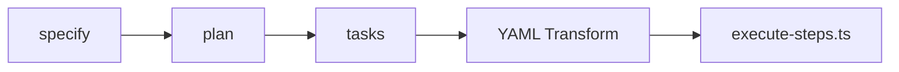

# ADR-001: Integration of spec-kit and .regent Systems

**Status**: Proposed
**Date**: 2025-09-28
**Authors**: Dogfooding Team

## Context

During Phase 6 of dogfooding The Regent CLI, we discovered a fundamental architectural disconnect:

### Two Parallel Systems

1. **spec-kit** (Planning System)
   - Commands: `/constitution`, `/specify`, `/plan`, `/tasks`, `/implement`
   - Output: 6,336+ lines of markdown documentation
   - Execution: Direct code generation without validation

2. **.regent** (Execution System)
   - Commands: `/01-plan-layer-features`, `/02-validate`, `/03-generate`, `/06-execute`
   - Output: YAML workflows with validation steps
   - Execution: execute-steps.ts (808 lines of validation logic)

### The Problem

These systems operate in complete isolation, leading to:
- **90% duplicated effort** - Analysis performed twice
- **Quality bypass** - No RLHF scoring, no validation
- **Lost determinism** - No GitFlow, no audit trail
- **10x performance waste** - Re-analyzing already analyzed work

## Decision Drivers

1. **Performance**: Eliminate duplicate analysis
2. **Quality**: Enforce validation and scoring
3. **Determinism**: Ensure repeatable, auditable builds
4. **Simplicity**: Single execution path
5. **Backwards Compatibility**: Don't break existing workflows

## Considered Options

### Option 1: spec-kit Generates YAML (Recommended)
- Modify spec-kit commands to output YAML
- Route all execution through execute-steps.ts
- Transform markdown to YAML as final step



**Pros:**
- Leverages existing 6,336 lines of analysis
- No duplicate work
- Full validation pipeline
- Minimal changes to spec-kit

**Cons:**
- Need to write markdown→YAML transformer
- Changes spec-kit output format

### Option 2: .regent Consumes Markdown
- Modify .regent to parse markdown docs
- Extract implementation from markdown

**Pros:**
- No changes to spec-kit
- Preserves documentation format

**Cons:**
- Complex markdown parsing
- Loss of structured data
- Harder to maintain

### Option 3: Bridge Service
- Create translation layer between systems
- Keep both systems unchanged

**Pros:**
- No changes to either system
- Gradual migration possible

**Cons:**
- Another layer of complexity
- Maintenance overhead
- Doesn't solve root problem

## Decision

**We will implement Option 1: spec-kit generates YAML**

### Implementation Strategy

#### Phase 1: Transformer Development
```typescript
class SpecToYamlTransformer {
  async transformTask(taskId: string): Promise<YamlStep[]> {
    const task = await this.loadTask(taskId);
    const spec = await this.loadRelatedSpec(task);

    return this.generateYamlSteps(task, spec);
  }
}
```

#### Phase 2: Command Integration
```bash
/implement from task: T001
  ↓
Internally calls:
  → Load task from markdown
  → Transform to YAML structure
  → Add GitFlow steps
  → Execute via execute-steps.ts
```

#### Phase 3: GitFlow Enforcement
Every task generates:
```yaml
steps:
  - type: branch
    action:
      branch_name: feature/{task-id}

  - type: create_file
    # ... implementation

  - type: validation
    validation_script: tests

  - type: pull_request
    action:
      source_branch: feature/{task-id}
      target_branch: main
```

## Consequences

### Positive
- **10x performance improvement** - No re-analysis
- **Full validation** - All code through execute-steps.ts
- **RLHF scoring** - Every step scored
- **GitFlow enforced** - Deterministic builds
- **Single source of truth** - spec-kit analysis drives everything

### Negative
- **Breaking change** - `/implement` behavior changes
- **Migration needed** - Existing workflows must adapt
- **Initial development** - Transformer needs building

### Neutral
- Documentation format remains markdown
- YAML becomes internal format
- Both systems remain but connected

## Implementation Timeline

1. **Week 1**: Build transformer prototype
2. **Week 2**: Integrate with `/implement`
3. **Week 3**: Add GitFlow steps
4. **Week 4**: Migration guide and testing

## Metrics for Success

- Execution time: < 10% of current
- RLHF scores: 100% of steps scored
- GitFlow compliance: 100% of implementations
- Test coverage: Maintained or improved
- User satisfaction: No workflow disruption

## Anti-Pattern Documentation

This discovery reveals the **"Parallel Evolution"** anti-pattern:

**Definition**: When subsystems evolve independently to solve overlapping problems without coordination.

**Symptoms**:
- Duplicate functionality
- Inconsistent behavior
- Integration debt
- User confusion

**Solution**: Architectural unification through controlled integration.

## References

- PR #79: Dogfooding discoveries
- Issue #75: Architectural disconnect
- Issue #76: /implement bypass
- Issue #77: Performance opportunity
- Issue #78: GitFlow violation

## Review History

- 2025-09-28: Initial proposal from dogfooding discovery