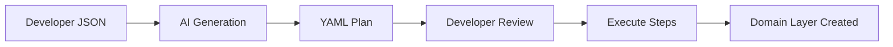

# Domain Layer Template (Clean Architecture) - DRY Refactored

This document defines the structure, rules, and automated workflow for creating domain layers. Source of truth: `TODO_DOMAIN_TEMPLATE.yaml`.

## 📋 Placeholder Definitions

All templates use these standardized placeholders:

| Placeholder | Description | Example |
|------------|-------------|---------|
| `__FEATURE_NAME_KEBAB_CASE__` | Feature name in kebab-case | `user-account` |
| `__FEATURE_NAME_PASCAL_CASE__` | Feature name in PascalCase | `UserAccount` |
| `__ACTION_ENTITY_KEBAB_CASE__` | Action-Entity in kebab-case | `create-user` |
| `__ACTION_ENTITY_PASCAL_CASE__` | Action-Entity in PascalCase | `CreateUser` |
| `__ACTION_ENTITY_LOWER_CASE__` | Action-Entity in lowercase | `create user` |
| `__USE_CASE_DESCRIPTION__` | Use case business description | `Creates a new user account` |
| `__USE_CASE_INPUT_FIELDS__` | TypeScript input fields | `email: string; password: string` |
| `__USE_CASE_OUTPUT_FIELDS__` | TypeScript output fields | `id: string; email: string` |
| `__ERROR_NAME_KEBAB_CASE__` | Error name in kebab-case | `user-already-exists` |
| `__ERROR_NAME_PASCAL_CASE__` | Error name in PascalCase | `UserAlreadyExists` |
| `__ERROR_DESCRIPTION__` | Error condition description | `the email is already registered` |
| `__ERROR_MESSAGE__` | Error message text | `User with this email already exists` |
| `__MOCK_INPUT_DATA__` | Mock input values | `email: 'test@example.com'` |
| `__MOCK_OUTPUT_DATA__` | Mock output values | `id: 'user-123'` |

## 🏗️ Domain Structure

```
src/features/__FEATURE_NAME_KEBAB_CASE__/domain/
├── errors/         # Domain-specific typed errors
├── use-cases/      # Business operation interfaces
└── test/           # Mock implementations & helpers
```

## 📜 Domain Layer Rules

### Core Principle
**Domain layer must be completely independent** - no imports from other layers or external libraries.

### Dependency Matrix

| Layer | Can Import Domain? | Domain Can Import? |
|-------|-------------------|-------------------|
| Data | ✅ (implements interfaces) | ❌ |
| Presentation | ✅ (uses types & calls) | ❌ |
| Infrastructure | ✅ (uses for adapters) | ❌ |
| External Libs | N/A | ❌ |

### Allowed vs Forbidden

| ✅ **Allowed** | ❌ **Forbidden** |
|---------------|-----------------|
| Type definitions (Input/Output) | Business logic implementation |
| Use case interfaces | External library imports |
| Domain-specific errors | I/O operations (console, DB, files) |
| Test helpers & mocks | Framework-specific code |
| Pure functions | State management |
| Documentation | Side effects |

## 🤖 Automated Workflow

### Two-Step Process



### Step 1: AI Generation

**Input:** Feature JSON → **Process:** Template substitution → **Output:** Validated YAML

### Step 2: Execution

```bash
npx tsx execute-steps.ts [feature-name]-implementation.yaml
```

## 📝 Code Templates

### Reusable TypeScript Patterns

```typescript
// Common documentation header
const JSDOC_HEADER = `/**
 * __DESCRIPTION__
 * @__DECORATOR__
 */`;

// Common export pattern
const EXPORT_TYPE = `export type __NAME__ = {
  __FIELDS__
};`;

// Common interface pattern
const EXPORT_INTERFACE = `export interface __NAME__ {
  execute: (input: __INPUT__) => Promise<__OUTPUT__>;
}`;

// Common error class pattern
const ERROR_CLASS = `export class __NAME__Error extends Error {
  constructor() {
    super("__MESSAGE__");
    this.name = "__NAME__Error";
  }
}`;

// Common mock function pattern
const MOCK_FUNCTION = `export const mock__NAME__ = (): __TYPE__ => ({
  __DATA__
});`;
```

### Applied Templates

#### Use Case Template
Location: `src/features/__FEATURE_NAME_KEBAB_CASE__/domain/use-cases/__ACTION_ENTITY_KEBAB_CASE__.ts`

```typescript
/**
 * Input parameters for __ACTION_ENTITY_PASCAL_CASE__UseCase
 */
export type __ACTION_ENTITY_PASCAL_CASE__Input = {
  __USE_CASE_INPUT_FIELDS__
};

/**
 * Output type for __ACTION_ENTITY_PASCAL_CASE__UseCase
 */
export type __ACTION_ENTITY_PASCAL_CASE__Output = {
  __USE_CASE_OUTPUT_FIELDS__
};

/**
 * __ACTION_ENTITY_PASCAL_CASE__UseCase interface
 * @description __USE_CASE_DESCRIPTION__
 */
export interface __ACTION_ENTITY_PASCAL_CASE__UseCase {
  /**
   * Execute the __ACTION_ENTITY_LOWER_CASE__ operation
   * @param input - The input parameters
   * @returns Promise with the operation output
   */
  execute: (
    input: __ACTION_ENTITY_PASCAL_CASE__Input
  ) => Promise<__ACTION_ENTITY_PASCAL_CASE__Output>;
}
```

#### Error Template
Location: `src/features/__FEATURE_NAME_KEBAB_CASE__/domain/errors/__ERROR_NAME_KEBAB_CASE__.ts`

```typescript
/**
 * Error thrown when __ERROR_DESCRIPTION__
 * @extends Error
 */
export class __ERROR_NAME_PASCAL_CASE__Error extends Error {
  constructor() {
    super("__ERROR_MESSAGE__");
    this.name = "__ERROR_NAME_PASCAL_CASE__Error";
  }
}
```

#### Test Helper Template
Location: `src/features/__FEATURE_NAME_KEBAB_CASE__/domain/test/mock-__ACTION_ENTITY_KEBAB_CASE__-use-case.ts`

```typescript
import { vi } from "vitest";
import type {
  __ACTION_ENTITY_PASCAL_CASE__UseCase,
  __ACTION_ENTITY_PASCAL_CASE__Input,
  __ACTION_ENTITY_PASCAL_CASE__Output,
} from "../use-cases/__ACTION_ENTITY_KEBAB_CASE__";

/**
 * Creates a mock instance of __ACTION_ENTITY_PASCAL_CASE__Input
 */
export const mock__ACTION_ENTITY_PASCAL_CASE__Input =
  (): __ACTION_ENTITY_PASCAL_CASE__Input => ({
    __MOCK_INPUT_DATA__
  });

/**
 * Creates a mock instance of __ACTION_ENTITY_PASCAL_CASE__Output
 */
export const mock__ACTION_ENTITY_PASCAL_CASE__Output =
  (): __ACTION_ENTITY_PASCAL_CASE__Output => ({
    __MOCK_OUTPUT_DATA__
  });

/**
 * Creates a mock instance of __ACTION_ENTITY_PASCAL_CASE__UseCase
 */
export const mock__ACTION_ENTITY_PASCAL_CASE__UseCase =
  (): __ACTION_ENTITY_PASCAL_CASE__UseCase => ({
    execute: vi.fn()
  });
```

## 🔧 Universal Validation Script

All steps use this single validation script (placeholders vary per step):

```bash
#!/bin/bash
set -e  # Exit on any error

# Lint check with auto-fix
echo "🔍 Running lint check..."
yarn lint || (
  echo "⚠️ Lint failed, attempting auto-fix..."
  yarn lint --fix && yarn lint
) || exit 1
echo "✅ Lint passed"

# Test execution
echo "🧪 Running tests with coverage..."
yarn test --coverage || exit 1
echo "✅ Tests passed"

# Git operations
echo "📦 Staging changes..."
git add .

echo "💾 Creating commit..."
git commit -m "feat(__FEATURE_NAME_KEBAB_CASE__): add __ACTION_ENTITY_KEBAB_CASE__ __ARTIFACT_TYPE__" || exit 1
echo "✅ Successfully committed"
```

## 📋 Example Feature JSON

Minimal input structure for AI generation:

```json
{
  "featureName": "User Account",
  "useCases": [
    {
      "name": "Create User Account",
      "description": "Creates a new user account",
      "input": [
        { "name": "email", "type": "string" },
        { "name": "password", "type": "string" }
      ],
      "output": [
        { "name": "id", "type": "string" },
        { "name": "email", "type": "string" }
      ],
      "mockInput": [
        { "name": "email", "value": "'test@example.com'" },
        { "name": "password", "value": "'SecurePassword123!'" }
      ],
      "mockOutput": [
        { "name": "id", "value": "'user-123'" },
        { "name": "email", "value": "'test@example.com'" }
      ]
    }
  ],
  "errors": [
    {
      "name": "User Already Exists",
      "description": "when the email is already registered",
      "message": "User with this email already exists"
    }
  ]
}
```

## 🚀 Quick Reference

### Commands
```bash
# Generate plan
/03-generate-domain-code create feature from json: {...}

# Execute plan
npx tsx execute-steps.ts [feature-name]-implementation.yaml

# Validate plan
npx tsx validate-implementation.ts [feature-name]-implementation.yaml
```

### File Naming Conventions
- **Use Cases:** `[action]-[entity].ts` (e.g., `create-user.ts`)
- **Errors:** `[error-name]-error.ts` (e.g., `user-already-exists-error.ts`)
- **Test Helpers:** `mock-[use-case]-use-case.ts` (e.g., `mock-create-user-use-case.ts`)

### Quality Checklist
- [ ] No external imports in domain layer
- [ ] All use cases have corresponding test helpers
- [ ] Each error extends base Error class
- [ ] Types use explicit field definitions
- [ ] Documentation includes JSDoc comments
- [ ] Files follow naming conventions
- [ ] Tests pass with 100% coverage
- [ ] Lint checks pass without warnings

---

*Generated from DOMAIN_TEMPLATE.md using DRY principles*